# Electrical Machine I Sessional (EEE 2208) — Lab Manual Study Notes

> **Course:** EEE 2208 — Electrical Machine I Sessional  
> **Institution:** Department of Electrical & Electronic Engineering, RUET  
> **Credit:** 1.5  
> **Core Focus:** DC Machines (Generators & Motors) and Transformers (Characteristics, Speed Control, Parameter Determination, Regulation, and Polyphase Bank Configurations).

---

## Quick Navigation Table

| Exp #  | Experiment Title                                                                | Core Focus / Concept                                      | Key Result / Formula                                            |
| :----: | :------------------------------------------------------------------------------ | :-------------------------------------------------------- | :-------------------------------------------------------------- |
| **01** | [Study & Ratings of DC Machines & Transformers](#exp-01)                        | Nameplate data, construction, operating principles        | $E = k \Phi \omega_m$, $\tau = k \Phi I_a$                      |
| **02** | [No-Load Magnetization Curve (OCC) of Separately Excited DC Generator](#exp-02) | Magnetic saturation, residual flux, critical resistance   | $E_g \propto \Phi \propto I_f$ (prior to saturation)            |
| **03** | [External Characteristics of Self-Excited DC Shunt Generator](#exp-03)          | Voltage droop under load, 3 causes of drop                | $V_T = E_g - I_a R_a$, $I_f = V_T / R_{sh}$                     |
| **04** | [External Characteristics of DC Compound Generators](#exp-04)                   | Cumulative vs Differential compounding                    | $\Phi_{net} = \Phi_{sh} \pm \Phi_{se}$                          |
| **05** | [Starting of DC Shunt Motor using 3-Point Starter](#exp-05)                     | Limiting starting current, NVC & OLR protection           | $I_{a,\text{start}} = V / R_a \gg I_{\text{rated}}$             |
| **06** | [Speed Control of DC Shunt Motor](#exp-06)                                      | Armature resistance vs Field flux control                 | $N \propto \frac{V - I_a R_a}{\Phi}$                            |
| **07** | [Torque & Speed Characteristics of DC Motors](#exp-07)                          | Shunt, Cumulative, Differential motor behavior            | $\tau \propto \Phi I_a$, $N \propto (V - I_a R_a)/\Phi$         |
| **08** | [Transformer Parameter Determination (OC & SC Tests)](#exp-08)                  | Equivalent circuit parameters: $R_c, X_m, R_{eq}, X_{eq}$ | Core loss via OC; Copper loss via SC                            |
| **09** | [Voltage Regulation for Different Load Types](#exp-09)                          | Resistive, Inductive (lagging), Capacitive (leading)      | $\%VR = \frac{E_2 - V_s}{V_s} \times 100\%$                     |
| **10** | [Open-Delta (V-V) 3-Phase Transformer Construction](#exp-10)                    | Emergency 3-phase supply using 2 single-phase units       | $S_{V-V} = \frac{1}{\sqrt{3}} S_{\Delta-\Delta} \approx 57.7\%$ |

---

## Experiment 01: Introduction & Study of DC Machines & Transformers (Observation of Ratings)

### 1. Intuitive Summary in Plain Words
Every electrical machine has a "birth certificate" fixed to its frame called the **nameplate**. It tells an engineer the safe operating limits (voltage, current, power, speed, insulation limit). Running a machine above these values causes excessive heating, insulation breakdown, or mechanical failure.

### 2. Physical Construction & Operating Principles

#### A. DC Machines (Motor & Generator)
*   **Fundamental Law:**
    *   **Generator Action (Faraday's Law):** When conductors rotate inside a magnetic field, they cut lines of magnetic flux, inducing an alternating electromotive force (EMF):
        $$e = B \ell v \sin\theta \implies E_g = \frac{P \Phi Z N}{60 A}$$
    *   **Motor Action (Lorentz Force):** When a current-carrying conductor is placed in a magnetic field, it experiences a mechanical force:
        $$F = B I \ell \sin\theta \implies \tau = \frac{P \Phi Z I_a}{2 \pi A} = k \Phi I_a$$
*   **Essential Components:**
    1.  **Stator (Stationary Part):** 
        *   *Yoke (Frame):* Outer cast steel/iron casing providing mechanical protection and returning path for magnetic flux.
        *   *Field Poles & Windings:* Electromagnets producing working magnetic flux $\Phi$.
        *   *Interpoles / Commutating Poles:* Small poles placed midway between main poles to neutralize armature reaction in the neutral zone and eliminate sparking at brushes.
    2.  **Rotor / Armature (Rotating Part):**
        *   *Armature Core:* Made of thin, laminated silicon steel sheets (insulated by varnish) to minimize **eddy current losses** ($P_e \propto f^2 B_{max}^2 t^2$).
        *   *Armature Windings:* Copper coils placed in slots where energy conversion takes place.
        *   *Commutator:* A cylindrical ring of copper segments insulated with mica. Acts as a **mechanical rectifier** in generators (converting internal AC into external DC) and an **inverter** in motors (converting DC supply into alternating current in armature coils to maintain unidirectional torque).
        *   *Carbon Brushes:* Rest on commutator to collect or inject current. Made of carbon/graphite because of high contact resistance (improves sparkless commutation) and self-lubricating properties.

#### B. Transformers
*   **Operating Principle:** Mutual Electromagnetic Induction. An alternating primary current creates a time-varying magnetic flux $\Phi(t)$ in the closed iron core, which links with the secondary winding and induces an AC voltage:
    $$e_1 = -N_1 \frac{d\Phi}{dt}, \quad e_2 = -N_2 \frac{d\Phi}{dt} \implies \frac{E_1}{E_2} = \frac{N_1}{N_2} = a$$
*   **Key Distinction:** Completely static machine (no moving parts); efficiency is very high ($>95\%-98\%$). Transfers electric power from one voltage level to another without altering frequency.

### 3. Machine Ratings Recorded in Laboratory

| Machine Type | Parameter | Rated Value | Engineering Significance |
| :--- | :--- | :--- | :--- |
| **DC Motor** | Power Rating | **300 W** | Rated mechanical output delivered at shaft |
| | Voltage | **220 V** | Safe DC terminal voltage across input terminals |
| | Current | **1.4 A** | Maximum continuous full-load current |
| | Speed | **2500 rpm** | Rated base speed at rated voltage and field |
| **DC Generator** | Power Rating | **300 W** | Rated electrical power delivered to load |
| | Voltage | **220 V** | Rated DC terminal output voltage |
| | Current | **1.4 A** | Rated load current capability |
| | Speed | **1380 rpm** | Mechanical speed supplied by prime mover |
| **1-Phase Transformer** | Apparent Power | **760 VA (0.76 kVA)** | Core thermal capacity ($S = V \times I$) |
| | Primary Voltage ($U_1$) | **230 V** | Low-voltage (LV) winding rated voltage |
| | Secondary Voltage ($U_2$)| **400 V / 230 V** | High-voltage (HV) tapped secondary rating |
| | Primary Current ($I_1$) | **3.7 A** | Maximum continuous primary current |
| | Secondary Current ($I_2$)| **1.0 A – 1.7 A** | Full load secondary current limits |
| | Frequency | **50 Hz** | Design frequency for core flux density |
| **3-Phase Induction Motor** (Prime Mover) | Output Power | **500 W** | Drives the DC generator shaft |
| | Voltage & Current | **400 V (1.8 A) / 230 V (1.3 A)** | Star ($Y$) or Delta ($\Delta$) connection ratings |
| | Base Speed | **1380 rpm / 2850 rpm** | Synchronous speed minus slip |

---

## Experiment 02: No-Load Magnetization Curve (OCC) of Separately Excited DC Generator

### 1. Intuitive Summary in Plain Words
The **Open Circuit Characteristic (OCC)** or **Magnetization Curve** shows how much voltage the generator produces when it spins freely at constant speed with NO load connected, as we gradually increase the magnetic field current ($I_f$). It is essentially the magnetic $B-H$ curve of the machine iron core viewed from electrical terminals as $E_g$ vs. $I_f$.

### 2. Circuit Diagram & Setup
The field circuit is powered by a separate, adjustable DC source. The armature terminals are left open and connected solely to a high-resistance DC voltmeter to measure no-load induced EMF $E_g$.

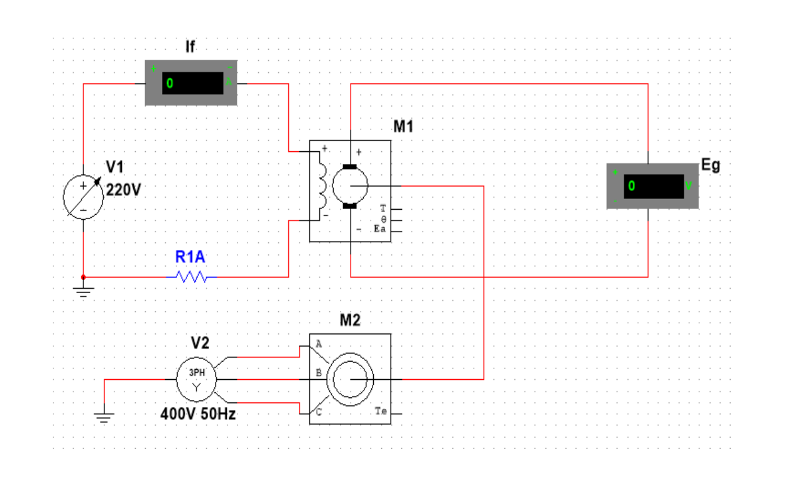

### 3. Governing Equations
$$E_g = \frac{P \Phi Z N}{60 A} = k \Phi \omega$$
When the prime mover drives the generator at a **strictly constant speed** ($N = \text{constant}$):
$$E_g \propto \Phi$$
Since the flux $\Phi$ is produced by ampere-turns of the field winding ($M = N_f I_f$):
*   At low excitation (before saturation): $\Phi \propto I_f \implies E_g \propto I_f$ (Linear line).
*   At high excitation: Iron core saturates; reluctance of iron rises steeply $\implies \Phi$ levels off, causing $E_g$ to plateau.

### 4. Graph & Curve Behavior Analysis

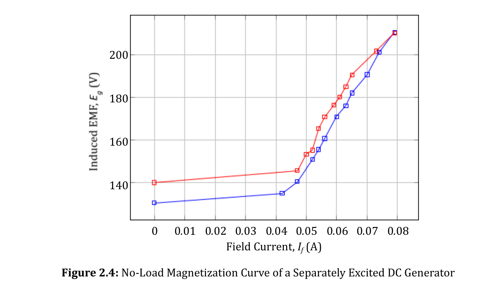

1.  **Residual Voltage ($I_f = 0$):**
    When $I_f = 0$, the induced voltage is NOT zero ($E_g \approx 6\text{V} - 15\text{V}$). This tiny voltage exists because the iron pole shoes retain residual magnetic flux ($\Phi_{\text{res}}$) from previous operation.
2.  **Air Gap Line (Linear Region):**
    From zero to moderate $I_f$, the magnetic path reluctance is dominated by the machine air gap. Because air does not saturate, the graph is a straight line.
3.  **Knee Point & Saturation:**
    Beyond the knee point, the iron of the poles and armature teeth saturates. Further increases in $I_f$ yield negligible extra flux $\Phi$.
4.  **Hysteresis Loop (Increasing vs Decreasing Curve):**
    When reducing $I_f$ back to zero, the decreasing voltage curve lies slightly *above* the ascending curve because of magnetic hysteresis (the core iron retains magnetization).

> [!IMPORTANT]
> **Critical Resistance ($R_c$):** In self-excited machines, the slope of the tangent to the initial linear portion of the OCC curve (the air gap line) represents the **Critical Field Resistance** ($R_c$). If the shunt field resistance exceeds $R_c$, the generator will fail to build up voltage.

---

## Experiment 03: External Characteristics of Self-Excited DC Shunt Generator

### 1. Intuitive Summary in Plain Words
In a self-excited shunt generator, the field coil is connected across its own armature output terminals. As you connect more electrical loads (appliances/resistors), the generator must deliver more load current ($I_L$). This experiment tests: **How stable is the output terminal voltage ($V_T$) as the load draws more current?**

### 2. Circuit Diagram & Setup
The shunt field circuit (in series with a field rheostat) is wired in parallel with the armature. A variable resistor bank acts as load, monitored by load ammeter ($I_L$) and voltmeter ($V_T$).

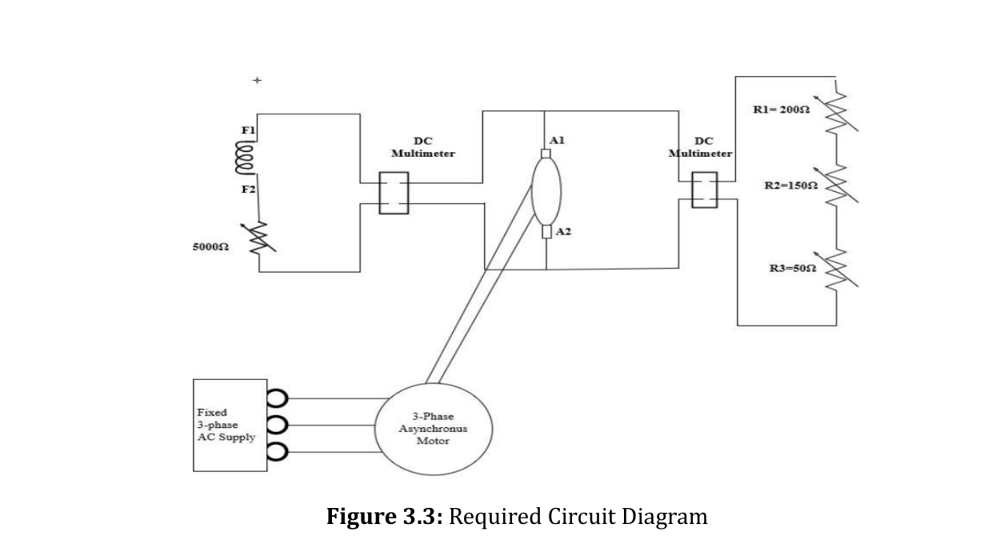

### 3. Governing Equations
$$I_a = I_L + I_f \approx I_L \quad (\text{since } I_f \ll I_L)$$
$$V_T = E_g - I_a R_a$$
$$I_f = \frac{V_T}{R_{sh}}$$

### 4. Graph Analysis & The 3 Causes of Voltage Droop

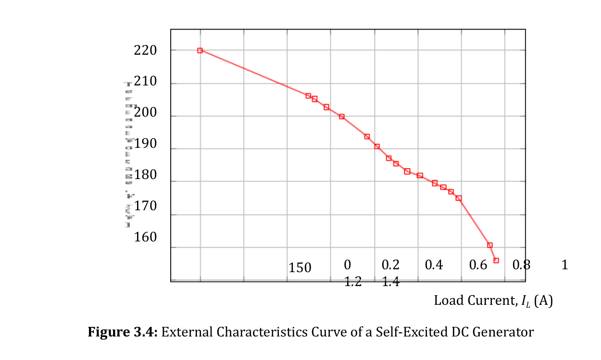

As load current $I_L$ increases from zero to full load, the terminal voltage $V_T$ droops significantly due to **three compounding factors**:
1.  **Armature Resistance Drop ($I_a R_a$):** The armature winding has internal copper resistance ($R_a$). Higher $I_a$ causes higher internal ohmic voltage drop.
2.  **Armature Reaction Demagnetizing Effect:** The current flowing through the armature conductors sets up an armature magnetic field perpendicular to the main field. Due to magnetic saturation at the trailing pole tips, the net working flux $\Phi$ per pole decreases, which lowers the internally generated EMF $E_g$ ($E_g = k \Phi \omega$).
3.  **Cumulative Drop in Field Current ($I_f = V_T / R_{sh}$):** Unlike separately excited machines, the field winding is fed from $V_T$. As $V_T$ drops due to causes (1) and (2), $I_f$ drops simultaneously. A lower $I_f$ weakens the field flux even further, causing a steep compounding fall in $V_T$.

> [!NOTE]
> **Breakdown / Turn-Around Phenomenon:** If the load resistance is reduced beyond a critical minimum, the drop in $V_T$ is so severe that $I_f$ collapses. Both terminal voltage and load current turn back toward zero (the curve hooks back). This acts as a natural partial short-circuit self-protection in shunt generators.

---

## Experiment 04: External Characteristics of DC Compound Generators (Cumulative vs. Differential)

### 1. Intuitive Summary in Plain Words
A pure shunt generator suffers from a dropping terminal voltage when loaded. To solve this, a **Compound Generator** adds a second field winding—the **Series Field** (few turns of thick wire)—connected in series with the load.
*   If the series winding is connected so its flux **adds** to the shunt flux, it is **Cumulative**.
*   If it is connected so its flux **opposes** the shunt flux, it is **Differential**.

### 2. Circuit Diagram & Connections

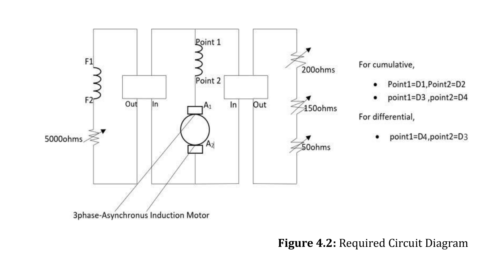

*   **Terminals $D_1 - D_2$ and $D_3 - D_4$:** Represent the series field coil leads. Reversing the series field connections switches the machine between Cumulative and Differential operation.

### 3. Governing Equations
$$\Phi_{\text{net}} = \Phi_{sh} \pm \Phi_{se}$$
*   **Cumulative Compounding:** $\Phi_{\text{net}} = \Phi_{sh} + \Phi_{se} = \Phi_{sh} + c I_a$
*   **Differential Compounding:** $\Phi_{\text{net}} = \Phi_{sh} - \Phi_{se} = \Phi_{sh} - c I_a$
$$V_T = E_g - I_a (R_a + R_{se})$$

### 4. Graph & Performance Comparison

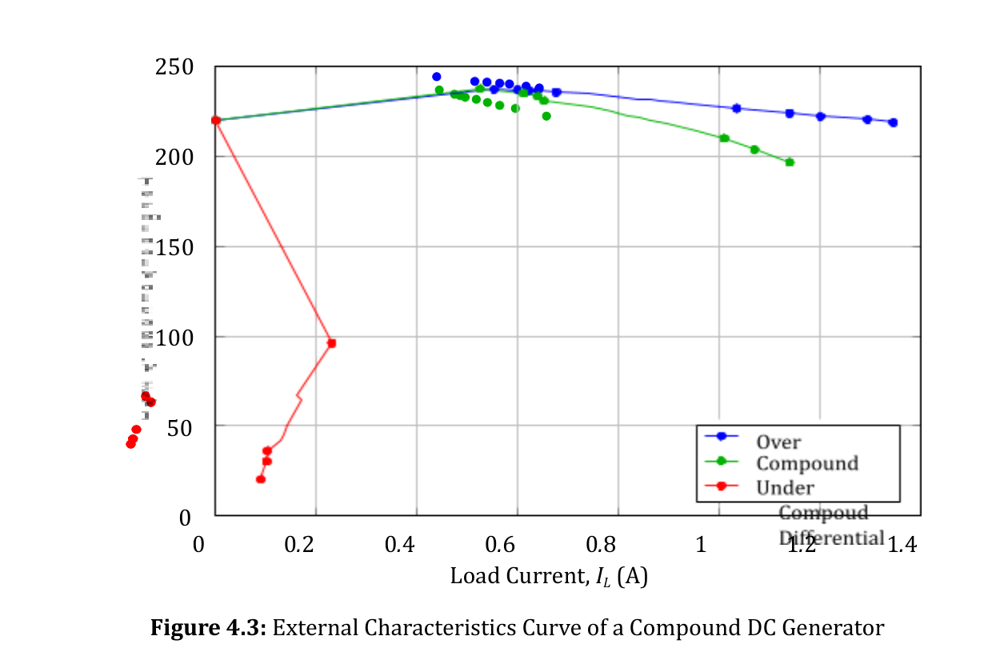

1.  **Over-Compounded (Cumulative):**
    *   Series turns are abundant. At full load, the series boost ($\Phi_{se}$) exceeds the sum of $I_a R_a$ drop and armature reaction.
    *   **$V_{\text{full-load}} > V_{\text{no-load}}$**. Used to compensate for voltage drops along long distribution feeder lines.
2.  **Flat / Level-Compounded (Cumulative):**
    *   Series turns are balanced. Full-load voltage matches no-load voltage (**$V_{\text{full-load}} = V_{\text{no-load}}$**). Ideal for local industrial DC power.
3.  **Under-Compounded (Cumulative):**
    *   Series turns are few. Terminal voltage drops slightly, but droops far less than a standard shunt generator.
4.  **Differential Compound:**
    *   As load current $I_L$ rises, the series field violently subtracts from the shunt field ($\Phi_{\text{net}} \downarrow\downarrow$).
    *   Terminal voltage collapses precipitously to near zero.
    *   **Application:** Constant-current welding generators (where short-circuiting the electrode to workpiece must not burn out the generator).

---

## Experiment 05: Starting of DC Shunt Motor Using a 3-Point Starter

### 1. Intuitive Summary in Plain Words
When a motor is standing still, its armature is just a bundle of thick copper wire with almost zero electrical resistance ($R_a \approx 0.5 - 1.5\ \Omega$). If you directly switch on a $220\text{V}$ line, hundreds of amperes would surge into the rotor, causing melted coils, burned commutator bars, blown fuses, and violent mechanical stress. A **3-point starter** temporarily inserts a protective resistor ladder during starting and cuts it out as the motor picks up speed.

### 2. Circuit Diagram & Working Mechanism

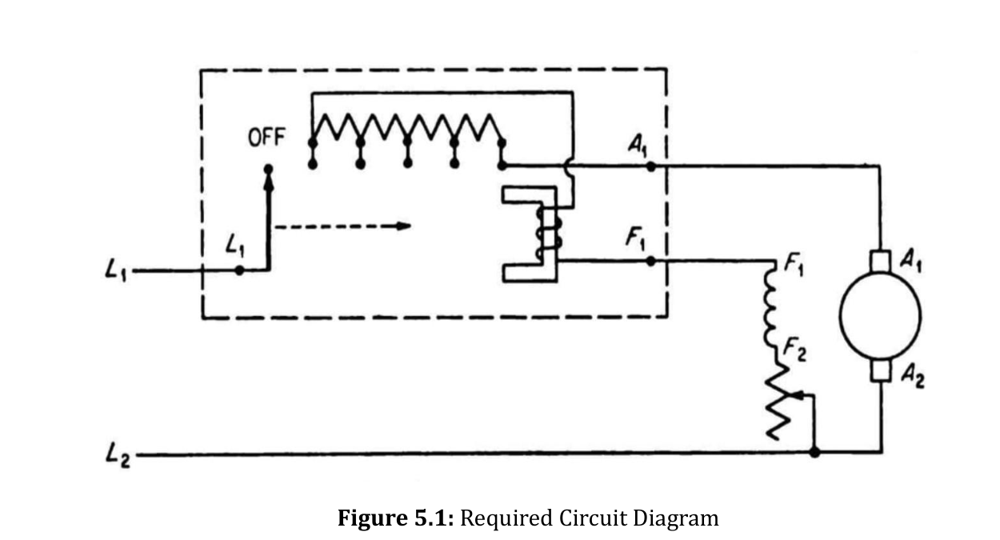

*   **The 3 Terminals:**
    *   **L (Line):** Connected to positive incoming DC power supply line.
    *   **A (Armature):** Connected to the motor armature winding.
    *   **F (Field):** Connected to the motor shunt field winding.

### 3. Governing Theory & Formulas
The armature current of a DC motor is:
$$I_a = \frac{V - E_b}{R_a}$$
Where $E_b$ is the **Back EMF** (counter-electromotive force) induced by rotation:
$$E_b = k \Phi N$$
*   **At Starting Instant ($N = 0$):**
    $$E_b = 0 \implies I_{a,\text{start}} = \frac{V}{R_a} = \frac{220\text{ V}}{1\ \Omega} = 220\text{ A} \quad (15\times \text{ to } 20\times \text{ rated current!})$$
*   **With 3-Point Starter ($R_{\text{start}}$ in series):**
    $$I_{a,\text{start}} = \frac{V}{R_a + R_{\text{start}}} \le 1.5 \times I_{\text{rated}}$$
*   **Running Condition:** As motor speeds up, $E_b$ climbs towards $V$. The starter handle is moved step-by-step from Stud 1 to the final RUN stud, cutting out $R_{\text{start}}$ completely once $E_b$ is large enough to self-regulate current.

### 4. Protective Components Inside Starter
1.  **No-Volt Coil (NVC) / Hold-on Coil:**
    *   An electromagnet wired in series with the shunt field winding.
    *   In the RUN position, the soft iron handle keeper is held tight against the NVC against the tension of a spiral return spring.
    *   *If supply fails or field wire snaps:* NVC loses its magnetism. The return spring immediately snaps the handle back to the OFF position, preventing the motor from restarting unassisted when voltage returns.
2.  **Overload Release Coil (OLR):**
    *   An electromagnet wired in series with the main incoming Line (L).
    *   If motor experiences excessive mechanical overload ($I_a \uparrow$), the magnetic pull of the OLR lifts a small iron triangle that short-circuits the two terminals of the NVC.
    *   Shorting the NVC de-energizes it, releasing the handle back to OFF to save the motor from burnout.

---

## Experiment 06: Speed Control of DC Shunt Motor (Armature vs. Field Control)

### 1. Intuitive Summary in Plain Words
A major advantage of DC motors is their flexible, smooth speed control. We can control motor speed by either:
1.  Choking the voltage delivered to the armature using a series resistor (**Armature Control** $\to$ for speeds *below* normal base speed).
2.  Weakening the magnetic field flux using a field rheostat (**Field Control** $\to$ for speeds *above* normal base speed).

### 2. Circuit Diagram & Setup

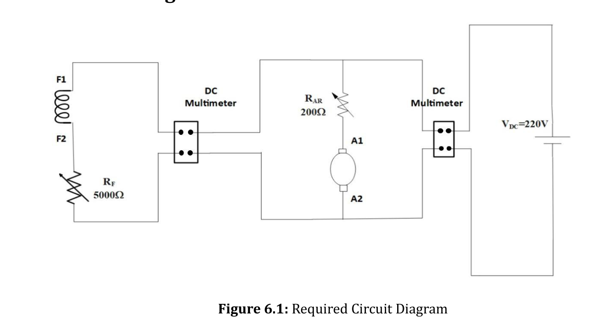

### 3. Governing Equation
From voltage balance: $V = E_b + I_a R_a \implies E_b = V - I_a R_a = k \Phi N$
Rearranging for rotational speed $N$:
$$N = \frac{V - I_a R_a}{k \Phi}$$

### 4. Comparison of the Two Control Methods

#### Method A: Armature Resistance Control (Rheostatic Control)
*   **How it works:** An external rheostat $R_{\text{ext}}$ is placed in series with the armature:
    $$N = \frac{V - I_a (R_a + R_{\text{ext}})}{k \Phi}$$
*   **Speed Range:** As $R_{\text{ext}}$ increases, the voltage drop across the armature increases, leaving less voltage for the armature. Speed **decreases below rated speed (Sub-rated speeds)**.
*   **Limitation:** Very wasteful. The full armature current passes through $R_{\text{ext}}$, causing heavy heat dissipation ($I_a^2 R_{\text{ext}}$ losses). Speed regulation is poor under varying loads.

#### Method B: Field Flux Control (Field Rheostat Control)
*   **How it works:** A variable rheostat $R_f$ is placed in series with the shunt field winding:
    $$I_f = \frac{V}{R_{sh} + R_f} \implies \Phi \propto I_f$$
*   **Speed Range:** As $R_f$ increases, $I_f$ decreases, which **weakens the field flux $\Phi$**.
*   **Why does speed INCREASE when field weakens?**
    $$\text{When } \Phi \downarrow \implies E_b = k\Phi N \text{ drops temporarily} \implies I_a = \frac{V - E_b}{R_a} \text{ surges dramatically!}$$
    The surge in $I_a$ overcompensates for the drop in $\Phi$, producing excess accelerating torque ($\tau = k \Phi I_a$). The rotor accelerates until back EMF rises to rebalance current. Thus, speed **rises above rated speed (Super-rated speeds)**.
*   **Advantage:** Highly energy efficient because field current is small ($<5\%$ of total motor current), resulting in negligible $I_f^2 R_f$ heat loss.

### 5. Measured Characteristic Curves

| Field Control Curve ($N$ vs. $I_f$) | Armature Control Curve ($N$ vs. $I_a$) |
| :---: | :---: |
| 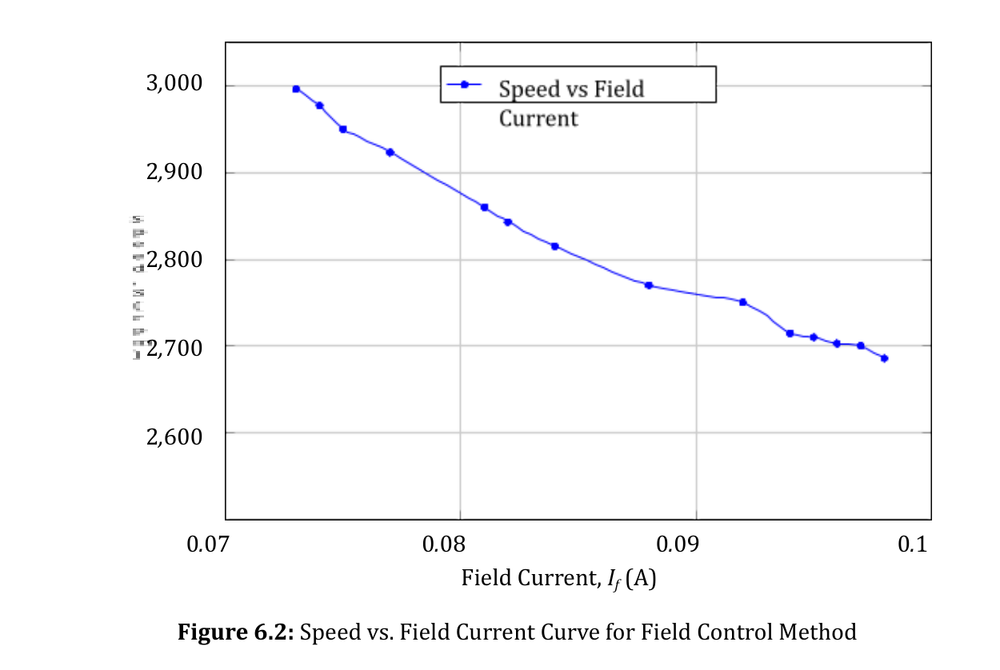 | 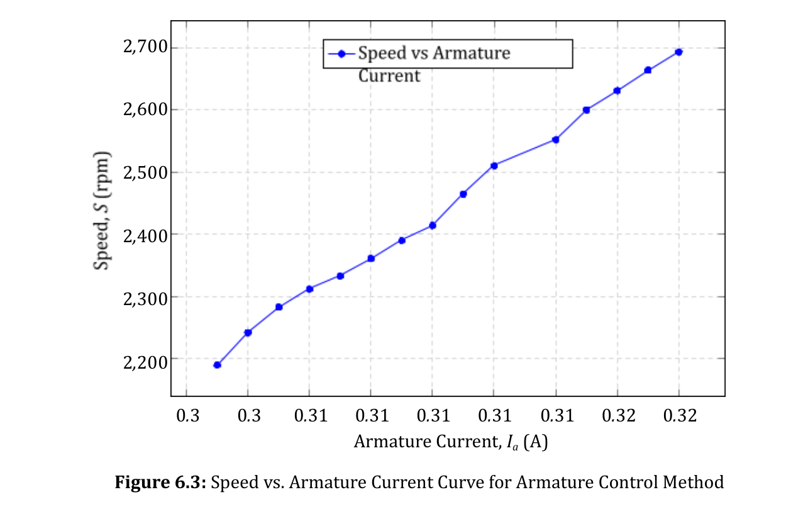 |
| As field current $I_f$ drops, speed $N$ climbs exponentially upwards ($N \propto 1/\Phi$). | Increasing armature resistance drops available voltage, drooping speed downwards. |

> [!CAUTION]
> **Field Runaway Danger:** Never open the field circuit of an unloaded DC shunt motor while running! If $I_f \to 0$, the flux drops to residual values ($\Phi \to \Phi_{\text{res}} \approx 0$). The motor will accelerate to extremely high speeds ($N \to \infty$), causing the rotor to tear itself apart by centrifugal force.

---

## Experiment 07: Torque & Speed Characteristics of DC Motors (Shunt, Cumulative, Differential)

### 1. Intuitive Summary in Plain Words
Every motor responds differently when a heavy mechanical drag (load torque) is applied to its shaft:
*   Does it maintain a steady speed (like a precision lathe machine)?
*   Does it slow down smoothly while delivering massive twisting force (like an elevator or crusher)?
*   Does it become unstable and dangerously race out of control?

### 2. Experimental Setup & Circuit Diagram
A mechanical load is applied to the motor shaft via an **Eddy Current Dynamometer**, allowing precise measurement of mechanical torque $\tau$ (in $\text{kg}\cdot\text{m}$) and rotational speed $N$ (in $\text{rpm}$) at varying armature currents $I_a$.

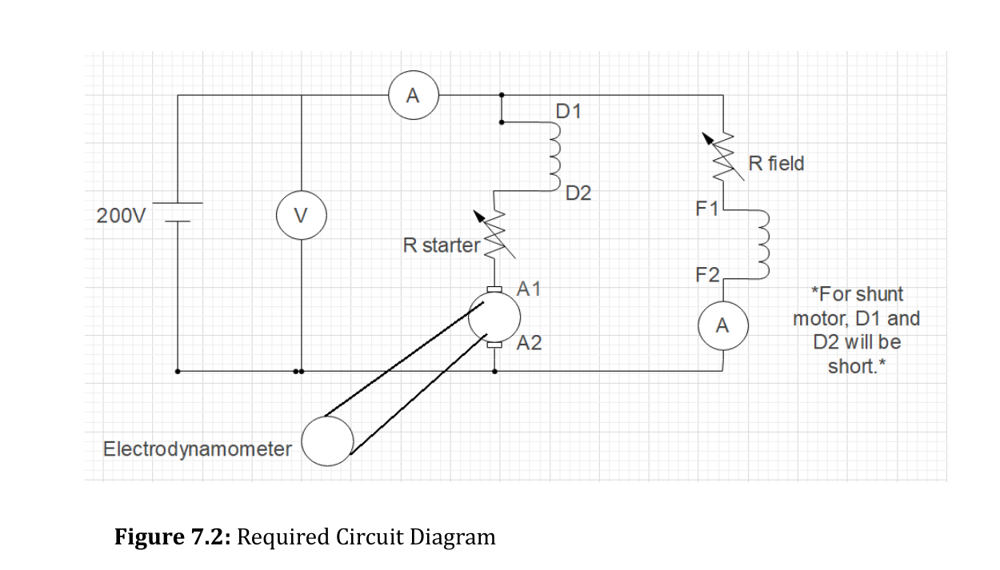

### 3. Governing Equations
$$\tau = k \Phi I_a, \quad N = \frac{V - I_a R_a}{k \Phi}$$

### 4. Graph & Performance Analysis

| Torque vs. Armature Current ($\tau$ vs. $I_a$) | Speed vs. Armature Current ($N$ vs. $I_a$) |
| :---: | :---: |
| 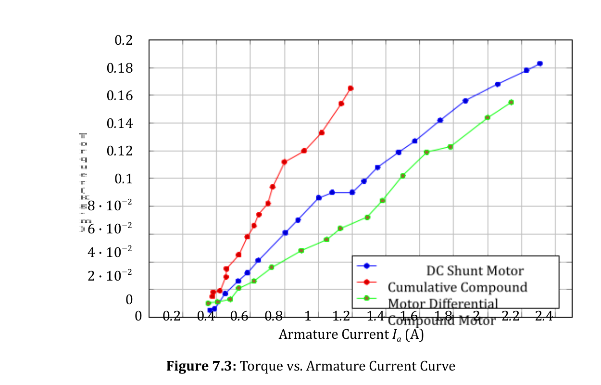 | 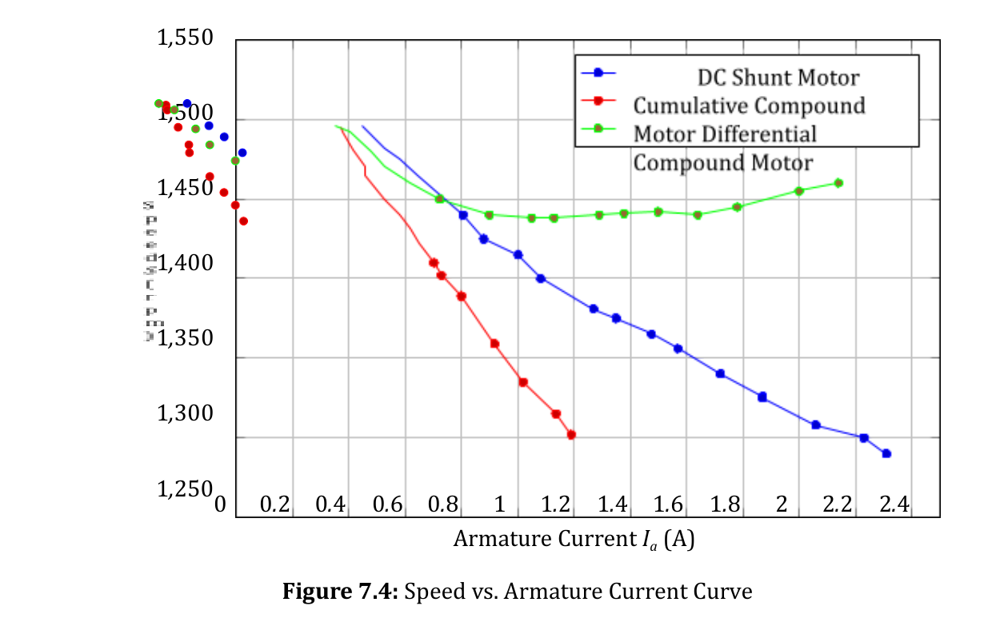 |

#### Detailed Machine Behavior Comparison:

1.  **DC Shunt Motor ($\Phi \approx \text{Constant}$):**
    *   *Torque ($\tau \propto I_a$):* A pure straight line. Torque is directly proportional to armature current.
    *   *Speed Characteristic:* Nearly flat curve. Speed drops by only $5\% - 8\%$ from no-load to full-load due to small $I_a R_a$ voltage drop. Known as a **"Constant Speed Motor"**.
    *   *Applications:* Lathes, centrifugal pumps, machine tools, blowers, conveyors.
2.  **Cumulative Compound Motor ($\Phi = \Phi_{sh} + c I_a$):**
    *   *Torque:* Curves upwards! Because flux increases with load current, at high $I_a$ it develops significantly higher starting torque than a shunt motor.
    *   *Speed Characteristic:* Droops more sharply than shunt motor because flux increases as load increases ($N \propto 1/\Phi$).
    *   *Major Advantage:* High torque on heavy loads without the danger of runaway at zero load (the shunt field ensures a finite safe no-load speed).
    *   *Applications:* Rolling mills, punch presses, elevators, metal shears, heavy hoists.
3.  **Differential Compound Motor ($\Phi = \Phi_{sh} - c I_a$):**
    *   *Torque:* Flattened or droops at high current because the series field cancels the main field.
    *   *Speed Characteristic:* **Speed actually RISES with increasing load!** Because the demagnetizing series flux weakens net field $\Phi$ faster than $I_a R_a$ drops, $N$ accelerates upward under load.
    *   *Danger:* Highly unstable. Under heavy overload, it can stall, reverse direction, or run away dangerously. Rarely used in industry.

---

## Experiment 08: Transformer Parameter Determination (Open Circuit & Short Circuit Tests)

### 1. Intuitive Summary in Plain Words
To predict how a transformer will behave (its efficiency and voltage regulation at any load) without actually loading it with hundreds of kilowatts of power, we perform two simple, low-power non-destructive bench tests:
1.  **Open Circuit (OC) Test:** Finds core iron losses ($P_c$) and magnetizing branch parameters ($R_c, X_m$).
2.  **Short Circuit (SC) Test:** Finds full-load copper losses ($P_{cu}$) and equivalent series impedance ($R_{eq}, X_{eq}$).

### 2. Circuit Diagrams

| Short Circuit (SC) Test Circuit | Open Circuit (OC) Test Circuit |
| :---: | :---: |
| 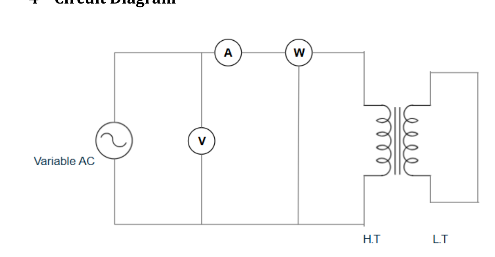 | 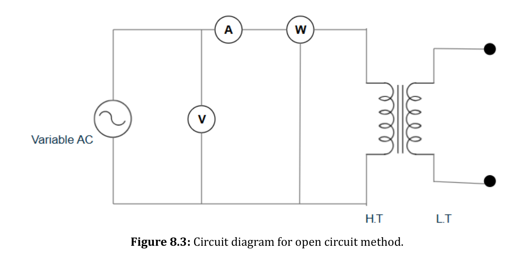 |
| LV side shorted with thick wire; low variable voltage applied to HV side. | HV side left completely open; rated voltage applied to LV side. |

### 3. Open Circuit (OC) Test / No-Load Test Theory

*   **Setup:** Rated voltage $V_0$ applied to LV winding; HV winding is left open.
*   **Physics:** Since the secondary is open, the transformer draws only a small **no-load current** $I_0$ ($2\%-5\%$ of rated). 
    *   Because $I_0$ is tiny, the copper loss ($I_0^2 R_1 \approx 0$) is negligible.
    *   The wattmeter reading $W_0$ measures almost exclusively the **Core Iron Losses** ($P_{\text{core}} = P_{\text{hysteresis}} + P_{\text{eddy}}$).
*   **Formulas & Calculations:**
    $$\text{No-load power factor: } \cos\theta_0 = \frac{W_0}{V_0 I_0}$$
    $$\text{Core-loss current component: } I_c = I_w = I_0 \cos\theta_0$$
    $$\text{Magnetizing current component: } I_m = I_0 \sin\theta_0 = \sqrt{I_0^2 - I_c^2}$$
    $$\text{Core loss resistance: } R_c = \frac{V_0}{I_c} = \frac{V_0^2}{W_0}$$
    $$\text{Magnetizing reactance: } X_m = \frac{V_0}{I_m}$$
    *(Or using Admittance method: $|Y_0| = I_0 / V_0$, Conductance $G_0 = W_0 / V_0^2$, Susceptance $B_0 = \sqrt{Y_0^2 - G_0^2}$, where $R_c = 1/G_0$ and $X_m = 1/B_0$)*.

### 4. Short Circuit (SC) Test Theory

*   **Setup:** LV winding is short-circuited with a thick conductor; a very low variable AC voltage ($5\% - 10\%$ of rated) is applied to HV winding until rated full-load current flows ($I_{sc} = I_{\text{rated}}$).
*   **Physics:** Because the applied voltage $V_{sc}$ is very small, the core magnetic flux is tiny ($\Phi \propto V$). 
    *   Core losses are proportional to $V^2$, making iron losses completely negligible during this test.
    *   The wattmeter reading $W_{sc}$ measures the **Full-Load Copper Losses** ($P_{cu} = I_{sc}^2 R_{eq}$).
*   **Formulas & Calculations:**
    $$\text{Equivalent series impedance: } Z_{eq} = \frac{V_{sc}}{I_{sc}}$$
    $$\text{Equivalent series resistance: } R_{eq} = R_s = \frac{W_{sc}}{I_{sc}^2}$$
    $$\text{Equivalent series reactance: } X_{eq} = X_s = \sqrt{Z_{eq}^2 - R_{eq}^2}$$
    $$\text{Short circuit power factor: } \cos\theta_{sc} = \frac{W_{sc}}{V_{sc} I_{sc}}$$

> [!TIP]
> **Why test on LV for OC and HV for SC?**
> *   *OC on LV:* Rated LV voltage is safe and readily available in the lab (e.g. 230V). No-load current on LV is large enough to read reliably on standard ammeters.
> *   *SC on HV:* Rated current on the HV side is lower, meaning the lab variac and ammeters don't need to carry excessive current. A tiny voltage (e.g. 15–20V) is easily adjusted to establish rated current safely.

---

## Experiment 09: Determination of Voltage Regulation of Single-Phase Transformer for Different Kinds of Loads

### 1. Intuitive Summary in Plain Words
When a transformer is supplying power, internal resistance ($R_{eq}$) and leakage reactance ($X_{eq}$) cause internal voltage drops. **Voltage Regulation (VR)** quantifies how much the secondary terminal voltage drops when you transition from zero load to full load. The type of load connected (Resistor, Inductor, or Capacitor) dramatically changes whether the voltage drops or even *rises*!

### 2. Circuit Diagram & Setup

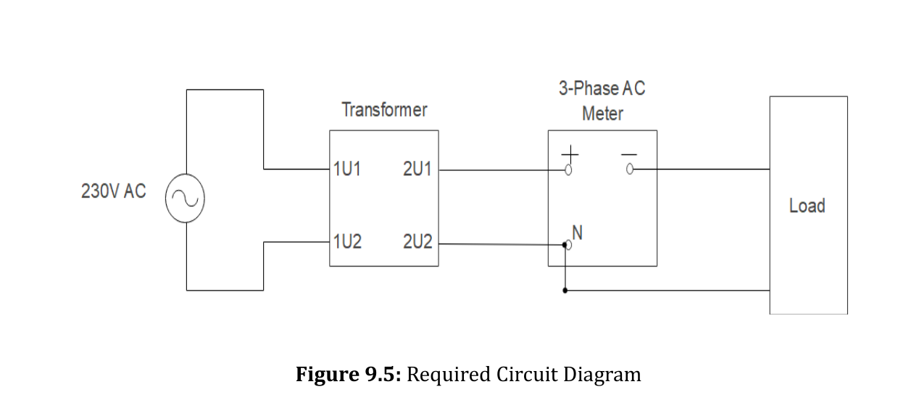

*   The secondary side is connected to three switchable load banks:
    1.  **Resistive Load ($R$):** Pure heating/lighting element ($\text{PF} = 1.0$).
    2.  **Inductive Load ($L$):** Choke coils / motors (Lagging PF).
    3.  **Capacitive Load ($C$):** Capacitor banks (Leading PF).

### 3. Governing Formulas
$$\text{Voltage Regulation (\%VR)} = \frac{V_{2,\text{no-load}} - V_{2,\text{full-load}}}{V_{2,\text{full-load}}} \times 100\% = \frac{E_2 - V_s}{V_s} \times 100\%$$
Using approximate equivalent circuit phasor projection:
$$E_2 \approx V_s + I_s R_{eq} \cos\phi \pm I_s X_{eq} \sin\phi$$
*   **$+$ sign:** for **Lagging** Power Factor (Inductive load).
*   **$-$ sign:** for **Leading** Power Factor (Capacitive load).

### 4. Graph & Load Performance Analysis

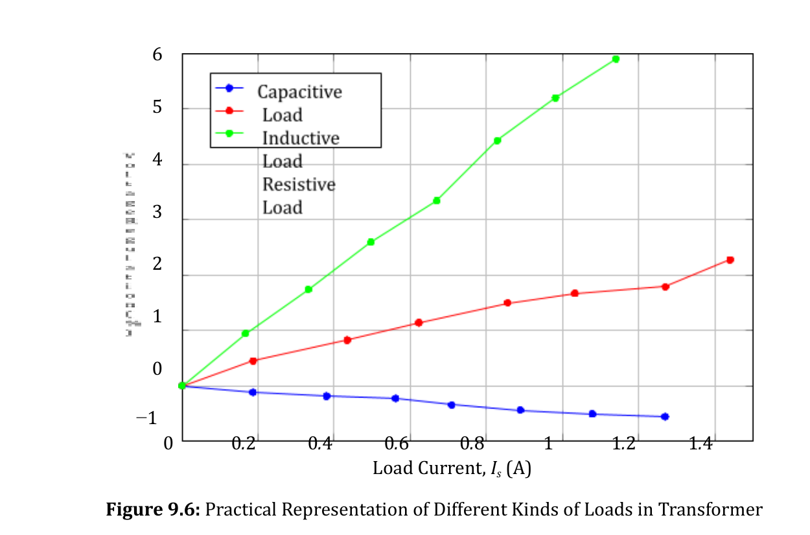

1.  **Inductive Load (Lagging PF — Lower Curve):**
    *   Both the resistance drop ($I R_{eq} \cos\phi$) and leakage reactance drop ($I X_{eq} \sin\phi$) add constructively in phase.
    *   Secondary terminal voltage $V_s$ drops steeply as load current $I_s$ increases.
    *   **$\%VR$ is large and positive** (worst regulation).
2.  **Resistive Load (Unity PF — Middle Curve):**
    *   $\cos\phi = 1, \sin\phi = 0$. The primary drop is purely ohmic ($I R_{eq}$).
    *   Voltage drops moderately with load.
    *   **$\%VR$ is small and positive** (typically $2\% - 5\%$).
3.  **Capacitive Load (Leading PF — Upper Curve):**
    *   Because current leads voltage by $90^\circ$, the current through the internal leakage inductance produces a voltage component that is **in-phase with the terminal voltage** (partial resonance / Ferranti-like effect).
    *   As load current increases, the terminal voltage $V_s$ can actually **RISE above the no-load voltage** ($V_s > E_2$)!
    *   **$\%VR$ becomes NEGATIVE**.

---

## Experiment 10: Construction of Three-Phase Transformer using Two Single-Phase Transformers (Open-Delta / V-V Connection)

### 1. Intuitive Summary in Plain Words
Imagine an industrial plant running on a 3-phase Delta-Delta ($\Delta-\Delta$) bank of three single-phase transformers. Suddenly, one transformer blows a winding or is taken offline for maintenance. Do you have to shut down the entire factory?
**No!** You can remove the damaged unit, leave the remaining two transformers connected in **Open-Delta ($V-V$)**, and continue delivering balanced 3-phase power, albeit at a reduced power capacity ($57.7\%$).

### 2. Circuit Diagram

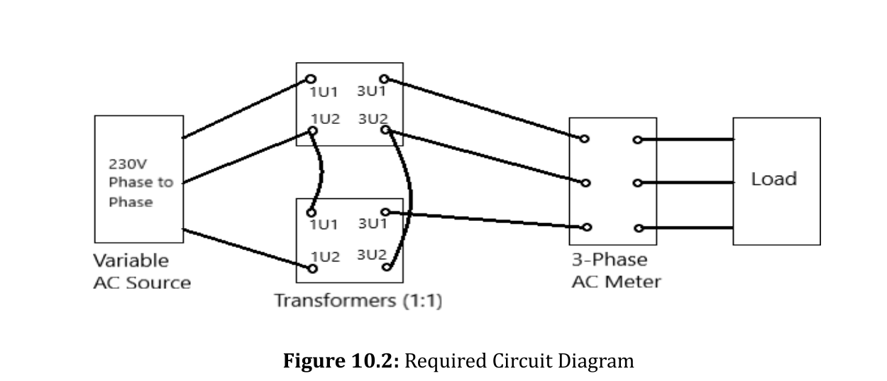

### 3. Governing Theory & Mathematical Derivations

#### A. Closed Delta ($\Delta-\Delta$) Bank Capacity
With 3 identical transformers, each rated at voltage $V$ and current $I$:
*   Line voltage: $V_L = V_{ph} = V$
*   Line current: $I_L = \sqrt{3} I_{ph} = \sqrt{3} I$
*   Total 3-phase apparent power:
    $$S_{\Delta-\Delta} = \sqrt{3} V_L I_L = \sqrt{3} \times V \times (\sqrt{3} I) = 3 V I$$

#### B. Open Delta ($V-V$) Bank Capacity
When one transformer is removed:
*   The open delta still provides balanced line voltages: $V_{ab}, V_{bc}, V_{ca}$.
*   However, each of the two remaining transformer windings is now directly in series with a supply line.
*   Therefore, the maximum winding current is strictly limited to line current without overload:
    $$I_{\text{winding}} = I_L = I$$
*   Total 3-phase apparent power delivered by the V-V bank:
    $$S_{V-V} = \sqrt{3} V_L I_L = \sqrt{3} V I$$

#### C. The Two Fundamental Capacity Ratios

1.  **Ratio of V-V capacity to original Closed Delta capacity:**
    $$\frac{S_{V-V}}{S_{\Delta-\Delta}} = \frac{\sqrt{3} V I}{3 V I} = \frac{1}{\sqrt{3}} \approx 0.577 = \mathbf{57.7\%}$$
    *(The open delta delivers $57.7\%$ of the power of the original 3-transformer bank).*

2.  **Ratio of V-V capacity to installed capacity of the TWO transformers:**
    The two transformers have a combined nameplate rating of $2 \times V I = 2 V I$.
    $$\text{Utilization Factor} = \frac{S_{V-V}}{2 V I} = \frac{\sqrt{3} V I}{2 V I} = \frac{\sqrt{3}}{2} \approx 0.866 = \mathbf{86.6\%}$$
    *(The two transformers can only be operated up to $86.6\%$ of their combined nameplate capacity before their windings overheat, because of internal $30^\circ$ phase angle displacement between winding current and voltage).*

### 4. Experimental Power Calculations
In the laboratory:
$$P_{\text{closed}} = V_{ab} I_a + V_{bc} I_b + V_{ca} I_c$$
$$P_{\text{open}} = \sum P_{\text{measured}}$$
$$\text{Experimental Ratio} = \frac{P_{\text{open}}}{P_{\text{closed}}} \times 100\% \approx 57.7\%$$

---

## Master Viva Voce & Conceptual Exam Review

> [!TIP]
> Use these rapid-fire Q&As to test your conceptual understanding before lab exams and vivas.

1.  **Q: Why doesn't a DC generator build up voltage if residual magnetism is lost?**  
    *A:* Voltage buildup is a positive-feedback bootstrap process: Residual flux induces a tiny voltage $\to$ sends a tiny current through field coil $\to$ strengthens field flux $\to$ induces higher voltage. If residual flux is zero, initial induced EMF is zero, field current is zero, and buildup never starts. (Fixed by "field flashing" — momentarily connecting a battery across field).
2.  **Q: What is the significance of the knee point on the OCC curve?**  
    *A:* It marks the transition from unsaturated to magnetically saturated iron. Generators are designed to operate slightly above the knee point so that slight variations in engine speed or field current do not cause wildly fluctuating terminal voltage.
3.  **Q: Why is the voltage regulation of a transformer negative for capacitive load?**  
    *A:* Leading current through leakage reactance produces a voltage phasor that is in phase with the secondary terminal voltage, causing $V_{\text{terminal}}$ to rise above no-load induced EMF ($E_2$).
4.  **Q: Why is the efficiency of a transformer higher than any rotating machine?**  
    *A:* A transformer is completely static—it has zero friction losses and zero windage/bearing losses.
5.  **Q: Why should a DC shunt motor never be started without field excitation?**  
    *A:* With $\Phi \approx 0$, back EMF cannot develop ($E_b = k\Phi N \approx 0$). The motor attempts to accelerate towards infinite runaway speed ($N \propto 1/\Phi$) while simultaneously drawing massive destructive starting current.
6.  **Q: Why are core losses considered constant while copper losses are variable?**  
    *A:* Core losses depend directly on magnetic flux and voltage ($P_c \propto V^2$), which are constant under standard grid operation. Copper losses depend on the square of load current ($I^2 R$), which varies dynamically with the connected electrical load.
7.  **Q: In an Open-Delta (V-V) bank, why is the utilization factor only $86.6\%$ instead of $100\%$?**  
    *A:* Because of the open phase, the current and voltage in each transformer are shifted by $30^\circ$ out of phase even when feeding a unity power factor load. Each unit operates at $\cos(30^\circ) = \frac{\sqrt{3}}{2} \approx 0.866$ power factor.
