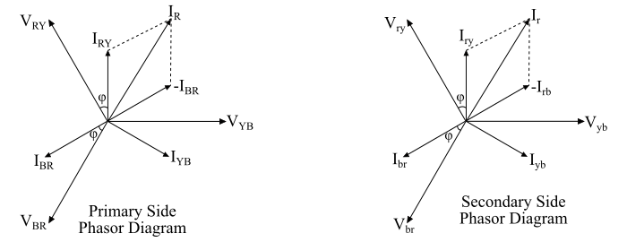
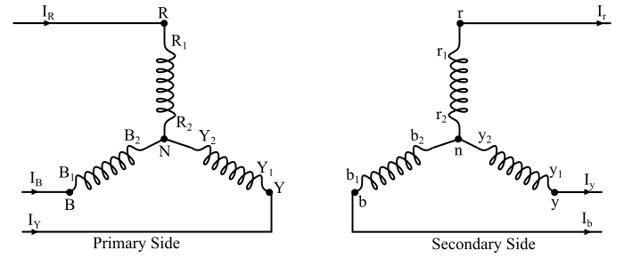
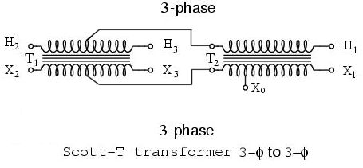
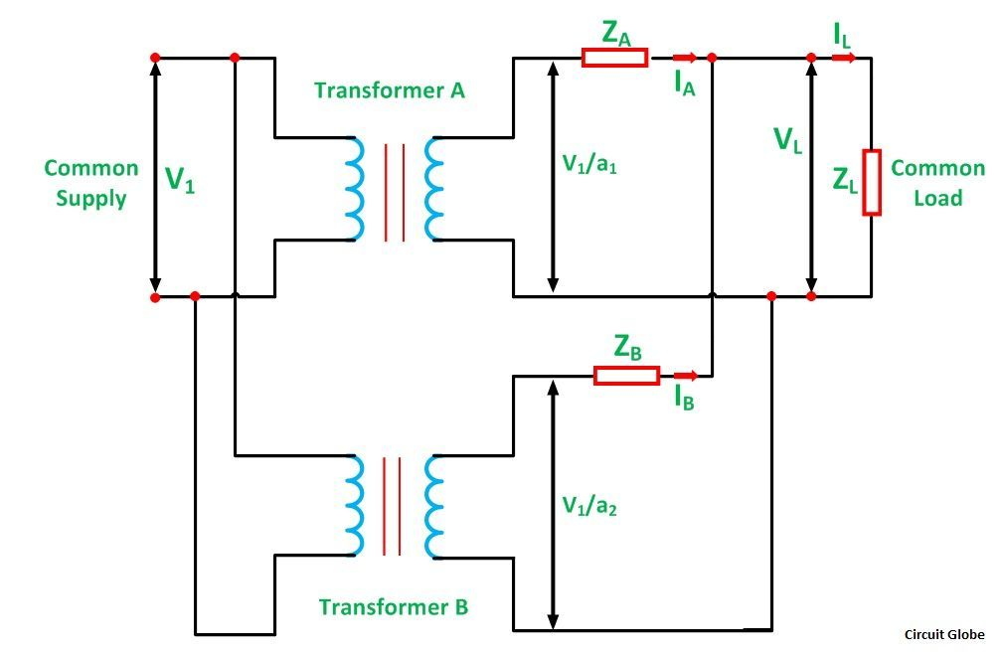

# Electrical Machine I Sessional (EEE 2208) — Master Laboratory & Board Viva Study Notes

> **Course:** EEE 2208 — Electrical Machine I Sessional  
> **Institution:** Department of Electrical & Electronic Engineering, Rajshahi University of Engineering & Technology (RUET)  
> **Course Teachers:** Md. Ruhul Amin Sir (Ratul Sir), Md. Shafiqul Islam Sir  
> **Credit:** 1.50 | **Total Marks:** 100  
> **Evaluation Rubric:** Lab Performance (40%) + Lab Report (20%) + Lab Final (20%) + Lab Viva (20%)  
> **Core Focus:** DC Generators & Motors (Construction, Windings, OCC, External Characteristics, 3-Point/4-Point Starting, Rheostatic/Field Speed Control, Compounding) and Transformers (OC/SC Parameter Extraction, Voltage Regulation for R-L-C Loads, Balanced Three-Phase $\Delta-\Delta$ and $Y-Y$ Banks, Open-Delta / $V-V$ Transformation, Instrument Transformers).

---

## Quick Navigation Table

| Exp # | Experiment Title | Core Focus / Concept | Key Formulas & Governing Relations |
| :---: | :--- | :--- | :--- |
| **01** | [Study & Ratings of DC Machines & Transformers](#exp-01) | Nameplate data, Stator vs Rotor, Commutator, Lap vs Wave, Fleming's rules | $E_g = \frac{P\Phi Z N}{60 A}$, $\tau = k\Phi I_a$, $A_{\text{lap}}=mP$, $A_{\text{wave}}=2m$ |
| **02** | [No-Load Magnetization Curve (OCC) of Separately Excited DC Generator](#exp-02) | Magnetic saturation, residual flux, critical resistance ($R_c$) & speed ($N_c$), 5 build-up conditions | $E_g \propto \Phi \propto I_f$ (pre-saturation), $R_f < R_c$, $N > N_c$ |
| **03** | [External Characteristics of Self-Excited DC Shunt Generator](#exp-03) | Voltage droop under load (4 causes), breakdown/turn-around point | $V_T = E_g - I_a R_a$, $I_f = V_T / R_{sh}$, $\%VR = \frac{V_{NL}-V_{FL}}{V_{FL}}\times 100$ |
| **04** | [External Characteristics of DC Compound Generators](#exp-04) | Cumulative (Over, Flat, Under) vs Differential, negative regulation, arc welding | $\Phi_{\text{net}} = \Phi_{sh} \pm \Phi_{se}$, $V_T = E_g - I_a(R_a + R_{se})$ |
| **05** | [Starting of DC Shunt Motor using 3-Point & 4-Point Starters](#exp-05) | Inrush current limitation, NVC & OLR coils, 3-point vs 4-point design difference | $I_{a,\text{start}} = \frac{V}{R_a} \gg I_{\text{rated}}$, $I_a = \frac{V - E_b}{R_a + R_{\text{start}}}$ |
| **06** | [Speed Control of DC Shunt Motor](#exp-06) | Armature resistance ($<N_{\text{base}}$) vs Field flux control ($>N_{\text{base}}$), physical acceleration mechanism | $N = \frac{V - I_a R_a}{k\Phi}$, $\Phi \downarrow \implies E_b \downarrow \implies I_a \uparrow\uparrow \implies N \uparrow$ |
| **07** | [Torque & Speed Characteristics of DC Motors](#exp-07) | Shunt, Series, Cumulative & Differential motor performance, negative speed regulation | $\tau = k\Phi I_a$, $\tau_{\text{series}} \propto I_a^2$, differential speed rises with load |
| **08** | [Transformer Parameter Determination (OC & SC Tests)](#exp-08) | Core loss via OC (LV side), Copper loss via SC (HV side), equivalent circuit parameters | $R_c = \frac{V_0^2}{W_0}$, $X_m = \frac{V_0}{I_m}$, $R_{eq} = \frac{W_{sc}}{I_{sc}^2}$, $X_{eq} = \sqrt{Z_{eq}^2 - R_{eq}^2}$ |
| **09** | [Voltage Regulation for Different Load Types](#exp-09) | Resistive (unity PF), Inductive (lagging PF), Capacitive (leading PF & negative VR) | $E_2 \approx V_s + I_s R_{eq}\cos\phi \pm I_s X_{eq}\sin\phi$ ($+$ lag, $-$ lead) |
| **10** | [Balanced Three-Phase Transformer with Delta-Delta ($\Delta-\Delta$) Connection](#exp-10) | Closed-delta bank, circulating 3rd harmonics, unbalanced load capability | $V_L = V_{ph}$, $I_L = \sqrt{3} I_{ph}$, Phase shift = $0^\circ$, $S_{\Delta-\Delta} = 3VI$ |
| **11** | [Balanced Three-Phase Transformer with Star-Star (Y-Y) Connection](#exp-11) | Neutral grounding, 3rd harmonic distortion, floating neutral, high-voltage economy | $V_L = \sqrt{3} V_{ph}$, $I_L = I_{ph}$, Phase shift = $0^\circ$, $V_{ph} = V_L / \sqrt{3}$ |
| **12** | [Construction of Three-Phase Transformer using Two Single-Phase Transformers (Open-Delta / V-V)](#exp-12) | Emergency 3-phase supply using 2 units, 57.7% bank capacity, 86.6% utilization factor | $\frac{S_{V-V}}{S_{\Delta-\Delta}} = \frac{1}{\sqrt{3}} \approx 57.7\%$, $\frac{S_{V-V}}{2VI} = \frac{\sqrt{3}}{2} \approx 86.6\%$ |
| **—** | [Supplemental High-Yield Machine Concepts](#supplemental-concepts) | Scott Connection, Parallel Operation, Universal Motor, Instrument Transformers (CT/PT) | 3-Phase to 2-Phase conversion, CT open secondary hazard, Alternator construction |
| **—** | [Comprehensive Board Viva Voce & Quiz Master Bank](#master-viva-voce) | 42 Categorized rapid-fire interview questions, derivations, and tricky examiner checks | Grouped across DC machines, starters, transformers, and AC principles |

---

## Experiment 01: Introduction & Study of DC Machines & Transformers (Observation of Ratings & Construction)

### 1. Intuitive Summary in Plain Words
Every electrical machine carries a nameplate that defines its safe thermal, electrical, and mechanical boundaries. Operating beyond these ratings causes winding overheating, insulation degradation, brush sparking, or shaft mechanical failure. This lab introduces physical parts (stator, rotor, commutator, brushes, core laminations) and clarifies why lap and wave windings are selected for specific voltage/current duties.

### 2. Physical Construction & Operating Principles

#### A. DC Machines (Generators & Motors)
*   **Operating Principles:**
    *   **Generator Action (Faraday's Law of Induction):** When an armature conductor moves across a magnetic field, it cuts flux lines and induces an EMF:
        $$e = B \ell v \sin\theta \implies E_g = \frac{P \Phi Z N}{60 A}$$
        *Direction of induced EMF/current:* Given by **Fleming's Right-Hand Rule** (Thumb = Motion, Forefinger = Magnetic Field $B$, Middle finger = Induced Current $I$).
    *   **Motor Action (Lorentz Force):** When current flows through an armature conductor placed within a magnetic field, it experiences mechanical force:
        $$F = B I \ell \sin\theta \implies \tau = \frac{P \Phi Z I_a}{2 \pi A} = k \Phi I_a$$
        *Direction of force/motion:* Given by **Fleming's Left-Hand Rule** (Thumb = Force/Thrust, Forefinger = Magnetic Field $B$, Middle finger = Current $I$).
    *   **Back EMF ($E_b$):** By **Lenz's Law**, as the motor armature rotates, conductors cut the main field flux, inducing a counter-EMF ($E_b = k \Phi N$) that opposes the applied terminal voltage $V$. Back EMF acts as an automatic governor that regulates armature current to match shaft load.

*   **Essential Components:**
    1.  **Stator (Stationary Frame):**
        *   *Yoke (Frame):* Cast iron (small machines) or cast steel (large machines). Protects internal parts and provides the return path for magnetic flux.
        *   *Main Field Poles & Pole Shoes:* Laminated sheet steel. Pole shoes spread magnetic flux uniformly across the air gap and support field coils.
        *   *Field Windings:*
            *   *Shunt Field:* Many turns of fine (thin) copper wire $\implies$ high resistance ($R_{sh} \approx 100 - 300\ \Omega$). Connected directly across full voltage; carries small current ($<5\%$ of rated current).
            *   *Series Field:* Few turns of heavy (thick) copper wire $\implies$ low resistance ($R_{se} \approx 0.1 - 0.5\ \Omega$). Connected in series with armature/load; carries full armature current.
        *   *Interpoles (Commutating Poles):* Narrow poles placed midway between main poles. Connected in series with the armature to neutralize cross-magnetizing armature flux in the interpolar zone and eliminate brush sparking.
        *   *Compensating Windings:* Embedded directly in slots on pole faces, connected in series with the armature. Cancels armature cross-magnetization directly under the main pole shoes in heavy-duty or reversing drives.
    2.  **Rotor / Armature (Rotating Assembly):**
        *   *Armature Core:* Cylindrical stack of slotted, thin ($0.35 - 0.5\text{ mm}$) silicon steel laminations coated with insulating varnish. Lamination dramatically curtails **eddy current losses** ($P_e \propto f^2 B_{\max}^2 t^2$), while silicon steel reduces **hysteresis losses**.
        *   *Armature Windings:* Insulated copper coils fitted inside armature slots where electromechanical energy conversion occurs.
        *   *Commutator:* Wedge-shaped, hard-drawn copper segments insulated from each other by thin mica sheets.
            *   *In Generators:* Functions as a **mechanical rectifier**, converting internal alternating EMF (AC) generated in armature coils into unidirectional (DC) terminal voltage.
            *   *In Motors:* Functions as a **mechanical inverter**, converting incoming DC supply into alternating current in rotating armature coils to guarantee unidirectional, continuous electromagnetic torque.
        *   *Carbon/Graphite Brushes:* Stationary blocks held by spring-loaded brush holders against the rotating commutator. Made of carbon/graphite because:
            *   Self-lubricating property reduces commutator ring wear.
            *   High contact resistance aids smooth current reversal (sparkless commutation).
            *   Negative temperature coefficient of resistance (contact resistance decreases as temperature stabilizes).

![[Pasted image 20260921063615.jpg]]

#### B. Armature Winding Configurations: Lap vs. Wave Winding

| Feature / Parameter | Lap Winding (Parallel Winding) | Wave Winding (Series Winding) |
| :--- | :--- | :--- |
| **Coil Connection** | Ends of each coil connect to adjacent commutator segments ($Y_c = \pm 1$) | Ends connect to commutator segments spaced roughly two pole pitches apart ($Y_c = \frac{C \pm 1}{P/2}$) |
| **Number of Parallel Paths ($A$)** | $A = m \cdot P$ (Simplex: $A = P$, number of poles) | $A = 2 \cdot m$ (Simplex: $A = 2$, independent of poles) |
| **Voltage & Current Suitability** | **High Current, Low Voltage** applications (e.g., electroplating, welding generators) | **High Voltage, Low Current** applications (e.g., traction, small generators) |
| **Equalizer Rings** | **Mandatory** for simplex/multiplex lap windings to equalize slight flux inequalities under different poles and prevent circulating currents that cause heavy brush sparking. | **Not required**, because conductors of each path pass under all poles equally, self-balancing induced EMFs. |
| **Dummy Coils** | Never required. | Occasionally used in wave windings when slots/commutator segments don't match winding pitch, solely to maintain dynamic mechanical rotor balance (electrically idle). |
| **Number of Brushes Required** | Equal to number of poles ($P$). | Minimum of 2 brushes is sufficient, regardless of pole count. |

#### C. Transformers
*   **Operating Principle:** Mutual Electromagnetic Induction. An alternating primary current sets up an alternating magnetic flux $\Phi(t)$ in a high-permeability laminated silicon steel core. This flux links both windings:
    $$e_1 = -N_1 \frac{d\Phi}{dt}, \quad e_2 = -N_2 \frac{d\Phi}{dt} \implies \frac{E_1}{E_2} = \frac{N_1}{N_2} = a$$
*   **Distinction:** A static electromagnetic device without moving components. Absence of friction and windage yields high operating efficiency ($>95\% - 98\%$). Transforms AC voltage and current levels at constant frequency.

#### D. Why Modern Alternators Use Stationary Armature & Rotating Field
In modern AC synchronous generators (alternators), the field rotates while the armature remains stationary (opposite to standard DC machines):
1.  **High Voltage Insulation:** Armature windings generate high voltages ($11\text{ kV} - 33\text{ kV}$). Placing them on the stationary stator allows thick insulation without centrifugal tearing stresses.
2.  **Direct Power Extraction:** Huge output currents ($1000\text{ A} - 10,000\text{ A}$) are drawn directly from stationary terminals, avoiding massive slip rings and brush wear.
3.  **Low DC Excitation on Rotor:** The rotor field requires low DC voltage ($110\text{ V} - 250\text{ V}$) and modest current, handled smoothly by just two light slip rings.
4.  **Superior Cooling & Mechanical Balance:** Stator slots accommodate large cooling ducts, and smooth cylindrical or salient rotors achieve high mechanical stability.

### 3. Machine Ratings Recorded in Laboratory

| Machine Type | Parameter | Rated Value | Engineering Significance |
| :--- | :--- | :--- | :--- |
| **DC Motor** | Power Rating | **300 W** | Rated continuous mechanical shaft output power |
| | Terminal Voltage | **220 V** | Rated DC supply voltage |
| | Full-Load Current | **1.4 A** | Maximum continuous thermal current rating |
| | Base Speed | **2500 rpm** | Speed at rated terminal voltage and full field excitation |
| **DC Generator** | Power Rating | **300 W** | Rated electrical power delivery to external load |
| | Terminal Voltage | **220 V** | Rated output DC terminal voltage |
| | Current Rating | **1.4 A** | Maximum continuous output load current |
| | Operating Speed | **1380 rpm** | Speed provided by prime mover |
| **1-Phase Transformer** | Apparent Power | **760 VA (0.76 kVA)** | Thermal core capacity ($S = V \times I$) |
| | Primary Voltage ($U_1$) | **230 V** | Low-voltage (LV) rating |
| | Secondary Voltage ($U_2$)| **400 V / 230 V** | High-voltage (HV) tapped secondary rating |
| | Primary Current ($I_1$) | **3.7 A** | Maximum rated LV current |
| | Secondary Current ($I_2$)| **1.0 A – 1.7 A** | Rated secondary output current limit |
| | Frequency | **50 Hz** | Design frequency for core flux density |
| **3-Phase Induction Motor** (Prime Mover) | Rated Output | **500 W** | Drives DC generator shaft |
| | Voltage & Current | **400 V (1.8 A) / 230 V (1.3 A)** | Star ($Y$) or Delta ($\Delta$) line ratings |
| | Operational Speed | **1380 rpm / 2850 rpm** | Operating speed below synchronous speed by slip |

---

## Experiment 02: No-Load Magnetization Curve (OCC) of Separately Excited DC Generator

### 1. Intuitive Summary in Plain Words
The **Open Circuit Characteristic (OCC)** or **Magnetization Curve** records the internal induced voltage ($E_g$) of an unloaded generator driven at strictly constant speed as field excitation current ($I_f$) is gradually adjusted. Because there is no load current, no internal ohmic voltage drops ($I_a R_a = 0$) or armature reaction distortions occur. The OCC represents the physical $B-H$ magnetic saturation curve of the machine iron core viewed from electrical terminals.

### 2. Circuit Diagram & Laboratory Setup
The field circuit is powered by an independent, adjustable DC power supply through a rheostat and ammeter. The armature terminals remain open-circuited and connect solely to a high-impedance DC voltmeter to record induced EMF ($E_g$).

### 3. Governing Equations & Constant Speed Requirement
$$E_g = \frac{P \Phi Z N}{60 A} = k \Phi \omega_m$$
*   **Why must speed ($N$) be kept strictly constant?**  
    Generated EMF depends on both field flux $\Phi$ and shaft speed $N$. To isolate the effect of flux variations $\Phi(I_f)$, the prime mover speed must be locked at rated speed (e.g., $1380\text{ rpm}$). If speed fluctuates during data recording, induced EMF readings distort. If tested at an alternate constant speed $N_2$, points project proportionally:
    $$\frac{E_{g2}}{E_{g1}} = \frac{N_2}{N_1}$$

### 4. Graph & Physical Zone Analysis

![[Pasted image 20260921070002.jpg]]
![[Pasted image 20260921070011.png]]

1.  **Residual Voltage Region ($I_f = 0$):**  
    At zero field current ($I_f = 0$), the generator still produces a small voltage ($E_{g,\text{res}} \approx 6\text{ V} - 15\text{ V}$). This is induced because ferromagnetic pole cores retain **residual magnetic flux** ($\Phi_{\text{res}}$) from previous magnetization.
2.  **Air-Gap Line (Linear Zone):**  
    At low values of $I_f$, total magnetic reluctance is dominated by the air gap between pole faces and rotor. Since air does not saturate, flux is strictly proportional to field current ($\Phi \propto I_f \implies E_g \propto I_f$).
3.  **Knee Point & Iron Core Saturation:**  
    Beyond the knee point, the iron domains in the pole cores and armature teeth become fully aligned (saturated). Magnetic reluctance of iron climbs steeply. Successive increments in field current yield diminishing increases in flux $\Phi$, causing the $E_g$ curve to bend and plateau horizontally.
4.  **Hysteresis Effect (Ascending vs. Descending Curve):**  
    When field current is increased from zero to maximum and then decreased back to zero, the descending curve lies slightly **above** the ascending curve. This occurs because the ferromagnetic core retains magnetic domain alignment due to magnetic hysteresis.
5.  **Critical Field Resistance ($R_c$):**  
    The slope of the tangent to the initial linear portion of the OCC drawn through the origin represents the **Critical Field Resistance** ($R_c$). If the shunt field resistance exceeds $R_c$, the field resistance line fails to intersect the OCC curve, and the generator cannot build up voltage.
6.  **Critical Speed ($N_c$):**  
    The lowest speed at which a self-excited DC generator can build up voltage with its field resistance fixed at rated value. At $N_c$, the OCC curve becomes tangent to the field resistance line.

### 5. The 5 Essential Conditions for Voltage Buildup in Self-Excited Generators

![[Pasted image 20260921071012.jpg]]

For a self-excited shunt generator to successfully build up voltage, all five conditions must be met simultaneously:
1.  **Presence of Residual Magnetism:** The pole cores must retain residual flux $\Phi_{\text{res}}$ to induce the initial bootstrap voltage ($E_{\text{res}}$).
2.  **Aiding Polarity Connection:** The field coil connections must be phased so that initial field current ($I_f = E_{\text{res}} / R_f$) creates magnetic flux that **aids** residual flux, rather than opposes it.
3.  **Field Resistance Below Critical Value ($R_f < R_c$):** Total field circuit resistance must be strictly less than the critical field resistance.
4.  **Speed Above Critical Speed ($N > N_c$):** Shaft speed must be sufficiently high so the OCC curve rises above the field resistance line.
5.  **Clean Contacts & Closed Circuit:** Commutator surfaces, brushes, and field loop wiring must have low contact resistance and zero open circuits.

> [!NOTE]
> **Field Flashing Procedure:** If a generator loses residual magnetism (due to long idle periods, mechanical shocks, or accidental reverse current), it will produce $0\text{ V}$. Residual magnetism is restored via **Field Flashing**: momentarily connecting an external DC source (such as a $6\text{V} - 12\text{V}$ battery or DC supply) across the field winding terminals with correct polarity for a few seconds while the generator is stopped.

---

## Experiment 03: External Characteristics of Self-Excited DC Shunt Generator

### 1. Intuitive Summary in Plain Words
A self-excited shunt generator excites its own magnetic field coils directly from its output terminals. As external electrical load increases (more current drawn), how well does the generator maintain its terminal voltage? This experiment charts the **External Characteristic**: terminal voltage ($V_T$) versus load current ($I_L$).

### 2. Circuit Diagram & Laboratory Setup
The shunt field circuit is connected in parallel with the armature terminals through a field rheostat. An adjustable load resistor bank connects across the output, with an ammeter measuring load current ($I_L$) and a voltmeter measuring terminal voltage ($V_T$).

### 3. Governing Equations
$$I_a = I_L + I_f \approx I_L \quad (\text{since } I_f \ll I_L)$$
$$V_T = E_g - I_a R_a - V_{\text{brush}}$$
$$I_f = \frac{V_T}{R_{sh}}$$
$$\%VR = \frac{V_{\text{no-load}} - V_{\text{full-load}}}{V_{\text{full-load}}} \times 100\%$$

### 4. The 4 Compounding Causes of Voltage Droop Under Load

![[Pasted image 20260921072920.jpg]]
![[Pasted image 20260921073646.jpg]]

As load current ($I_L$) increases, terminal voltage ($V_T$) drops due to four factors:
1.  **Armature Ohmic Resistance Drop ($I_a R_a$):** The armature winding possesses internal copper resistance ($R_a$). As current increases, internal ohmic voltage drop ($I_a R_a$) increases linearly.
2.  **Brush Contact Voltage Drop ($V_{\text{brush}}$):** Contact resistance between carbon brushes and copper commutator segments introduces a relatively constant $1\text{ V} - 2\text{ V}$ drop across the brush pairs.
3.  **Armature Reaction Demagnetizing Effect:** Armature current sets up a cross-magnetizing armature flux that distorts the main field and shifts the Magnetic Neutral Axis (MNA). Due to magnetic saturation at trailing pole tips, net flux per pole ($\Phi$) decreases, lowering internal generated EMF ($E_g = k \Phi \omega_m$).
4.  **Cumulative Drop in Field Excitation Current ($I_f = V_T / R_{sh}$):** Because the field winding is connected across the output terminals, any drop in terminal voltage caused by (1), (2), and (3) reduces field current ($I_f$). This weakens the main field flux further, causing an accelerated downward drop in $V_T$.

### 5. Breakdown / Turn-Around Phenomenon
If external load resistance ($R_L$) is reduced beyond a critical breakdown point, the severe collapse in $V_T$ chokes field current $I_f$. The generator enters an unstable region where both terminal voltage and load current decrease simultaneously, hooking the curve back toward zero. This behavior provides inherent short-circuit self-protection in shunt generators.

---

## Experiment 04: External Characteristics of DC Compound Generators (Cumulative vs. Differential)

### 1. Intuitive Summary in Plain Words
Because a pure shunt generator suffers from voltage droop under load, a **Compound Generator** incorporates a second field winding—the **Series Field** (few turns of thick copper wire)—connected in series with the load circuit.
*   **Cumulative Compounding:** Series field flux **aids** the shunt field flux.
*   **Differential Compounding:** Series field flux **opposes** the shunt field flux.

### 2. Circuit Diagram & Series Coil Lead Reversal
Reversing the connection leads of the series field ($D_1 - D_2$ and $D_3 - D_4$) flips the direction of series field current, switching the generator between Cumulative and Differential compounding modes.

### 3. Governing Equations
$$\Phi_{\text{net}} = \Phi_{sh} \pm \Phi_{se}$$
*   **Cumulative:** $\Phi_{\text{net}} = \Phi_{sh} + \Phi_{se} = \Phi_{sh} + c I_a$
*   **Differential:** $\Phi_{\text{net}} = \Phi_{sh} - \Phi_{se} = \Phi_{sh} - c I_a$
$$V_T = E_g - I_a (R_a + R_{se}) - V_{\text{brush}}$$

### 4. Graph & Performance Classification

![[Pasted image 20260921075301.jpg]]

1.  **Over-Compounded Generator (Cumulative):**
    *   Series turns are abundant. At full load, series flux boost exceeds total internal voltage drops: **$V_{\text{full-load}} > V_{\text{no-load}}$**.
    *   **Voltage Regulation is NEGATIVE:** $\%VR = \frac{V_{NL} - V_{FL}}{V_{FL}} \times 100\% < 0$.
    *   *Application:* Long-distance DC distribution feeders, where the voltage boost compensates for line resistance drop ($I_{\text{line}} R_{\text{line}}$).
2.  **Flat / Level-Compounded Generator (Cumulative):**
    *   Series field boost exactly balances internal drops: **$V_{\text{full-load}} = V_{\text{no-load}}$** ($\approx 0\% VR$).
    *   *Application:* Local industrial power supplies, hotels, office buildings, DC microgrids.
3.  **Under-Compounded Generator (Cumulative):**
    *   Series field boost partially compensates for drops: $V_{\text{full-load}}$ is slightly below $V_{\text{no-load}}$, but droops much less than a pure shunt generator.
    *   *Application:* Short distribution lines or loads located adjacent to the generator.
4.  **Differential Compounded Generator:**
    *   Series field opposes the shunt field. As load current increases, net flux collapses, causing terminal voltage to drop steeply.
    *   Acts as an approximate **constant-current source**.
    *   *Application:* **Electric Arc Welding Generators**, where touching the electrode to the workpiece creates a dead short that must not destroy the generator.

---

## Experiment 05: Starting of DC Shunt Motor Using 3-Point & 4-Point Starters

### 1. Intuitive Summary in Plain Words
At standstill, a DC motor generates zero back EMF ($E_b = 0$). Because the armature winding has very low resistance ($R_a \approx 0.5 - 1.5\ \Omega$), connecting it directly to a $220\text{V}$ line would draw an enormous current surge ($150 - 300\text{ A}$, or $15\times - 20\times$ rated current). This would melt windings, blow fuses, burn commutator bars, and cause severe mechanical shock. A **starter** inserts protective resistance during startup and cuts it out as the motor accelerates.

### 2. Circuit Diagram & Protective Mechanisms

![[Three-Point-Starter.-3-Point-Starter.webp]]

*   **Terminals of a 3-Point Starter:**
    *   **L (Line):** Connects to the incoming positive DC supply.
    *   **A (Armature):** Connects to the motor armature winding.
    *   **F (Field):** Connects to the motor shunt field winding.

### 3. Governing Theory & Starting Equations
$$I_a = \frac{V - E_b}{R_a}$$
$$E_b = k \Phi N$$
*   **At Starting Instant ($N = 0$):**
    $$E_b = 0 \implies I_{a,\text{start}} = \frac{V}{R_a} = \frac{220\text{ V}}{1\ \Omega} = 220\text{ A} \quad (\approx 1500\% \text{ of full-load rating!})$$
*   **With Starter Resistance ($R_{\text{start}}$ added):**
    $$I_{a,\text{start}} = \frac{V}{R_a + R_{\text{start}}} \le 1.5 \times I_{\text{rated}}$$
*   **Running Condition:** As the motor speeds up, back EMF ($E_b$) rises. The operator moves the starter handle smoothly across the studs to the RUN position, cutting out $R_{\text{start}}$ completely once $E_b$ is large enough to limit current.

### 4. Protective Components Inside Starter
1.  **No-Volt Coil (NVC) / Hold-on Coil:**
    *   An electromagnet wired in series with the shunt field winding in a 3-point starter.
    *   In the RUN position, it holds the soft iron keeper on the handle against the tension of a spiral return spring.
    *   *If supply voltage fails or the field circuit breaks:* The NVC de-energizes, and the return spring snaps the handle back to OFF. This prevents the motor from restarting unassisted when line voltage returns.
2.  **Overload Release Coil (OLR):**
    *   An electromagnet wired in series with the incoming Line (L).
    *   If motor current exceeds a preset safety threshold, the OLR draws up an iron armature that short-circuits the NVC terminals.
    *   Shorting the NVC drops its magnetic hold, allowing the return spring to snap the handle to OFF, protecting the motor from thermal burnout.

### 5. Limitation of 3-Point Starter & The 4-Point Starter Solution

![[Four-Point-Starter.-4-Point-Starter.webp]]
![[Pasted image 20260921081553.jpg]]

> [!IMPORTANT]
> **Why is a 4-Point Starter Preferred for Wide Speed Control?**
> *   **3-Point Starter Limitation:** Because the NVC is in series with the shunt field winding, whenever an engineer weakens the field current ($I_f \downarrow$) to run the motor above base speed, the current through the NVC also drops. If $I_f$ is reduced too much, the magnetic pull of the NVC weakens below the spring tension, and the starter handle **trips to OFF unexpectedly**.
> *   **4-Point Starter Solution:** A 4-point starter adds a 4th terminal (**N** - Neutral/Common). The NVC is connected directly across the DC supply line in series with a fixed current-limiting resistor, completely independent of the field circuit. Thus, field current can be adjusted to any value without affecting the holding strength of the NVC.

---

## Experiment 06: Speed Control of DC Shunt Motor (Armature Resistance vs. Field Flux Control)

### 1. Intuitive Summary in Plain Words
DC motors are widely used in variable-speed drives because their speed can be adjusted smoothly across a broad operating range using two distinct methods:
1.  **Armature Resistance Control:** For speeds **below base speed** ($N < N_{\text{base}}$).
2.  **Field Flux Control:** For speeds **above base speed** ($N > N_{\text{base}}$).

### 2. Circuit Diagram & Setup

### 3. Governing Speed Equation
From voltage balance: $V = E_b + I_a R_a \implies E_b = V - I_a R_a = k \Phi N$
$$N = \frac{V - I_a R_a}{k \Phi}$$

### 4. Comparison of Speed Control Methods

| Parameter / Feature | Method A: Armature Resistance Control | Method B: Field Flux Control |
| :--- | :--- | :--- |
| **Circuit Implementation** | Variable rheostat ($R_{\text{ext}}$) in series with armature | Variable rheostat ($R_f$) in series with shunt field |
| **Speed Range Achieved** | **Below Rated / Base Speed** ($N < N_{\text{base}}$) | **Above Rated / Base Speed** ($N > N_{\text{base}}$) |
| **Operating Efficiency** | **Very Poor / Inefficient:** Full armature current flows through $R_{\text{ext}}$, causing heavy heat dissipation ($I_a^2 R_{\text{ext}}$). | **Very High / Efficient:** Field current is small ($<5\%$ of motor current); heat loss in $R_f$ is negligible. |
| **Speed Regulation** | **Poor:** Speed fluctuates significantly with shaft load torque changes. | **Good:** Maintains relatively flat speed-torque characteristics. |
| **Drive Capability** | **Constant Torque Drive:** Motor can deliver full rated torque at reduced speeds. | **Constant Power Drive:** Maximum torque decreases as speed increases ($\tau \propto 1/N$). |

### 5. Physical Mechanism: Why Speed INCREASES When Field Weakens
When field rheostat resistance increases, field current drops ($I_f \downarrow \implies \Phi \downarrow$):
1.  Back EMF ($E_b = k \Phi N$) momentarily drops in proportion to flux.
2.  Because armature resistance $R_a$ is very small, a small drop in $E_b$ causes a **large surge in armature current**:
    $$I_a = \frac{V - E_b}{R_a} \uparrow\uparrow$$
3.  The proportional increase in $I_a$ is larger than the decrease in $\Phi$, so electromagnetic torque ($\tau = k \Phi I_a$) increases beyond load torque.
4.  This net accelerating torque accelerates the rotor to a higher speed until back EMF rises to establish a new current balance.

### 6. Characteristic Curves

| Field Control Curve ($N$ vs. $I_f$) | Armature Control Curve ($N$ vs. $I_a$) |
| :---: | :---: |
|  | ![[image-2.webp]]    |
| Speed rises inversely with field current ($N \propto 1/\Phi$). | Added armature resistance increases voltage drop, lowering speed. |

![[Pasted image 20260921084401.jpg]]

> [!CAUTION]
> **Field Runaway Hazard:** Never open the shunt field circuit of an unloaded running DC motor! If $I_f \to 0$, flux collapses to the tiny residual value ($\Phi \to \Phi_{\text{res}}$). The motor will accelerate uncontrollably toward dangerous speeds ($N \to \infty$), resulting in mechanical failure from centrifugal forces.

---
![[Pasted image 20260921091851.jpg]]
![[Pasted image 20260921091641.png]]
## Experiment 07: Torque & Speed Characteristics of DC Motors (Shunt, Cumulative, Differential)

### 1. Intuitive Summary in Plain Words
Different motor types react distinctively when mechanical load torque is applied to the output shaft:
*   Does speed remain stable (precision machine tools)?
*   Does the motor develop high torque while slowing down safely (heavy hoists, cranes)?
*   Does speed become unstable and race out of control?

### 2. Circuit Diagram & Dynamometer Setup
Mechanical load torque is applied via an **Eddy Current Dynamometer**, allowing simultaneous measurement of armature current ($I_a$), developed torque ($\tau$), and shaft speed ($N$).

### 3. Characteristic Curves & Performance Comparison

| Torque vs. Armature Current ($\tau$ vs. $I_a$) | Speed vs. Armature Current ($N$ vs. $I_a$) |
| :---: | :---: |
|  |  |

#### Comprehensive Machine Behavior Analysis:

1.  **DC Shunt Motor ($\Phi \approx \text{Constant}$):**
    *   *Torque Characteristic:* $\tau = k \Phi I_a \propto I_a$ (straight line).
    *   *Speed Characteristic:* Speed drops slightly ($5\% - 8\%$) from no-load to full-load due to $I_a R_a$ drop. Referred to as a **constant-speed motor**.
    *   *Applications:* Lathes, centrifugal pumps, fans, conveyors, woodworking machinery.
2.  **DC Series Motor ($\Phi \propto I_a$ prior to saturation):**
    *   *Torque Characteristic:* $\tau \propto I_a^2$ at light loads; transitions to $\tau \propto I_a$ after magnetic saturation. Delivers the highest starting torque among DC motors.
    *   *Speed Characteristic:* Speed is inversely proportional to load ($N \propto 1/I_a$). At zero load, speed rises toward dangerously high levels ($N \to \infty$). **Never run a DC series motor without mechanical load.**
    *   *Applications:* Electric traction, electric trains, cranes, hoists, vehicle starters.
3.  **Cumulative Compound Motor ($\Phi_{\text{net}} = \Phi_{sh} + c I_a$):**
    *   *Torque Characteristic:* Curves upward. Produces high starting torque without the runaway danger of a series motor at zero load (the shunt field establishes a safe base speed).
    *   *Speed Characteristic:* Speed droops moderately as load increases ($N \propto 1/\Phi_{\text{net}}$).
    *   *Applications:* Rolling mills, punch presses, metal shears, elevators, heavy industrial presses.
4.  **Differential Compound Motor ($\Phi_{\text{net}} = \Phi_{sh} - c I_a$):**
    *   *Torque Characteristic:* Torque droops at heavy loads because the series field opposes the main field.
    *   *Speed Characteristic:* **Speed increases as load increases!** This behavior is termed **Negative Speed Regulation**:
        $$\%SR = \frac{N_{\text{no-load}} - N_{\text{full-load}}}{N_{\text{full-load}}} \times 100\% < 0$$
    *   *Instability Danger:* Under heavy loads, the net flux collapses, causing the motor to stall, reverse rotation, or draw destructive currents. Rarely used in industry.

---

## Experiment 08: Transformer Parameter Determination (Open Circuit & Short Circuit Tests)

### 1. Intuitive Summary in Plain Words
To evaluate transformer efficiency and voltage regulation without connecting full-capacity loads, two low-power bench tests are performed:
1.  **Open Circuit (OC) Test:** Determines core iron losses ($P_c$) and shunt magnetizing branch parameters ($R_c, X_m$).
2.  **Short Circuit (SC) Test:** Determines full-load copper losses ($P_{cu}$) and series equivalent impedance ($R_{eq}, X_{eq}$).

### 2. Circuit Diagrams

|                               Short Circuit (SC) Test Circuit                                |                               Open Circuit (OC) Test Circuit                               |
| :------------------------------------------------------------------------------------------: | :----------------------------------------------------------------------------------------: |
|  |  |
|       Low variable voltage applied to HV side; LV side shorted with a thick conductor.       |              Rated voltage applied to LV side; HV side left completely open.               |

### 3. Open Circuit (OC) Test / No-Load Test Theory
*   **Setup:** Rated voltage $V_0$ is applied to the LV winding; HV winding is left open.
*   **Physics:** With the secondary open, the transformer draws only a small **no-load current** $I_0$ ($2\% - 5\%$ of rated current).
    *   Because $I_0$ is small, primary copper loss ($I_0^2 R_1 \approx 0$) is negligible.
    *   The wattmeter reading $W_0$ measures almost entirely **Core Iron Losses** ($P_{\text{core}} = P_{\text{hysteresis}} + P_{\text{eddy}}$).
*   **Formulas & Parameter Extraction:**
    $$\cos\theta_0 = \frac{W_0}{V_0 I_0} \quad (\text{No-load power factor})$$
    $$I_c = I_w = I_0 \cos\theta_0 \quad (\text{Core loss component})$$
    $$I_m = I_0 \sin\theta_0 = \sqrt{I_0^2 - I_c^2} \quad (\text{Magnetizing component})$$
    $$R_c = \frac{V_0}{I_c} = \frac{V_0^2}{W_0} \quad (\text{Core loss resistance})$$
    $$X_m = \frac{V_0}{I_m} \quad (\text{Magnetizing reactance})$$

### 4. Short Circuit (SC) Test Theory
*   **Setup:** LV winding is short-circuited with a thick conductor. A low variable voltage ($5\% - 10\%$ of rated HV voltage) is applied to the HV winding until rated full-load current flows ($I_{sc} = I_{\text{rated}}$).
*   **Physics:** Because applied voltage $V_{sc}$ is small, core flux $\Phi$ is low.
    *   Iron losses are proportional to $V^2$, making core losses negligible during this test.
    *   The wattmeter reading $W_{sc}$ measures **Full-Load Copper Losses** ($P_{cu} = I_{sc}^2 R_{eq}$).
*   **Formulas & Parameter Extraction:**
    $$Z_{eq} = \frac{V_{sc}}{I_{sc}} \quad (\text{Equivalent impedance referenced to HV})$$
    $$R_{eq} = \frac{W_{sc}}{I_{sc}^2} \quad (\text{Equivalent resistance referenced to HV})$$
    $$X_{eq} = \sqrt{Z_{eq}^2 - R_{eq}^2} \quad (\text{Equivalent leakage reactance})$$
    $$\cos\theta_{sc} = \frac{W_{sc}}{V_{sc} I_{sc}} \quad (\text{Short circuit power factor})$$

> [!TIP]
> **Why Test on LV for OC and HV for SC?**
> *   **OC Test on LV Side:** Rated LV voltage (e.g., $230\text{ V}$) is safe and readily available. No-load current on the LV side is large enough to read reliably on standard laboratory ammeters. Leaving the HV side open eliminates high-voltage shock hazards.
> *   **SC Test on HV Side:** Rated current on the HV side is much smaller than on the LV side ($I_{\text{rated,HV}} = I_{\text{rated,LV}} / a$). This avoids drawing excessive current from laboratory variacs and prevents ammeter/wattmeter overload. Adjusting a small voltage ($15\text{ V} - 25\text{ V}$) provides safe, precise control over rated current.

---

## Experiment 09: Determination of Voltage Regulation of Single-Phase Transformer for Different Kinds of Loads

### 1. Intuitive Summary in Plain Words
When a transformer supplies electrical load, internal winding resistance ($R_{eq}$) and leakage reactance ($X_{eq}$) produce internal voltage drops. **Voltage Regulation (VR)** quantifies the percentage change in secondary terminal voltage between no-load and full-load. The power factor of the load determines whether terminal voltage drops or rises.

### 2. Circuit Diagram & Setup

*   **Load Configurations Tested:**
    1.  **Resistive Load ($R$):** Unity Power Factor ($\cos\phi = 1.0$).
    2.  **Inductive Load ($L$):** Lagging Power Factor (current lags voltage).
    3.  **Capacitive Load ($C$):** Leading Power Factor (current leads voltage).

### 3. Governing Equations
$$\%VR = \frac{V_{2,\text{no-load}} - V_{2,\text{full-load}}}{V_{2,\text{full-load}}} \times 100\% = \frac{E_2 - V_s}{V_s} \times 100\%$$
Using the approximate equivalent circuit phasor projection:
$$E_2 \approx V_s + I_s R_{eq} \cos\phi \pm I_s X_{eq} \sin\phi$$
*   **Use $+$ sign:** For **Lagging** Power Factor (Inductive load).
*   **Use $-$ sign:** For **Leading** Power Factor (Capacitive load).
*   **Condition for Zero Voltage Regulation ($VR = 0$):**
    $$\tan\phi = -\frac{R_{eq}}{X_{eq}} \implies \cos\phi = \frac{X_{eq}}{\sqrt{R_{eq}^2 + X_{eq}^2}} \quad (\text{Leading PF})$$

### 4. Graph & Load Performance Comparison

1.  **Inductive Load (Lagging PF — Lower Drooping Curve):**
    *   Both resistance drop ($I_s R_{eq} \cos\phi$) and reactance drop ($I_s X_{eq} \sin\phi$) add in phase.
    *   Secondary terminal voltage droops significantly as load increases.
    *   **$\%VR$ is positive and largest** (worst voltage regulation).
2.  **Resistive Load (Unity PF — Middle Curve):**
    *   $\cos\phi = 1, \sin\phi = 0$. The drop is predominantly ohmic ($I_s R_{eq}$).
    *   Terminal voltage droops moderately ($2\% - 5\%$).
    *   **$\%VR$ is small and positive**.
3.  **Capacitive Load (Leading PF — Upper Rising Curve):**
    *   Because leading current passes through the leakage reactance, the reactive component ($-I_s X_{eq} \sin\phi$) opposes the resistive drop.
    *   At typical capacitive power factors, the terminal voltage **rises above the no-load voltage** ($V_s > E_2$) due to a Ferranti-like resonance effect.
    *   **$\%VR$ becomes NEGATIVE**.

---

## Experiment 10: Experimental Study of the Balanced Three-Phase Transformer with Delta-Delta ($\Delta-\Delta$) Connection

### 1. Intuitive Summary in Plain Words
In a Delta-Delta ($\Delta-\Delta$) bank, three single-phase transformers have both their primary and secondary windings connected in a closed mesh (delta). This connection is widely utilized in heavy industrial power supplies and low-to-medium distribution networks because it handles unbalanced single-phase loads comfortably and provides inherent natural suppression of third-harmonic voltages without requiring neutral conductors.

### 2. Circuit Diagram & Winding Architecture

*   **Primary Side ($\Delta$):** Terminals $A_1 - A_2$, $B_1 - B_2$, $C_1 - C_2$ are connected in a loop ($A_2$ to $B_1$, $B_2$ to $C_1$, $C_2$ to $A_1$).
*   **Secondary Side ($\Delta$):** Secondary windings $a_1 - a_2$, $b_1 - b_2$, $c_1 - c_2$ are similarly connected in a closed delta mesh feeding the three-phase load bus.

### 3. Governing Electrical Relations
*   **Line Voltage equals Phase Voltage:**
    $$V_{L1} = V_{ph1}, \quad V_{L2} = V_{ph2}$$
*   **Line Current is $\sqrt{3}$ times Phase Current:**
    $$I_{L1} = \sqrt{3} I_{ph1}, \quad I_{L2} = \sqrt{3} I_{ph2}$$
*   **Transformation Ratio:**
    $$\frac{V_{L1}}{V_{L2}} = \frac{V_{ph1}}{V_{ph2}} = \frac{N_1}{N_2} = a$$
*   **Angular Phase Displacement:** The phase angle displacement between primary and secondary line voltages is **$0^\circ$ (strictly in-phase)**.
*   **Total Apparent Power:**
    $$S_{\Delta-\Delta} = \sqrt{3} V_L I_L = \sqrt{3} \times V \times (\sqrt{3} I) = 3 V I$$

### 4. Distinct Advantages & Open-Delta Transition
1.  **Third-Harmonic Flux Suppression:** Because third-harmonic magnetizing currents are in phase across all three windings, they circulate freely in the closed delta loop. This traps the third harmonics inside the delta, ensuring pure sinusoidal magnetic core flux and distortion-free secondary voltages.
2.  **Unbalanced Load Capability:** Even if loads across the three phases are unequal, the delta closed loop self-balances phase currents without neutral point shifting.
3.  **Inherent Redundancy (Transition to Open-Delta):** If one single-phase transformer is damaged or burns out, it can be physically disconnected from the mesh, and the remaining two units continue to supply balanced 3-phase power in **Open-Delta ($V-V$)** at $57.7\%$ of the bank's original rating (tested in Experiment 12).

---

## Experiment 11: Experimental Study of the Balanced Three Phase Transformer with Star-Star (Y-Y) Connection

### 1. Intuitive Summary in Plain Words
The Star-Star (Y-Y or Wye-Wye) connection links three single-phase transformers with their primaries wired in Star and secondaries wired in Star, establishing a common neutral point on both sides. It is the most economical connection for **extra-high-voltage (EHV) transmission systems** because the voltage across each phase winding is reduced to $57.7\%$ of the transmission line voltage ($V_{ph} = V_L / \sqrt{3}$), dramatically reducing the required insulation thickness and coil turns.

### 2. Circuit Diagram & Neutral Setup

*   **Primary Star ($Y$):** Starts of windings ($A_1, B_1, C_1$) connect to the 3-phase incoming lines ($A, B, C$). The finish ends ($A_2, B_2, C_2$) are tied together to form the primary **neutral point ($N$)**.
*   **Secondary Star ($Y$):** Secondary finish ends are tied to form the secondary **neutral point ($n$)**, while starts ($a_1, b_1, c_1$) connect to the balanced 3-phase load lines.

### 3. Governing Voltage, Current & Power Equations
*   **Line Voltage is $\sqrt{3}$ times Phase Voltage:**
    $$V_{L1} = \sqrt{3} V_{ph1} \angle 30^\circ, \quad V_{L2} = \sqrt{3} V_{ph2} \angle 30^\circ$$
*   **Line Current equals Phase Current:**
    $$I_{L1} = I_{ph1}, \quad I_{L2} = I_{ph2}$$
*   **Transformation Ratio:**
    $$\frac{V_{L1}}{V_{L2}} = \frac{\sqrt{3} V_{ph1}}{\sqrt{3} V_{ph2}} = \frac{V_{ph1}}{V_{ph2}} = \frac{N_1}{N_2} = a$$
*   **Angular Phase Displacement:** **$0^\circ$ (Line voltages are in-phase between primary and secondary)**.
*   **Total Apparent Power:**
    $$S_{Y-Y} = \sqrt{3} V_L I_L = \sqrt{3} \times (\sqrt{3} V_{ph}) \times I_{ph} = 3 V_{ph} I_{ph}$$

### 4. Technical Challenges: Third Harmonics & Floating Neutral

Despite its voltage insulation economy, a pure ungrounded Star-Star bank suffers from two critical phenomena:

1.  **Third-Harmonic Voltage Distortion (The "Peak Effect"):**
    *   Because ferromagnetic transformer cores operate in the non-linear saturation region, the magnetizing current ($I_m$) must contain a prominent **third-harmonic component** ($150\text{ Hz}$ for $50\text{ Hz}$ supply) to produce a sinusoidal magnetic flux.
    *   In a three-phase system, third-harmonic components in all three phases are identical in magnitude and strictly **in-phase with each other** ($3 \times 120^\circ = 360^\circ \equiv 0^\circ$).
    *   In an ungrounded 3-wire star system without a neutral conductor, the sum of currents entering the neutral must equal zero ($i_a + i_b + i_c = 0$). Therefore, **third-harmonic currents cannot flow**!
    *   Deprived of their third-harmonic magnetizing currents, the magnetic core flux becomes flat-topped. By Faraday's Law ($e = -N \frac{d\Phi}{dt}$), the flat-topped flux induces a sharp, highly peaked **third-harmonic voltage** in each phase winding (up to $30\% - 50\%$ of fundamental voltage), placing severe dielectric stress on winding insulation and shifting the neutral potential.
2.  **Neutral Instability under Unbalanced Loads ("Floating Neutral"):**
    *   If an unbalanced load is connected to an ungrounded secondary star, neutral current cannot return to the source.
    *   The neutral point shifts from the geometric center of the voltage triangle towards the heavily loaded phase. Consequently, terminal phase voltages become severely unbalanced: lightly loaded phases experience dangerous overvoltages, while heavily loaded phases suffer voltage collapse.

### 5. Practical Engineering Remedies
1.  **Neutral Grounding ($Y_n - Y_n$):** Connecting the transformer primary neutral to the generator or system neutral provides a return path for third-harmonic magnetizing currents, eliminating voltage distortion.
2.  **Tertiary Delta Winding ($Y-Y-\Delta$):** High-voltage power transformers incorporate a third auxiliary winding connected in closed Delta ($\Delta$). The third-harmonic currents circulate freely within this closed tertiary delta, suppressing core flux distortion and stabilizing the neutral point without requiring physical neutral return lines.

---

## Experiment 12: Construction of Three Phase Transformer using Two Single Phase Transformers / Open Delta Transformer

### 1. Intuitive Summary in Plain Words
Imagine an industrial plant running on a 3-phase Delta-Delta ($\Delta-\Delta$) bank of three single-phase transformers (as studied in Experiment 10). Suddenly, one transformer develops an internal short or is removed for routine maintenance. Do you have to shut down the entire facility?
**No!** You can disconnect the damaged unit, leave the remaining two transformers connected in **Open-Delta ($V-V$)**, and continue delivering balanced 3-phase power to keep essential loads running, albeit at a reduced power capacity ($57.7\%$ of the original closed-delta bank rating).

### 2. Circuit Diagram & Connections

![[Pasted image 20260921103619.png]]

*   Two identical single-phase transformers are used.
*   The primary windings are connected across lines $A-B$ and $B-C$. Line $C-A$ is left open.
*   The secondary windings provide three-phase line terminals: $a, b, c$.

### 3. Governing Theory & Mathematical Derivations

#### A. Closed Delta ($\Delta-\Delta$) Bank Capacity
With 3 identical single-phase transformers, each rated at voltage $V$ and current $I$:
*   Line voltage: $V_L = V_{ph} = V$
*   Line current: $I_L = \sqrt{3} I_{ph} = \sqrt{3} I$
*   Total 3-phase apparent power:
    $$S_{\Delta-\Delta} = \sqrt{3} V_L I_L = \sqrt{3} \times V \times (\sqrt{3} I) = 3 V I$$

#### B. Open Delta ($V-V$) Bank Capacity
When one transformer is removed:
*   The open delta still provides balanced line voltages: $V_{ab}, V_{bc}, V_{ca}$.
*   However, each of the two remaining transformer windings is now directly in series with a supply line:
    $$I_{\text{winding}} = I_L = I$$
*   Total 3-phase apparent power delivered by the V-V bank without overloading either transformer:
    $$S_{V-V} = \sqrt{3} V_L I_L = \sqrt{3} V I$$

#### C. The Two Fundamental Capacity Ratios

1.  **Ratio of V-V capacity to original Closed-Delta capacity:**
    $$\frac{S_{V-V}}{S_{\Delta-\Delta}} = \frac{\sqrt{3} V I}{3 V I} = \frac{1}{\sqrt{3}} \approx 0.577 = \mathbf{57.7\%}$$
    *(The open delta delivers $57.7\%$ of the power of the original 3-transformer closed-delta bank).*

2.  **Ratio of V-V capacity to installed capacity of the TWO remaining transformers (Utilization Factor):**
    The two transformers have a combined nameplate rating of $2 \times V I = 2 V I$.
    $$\text{Utilization Factor} = \frac{S_{V-V}}{2 V I} = \frac{\sqrt{3} V I}{2 V I} = \frac{\sqrt{3}}{2} \approx 0.866 = \mathbf{86.6\%}$$
    *(The two transformers can only be operated up to $86.6\%$ of their combined nameplate capacity before their windings overheat).*

> [!NOTE]
> **Why is the Utilization Factor $86.6\%$ Instead of $100\%$?**  
> In an open-delta bank, a $30^\circ$ internal phase displacement occurs between winding voltage and current, even when feeding a unity power factor load. Consequently, each transformer operates at an effective power factor of $\cos(30^\circ) = \frac{\sqrt{3}}{2} \approx 0.866$.

### 4. Experimental Power Calculations
In the laboratory:
$$P_{\text{closed}} = V_{ab} I_a + V_{bc} I_b + V_{ca} I_c$$
$$P_{\text{open}} = \sum P_{\text{measured}}$$
$$\text{Experimental Ratio} = \frac{P_{\text{open}}}{P_{\text{closed}}} \times 100\% \approx 57.7\%$$

---

## Supplemental High-Yield Machine Concepts (From Board Viva & Probable Questions)

### 1. Scott Connection (T-Connection) for 3-Phase to 2-Phase Conversion
*   **Purpose:** Converts balanced 3-phase power into balanced 2-phase power (and vice versa) for electric arc furnaces and AC traction without unbalancing the 3-phase utility grid.
*   **Tapping Architecture:**
    *   *Main Transformer:* Connected across lines $B$ and $C$ with an exact **$50\%$ center tap ($D$)**.
    *   *Teaser Transformer:* Connected between line $A$ and center tap $D$, tapped at **$86.6\%$ ($\frac{\sqrt{3}}{2} N_1$)** of main transformer turns.
*   **Phasor Quadrature:** The altitude of the equilateral 3-phase triangle ($V_{AD} = \frac{\sqrt{3}}{2} V_L$) is perpendicular ($90^\circ$) to base $V_{BC}$. Since induced EMF per turn is equal in both units, the secondary produces two equal voltages in strict **$90^\circ$ time quadrature**.

### 2. Parallel Operation of Single-Phase Transformers
*   **Purpose:** Provides redundancy, system scalability, and high light-load efficiency by connecting transformer primaries to a common source bus and secondaries to a common load bus.
*   **The 4 Strict Conditions:**
    1.  *Identical Polarity:* Essential to prevent catastrophic short circuits ($E_1 + E_2 \approx 2E$).
    2.  *Equal Voltage Ratios ($V_1/V_2$):* Prevents no-load circulating current ($I_c = \frac{E_A - E_B}{Z_A + Z_B}$).
    3.  *Equal Percentage Impedances ($\%Z_A = \%Z_B$):* Ensures proportional kVA load sharing ($S_A / S_B = S_{\text{rated},A} / S_{\text{rated},B}$).
    4.  *Equal $X/R$ Ratios:* Ensures both transformers operate at identical phase angles.

### 3. The Universal Motor (Single-Phase AC Series Motor)
*   **Operating Concept:** A series-wound motor designed to operate on either **DC** or **single-phase AC** at approximately the same speed.
*   **Why It Runs on AC:** Field and armature coils are in series; both currents alternate simultaneously, keeping electromagnetic torque strictly unidirectional ($\tau \propto \Phi I_a$).
*   **AC vs. DC Differences:** On AC, winding inductive reactance ($X_L = 2\pi f L$) causes internal reactive voltage drop, lowering rotational speed and torque compared to DC operation.
*   **Applications:** Portable hand drills, vacuum cleaners, kitchen blenders, sewing machines ($3,000 - 15,000\text{ rpm}$).

### 4. Instrument Transformers: Current Transformer (CT) & Potential Transformer (PT)
*   **What is Burden Resistance?**  
    The total impedance (in ohms or VA at rated secondary current) connected across the secondary terminals of an instrument transformer (relays, meters, connecting leads).
*   **Critical Safety Rule: Why Must the Secondary of an Energized CT NEVER Be Opened?**
    *   In a Current Transformer, primary current ($I_1$) is determined entirely by power system load, not by the secondary burden.
    *   Under normal operation, secondary current ($I_2$) produces demagnetizing ampere-turns ($I_2 N_2$) that counter primary ampere-turns ($I_1 N_1$), keeping core net flux small.
    *   If the secondary is opened ($I_2 = 0$), opposing MMF collapses. The entire primary current becomes magnetizing current, driving the core into deep saturation.
    *   The sharp rate of change of flux ($d\Phi/dt$) induces **thousands of volts** across open secondary terminals, presenting a lethal shock hazard, causing insulation breakdown, and overheating the iron core.

### 5. Single-Phase Induction Motors: Starting Principles
*   **Why is a Single-Phase Induction Motor Not Self-Starting?**  
    According to **Double Revolving Field Theory**, an alternating single-phase pulsating magnetic flux can be resolved into two equal magnetic fields rotating in opposite directions at synchronous speed ($+N_s$ and $-N_s$). At standstill ($N = 0$), both fields produce equal and opposite torques, resulting in zero net starting torque.
*   **Starting Techniques:**
    *   *Split-Phase:* Uses an auxiliary winding with higher resistance/reactance ratio to create a spatial phase shift (approaching $90^\circ$) between main and auxiliary winding currents.
    *   *Capacitor-Start:* Places a capacitor in series with the auxiliary winding to create a $90^\circ$ phase displacement, generating a rotating magnetic field for high starting torque. A centrifugal switch disconnects the auxiliary winding once the motor reaches $\approx 75\%$ of rated speed.

### 6. Synchronous Machines & Alternators
*   **Synchronous Speed Formula:**
    $$N_s = \frac{120 f}{P}$$
*   **Why Synchronous Motors Are Not Self-Starting:**  
    Due to high rotor inertia, the rotor cannot accelerate from rest to synchronize with the stator's rapidly rotating magnetic field ($50\text{ Hz} = 3000\text{ rpm}$ for 2-pole) within half a cycle. Net average starting torque is zero. They require damper (Amortisseur) windings or pony motors to reach near-synchronous speed before field excitation locks them into synchronism.

---

## Comprehensive Board Viva Voce & Quiz Master Bank

> [!TIP]
> This categorized question bank synthesizes questions asked in RUET board vivas, lab quizzes, and external defense examinations.

### Category A: DC Machine Construction, Windings & Fundamentals

1.  **Q: What is the fundamental physical distinction between a DC generator and a DC motor?**  
    *A:* Constructionally, they are identical and reversible electromechanical machines. Operationally, a DC generator converts mechanical energy into electrical energy via Faraday's Law ($E_g = \frac{P\Phi Z N}{60A}$), governed by Fleming's Right-Hand Rule. A DC motor converts electrical energy into mechanical torque via Lorentz Force ($\tau = k\Phi I_a$), governed by Fleming's Left-Hand Rule.

2.  **Q: What is the role of the commutator in DC machines?**  
    *A:* In generators, it acts as a mechanical rectifier, converting internal alternating EMF generated in armature coils into unidirectional DC terminal voltage. In motors, it acts as a mechanical inverter, converting DC supply current into alternating current in rotating coils to maintain unidirectional torque.

3.  **Q: Why are armature cores laminated instead of solid cast steel?**  
    *A:* To minimize eddy current losses ($P_e \propto f^2 B_{\max}^2 t^2$). Thin laminations ($0.35 - 0.5\text{ mm}$) insulated by varnish break circulating eddy current paths, reducing thermal heating and boosting efficiency.

4.  **Q: Why are carbon/graphite brushes preferred over metallic copper brushes?**  
    *A:* Carbon brushes have high contact resistance, which assists in sparkless commutation by forcing current reversal in coils undergoing commutation. They are self-lubricating, soft (preventing commutator segment scoring), and have a negative temperature coefficient of resistance.

5.  **Q: Compare Lap Winding and Wave Winding.**  
    *A:* Lap winding has $A = mP$ parallel paths (high current, low voltage) and requires equalizer rings. Wave winding has $A = 2m$ parallel paths (high voltage, low current) and does not require equalizer rings.

6.  **Q: What are Equalizer Rings, and why are they used in Lap Winding?**  
    *A:* Copper rings connecting armature points that should be at identical potentials. Slight air-gap irregularities or unequal pole fluxes cause unbalanced induced voltages in different parallel paths, creating heavy circulating currents that cause brush sparking. Equalizer rings bypass these circulating currents away from brushes.

7.  **Q: What are Dummy Coils in Wave Windings?**  
    *A:* Electrically idle coils inserted into armature slots when the slot count does not match winding pitch requirements. They are taped and insulated, serving only to maintain mechanical balance of the rotating rotor.

8.  **Q: What is Back EMF ($E_b$), and why is it called a self-regulating governor?**  
    *A:* The EMF induced in motor armature conductors as they rotate through the magnetic field ($E_b = k\Phi N$). By Lenz's Law, $E_b$ opposes applied voltage $V$. Since $I_a = (V - E_b)/R_a$, if shaft load increases and the motor slows down ($N \downarrow \implies E_b \downarrow$), armature current automatically increases to generate the required balancing torque.

---

### Category B: DC Generators, OCC, Voltage Buildup & Compounding

9.  **Q: Why does a DC shunt generator terminal voltage ($V_T$) drop below its induced EMF ($E_g$) under load?**  
    *A:* Due to four compounding causes: (1) Internal armature resistance drop ($I_a R_a$), (2) Brush contact resistance drop ($1-2\text{V}$), (3) Armature reaction demagnetizing effect that weakens net flux $\Phi$, and (4) Reduction in field excitation current ($I_f = V_T / R_{sh}$) caused by the terminal voltage drop.

10. **Q: What is Armature Reaction, and what are its two major effects?**  
    *A:* The distortion and reduction of the main field flux caused by the magnetic field established by armature current. Its two effects are: (1) **Cross-magnetizing effect:** Distorts flux distribution and shifts the Magnetic Neutral Axis (MNA) in the direction of rotation for generators (opposite for motors), causing brush sparking. (2) **Demagnetizing effect:** Reduces net working flux per pole due to saturation at pole tips, decreasing generated voltage.

11. **Q: How is Armature Reaction counteracted in modern DC machines?**  
    *A:* (1) Shifting brushes to the new MNA, (2) Installing **Interpoles** in the interpolar zone connected in series with the armature to cancel cross-magnetization, and (3) Using **Compensating Windings** embedded in main pole faces to neutralize armature cross-magnetizing MMF under pole shoes.

12. **Q: What are the 5 essential conditions for voltage buildup in a self-excited DC shunt generator?**  
    *A:* (1) Presence of residual magnetism in field poles, (2) Correct field winding connection polarity (field flux aids residual flux), (3) Total field circuit resistance less than critical resistance ($R_f < R_c$), (4) Speed greater than critical speed ($N > N_c$), and (5) Clean commutator and proper brush contact without open circuits.

13. **Q: What is "Field Flashing"?**  
    *A:* The process of restoring lost residual magnetism by momentarily connecting an external DC source (like a $6\text{V} - 12\text{V}$ battery) across the field winding terminals with correct polarity while the generator is stationary.

14. **Q: Distinguish between physical construction of Shunt Field and Series Field windings.**  
    *A:* Shunt field: Many turns of fine (thin) wire $\implies$ high resistance; connected in parallel across terminal voltage. Series field: Few turns of thick wire $\implies$ low resistance; connected in series to carry full load current.

15. **Q: Why does an Over-Compounded DC generator exhibit Negative Voltage Regulation?**  
    *A:* In an over-compounded machine, series field turns are abundant. At full load, the series boost exceeds internal $I_a R_a$ drops, so full-load voltage exceeds no-load voltage ($V_{FL} > V_{NL}$). By definition, $\%VR = \frac{V_{NL} - V_{FL}}{V_{FL}} \times 100\% < 0$.

16. **Q: Why are Differential Compound generators used in Electric Arc Welding?**  
    *A:* When an arc is struck, the electrode touches the workpiece, creating a near-short circuit. The series winding opposes the shunt field, causing terminal voltage to drop immediately while keeping current within a safe, steady range (drooping constant-current characteristic).

---

### Category C: DC Motors, Starting & Speed Control

17. **Q: Why is a starter mandatory for a DC motor?**  
    *A:* At startup ($N = 0$), back EMF is zero ($E_b = 0$). Armature resistance is very low ($R_a \approx 1\ \Omega$). Direct connection to $220\text{V}$ produces $I_{a,\text{start}} = V/R_a \approx 220\text{ A}$ ($15\times - 20\times$ rated current), which would destroy windings and commutator bars. A starter inserts current-limiting resistance during starting.

18. **Q: What are the pre-start settings for rheostats when starting a DC shunt motor?**  
    *A:* (1) **Armature rheostat at MAXIMUM resistance:** Limits initial starting current surge. (2) **Field rheostat at MINIMUM resistance:** Ensures maximum field current, maximum flux $\Phi$, maximum starting torque ($\tau \propto \Phi I_a$), and lowest initial speed ($N \propto 1/\Phi$).

19. **Q: What is the operational difference between a 3-Point Starter and a 4-Point Starter?**  
    *A:* In a 3-point starter, the No-Volt Coil (NVC) is wired in series with the shunt field. Weakening field current for high-speed operation can de-energize the NVC, causing the handle to trip to OFF. In a 4-point starter, the NVC is connected directly across the supply line via a current-limiting resistor, independent of the field circuit.

20. **Q: What is Base Speed?**  
    *A:* The normal rated speed of a motor running at rated terminal voltage and rated field current without external control resistance.

21. **Q: Why does motor speed increase when field current is decreased?**  
    *A:* Decreasing $I_f$ lowers flux $\Phi$, causing $E_b$ to drop momentarily. Because $R_a$ is small, armature current surges ($I_a = (V - E_b)/R_a \uparrow\uparrow$). The current surge outweighs the flux drop, increasing accelerating torque ($\tau = k\Phi I_a$). The motor accelerates until back EMF rises to rebalance current at a higher speed.

22. **Q: Why is Field Flux Control more energy efficient than Armature Resistance Control?**  
    *A:* Armature control passes full motor current through the external rheostat, causing high heat losses ($I_a^2 R_{\text{ext}}$). Field control places resistance in the field circuit, which carries only a small fraction of rated current ($I_f < 5\% I_{\text{rated}}$), keeping power loss minimal.

23. **Q: Why must a DC series motor NEVER be started without load?**  
    *A:* In a series motor, field flux is produced by load current ($\Phi \propto I_a$). At zero load, armature current is small, so flux $\Phi \to 0$. By $N = (V - I_a R_a)/(k\Phi)$, the speed climbs toward dangerous runaway levels ($N \to \infty$), risking mechanical destruction from centrifugal forces.

24. **Q: Why does a Differential Compound motor exhibit Negative Speed Regulation?**  
    *A:* As load current increases, the series field subtracts from the shunt field, reducing net flux $\Phi_{\text{net}}$. Since speed is inversely proportional to flux ($N \propto 1/\Phi$), speed increases as load increases.

25. **Q: What happens if the shunt field circuit breaks while a DC motor is running unloaded?**  
    *A:* Field flux collapses to residual flux $\Phi_{\text{res}}$. The motor attempts to accelerate toward dangerous runaway speed ($N \to \infty$) while drawing heavy current, which will trigger overcurrent protection or cause mechanical failure.

---

### Category D: Transformers, Single-Phase Parameters & Regulation

26. **Q: Why are core losses considered constant while copper losses are variable?**  
    *A:* Core losses (hysteresis and eddy current) depend on core flux density and voltage ($P_c \propto V^2, B_{\max}^2$), which remain constant under grid operation. Copper losses depend on the square of load current ($I^2 R_{eq}$), varying with connected electrical load.

27. **Q: Why is the Open Circuit (OC) test performed on the LV side with the HV side open?**  
    *A:* (1) Rated LV voltage ($230\text{V}$) is safe and accessible. (2) No-load current on the LV side is large enough ($2-5\%$) to measure accurately on standard ammeters. (3) Leaving the HV side open eliminates high-voltage shock hazards for operators.

28. **Q: Why is the Short Circuit (SC) test performed on the HV side with the LV side shorted?**  
    *A:* (1) Rated current on the HV side is small ($I_{HV} = I_{LV}/a$), preventing variac overload and instrument burnout. (2) The required short-circuit test voltage is low ($5-10\%$ of rated), allowing safe and precise adjustment.

29. **Q: Why does the wattmeter in an OC test read core losses rather than copper losses?**  
    *A:* The no-load current is small ($I_0 \approx 2-5\%$ of rated), so winding copper loss ($I_0^2 R_1$) is negligible. Because rated voltage is applied, core flux is at normal levels, and the wattmeter measures core iron losses.

30. **Q: Why does the wattmeter in an SC test read copper losses rather than core losses?**  
    *A:* The applied test voltage is only $5-10\%$ of rated voltage, producing low core flux density. Since iron losses vary with $V^2$, core losses are negligible. Rated current flows through the windings, so the wattmeter measures full-load copper losses.

31. **Q: Why can transformer Voltage Regulation become negative for capacitive loads?**  
    *A:* Leading current produces a reactive voltage drop across internal leakage reactance that is in phase with secondary terminal voltage. This boosts secondary terminal voltage above no-load induced EMF ($V_s > E_2$), making regulation negative.

---

### Category E: Three-Phase Transformers ($\Delta-\Delta$, $Y-Y$, and Open-Delta $V-V$)

32. **Q: In an Open-Delta (V-V) bank, what is the capacity ratio compared to a closed-delta bank?**  
    *A:* Exactly $\frac{1}{\sqrt{3}} \approx 57.7\%$ of the original closed-delta bank capacity ($S_{V-V} = \sqrt{3}VI$, whereas $S_{\Delta-\Delta} = 3VI$).

33. **Q: In an Open-Delta bank, why is the utilization factor $86.6\%$ instead of $100\%$?**  
    *A:* Because of an internal $30^\circ$ phase angle displacement between winding current and voltage, each transformer operates at an effective power factor of $\cos(30^\circ) = \frac{\sqrt{3}}{2} \approx 0.866$, even when supplying a unity power factor load.

34. **Q: What is the primary cause of third-harmonic distortion in an ungrounded Star-Star (Y-Y) transformer?**  
    *A:* In an ungrounded 3-wire star connection, third-harmonic magnetizing currents cannot flow because they are co-phasal and require a neutral return path ($i_{a3} + i_{b3} + i_{c3} \neq 0$). Deprived of third-harmonic currents, the magnetic flux becomes flat-topped, inducing large, peaked 3rd-harmonic voltages across each phase winding.

35. **Q: How does a Tertiary Delta Winding solve third-harmonic issues in a Y-Y transformer?**  
    *A:* The closed delta loop of the tertiary winding provides a low-impedance circulatory path for third-harmonic currents. As third-harmonic currents circulate inside the tertiary delta, they restore sinusoidal core flux and eliminate distortion in the primary and secondary phase voltages.

36. **Q: Why does a Delta-Delta ($\Delta-\Delta$) transformer connection handle unbalanced loads better than ungrounded Y-Y?**  
    *A:* In a delta connection, the closed loop naturally provides circulating paths to rebalance phase currents without any neutral point shifting ("floating neutral").

37. **Q: Why is the Star-Star (Y-Y) connection preferred for high-voltage transmission over Delta?**  
    *A:* The phase voltage across each star winding is reduced to $V_{ph} = V_L / \sqrt{3} \approx 57.7\%$ of line voltage, drastically reducing the required insulation thickness, clearance requirements, and copper turns per phase.

---

### Category F: AC Machines, Universal Motors, Instrument Transformers & Safety

38. **Q: Why can a Universal Motor operate on both AC and DC supplies?**  
    *A:* Because the field and armature coils are connected in series, the field flux and armature current reverse polarity simultaneously each half-cycle on AC. Since torque is proportional to the product $\tau \propto \Phi I_a$, the resulting torque remains unidirectional.

39. **Q: Why does a Universal Motor develop lower speed and lower torque on AC compared to DC?**  
    *A:* On AC, the high inductive reactance ($X_L = 2\pi f L$) of the armature and field coils introduces a large reactive voltage drop ($I X_L$). This reduces the effective active voltage across the armature, lowering rotational speed and developed torque.

40. **Q: Why must the secondary of an energized Current Transformer (CT) never be opened?**  
    *A:* In a CT, primary current is determined by the external power system load. Opening the secondary eliminates opposing secondary ampere-turns ($I_2 N_2 = 0$). The entire primary current becomes magnetizing current, driving the core into deep saturation and inducing lethal voltage spikes (thousands of volts) across the open terminals.

41. **Q: Why is a single-phase induction motor not self-starting, and how is starting torque achieved?**  
    *A:* By Double Revolving Field Theory, single-phase pulsating flux resolves into two equal, counter-rotating fields producing zero net torque at rest. Starting torque is achieved by adding a spatial auxiliary winding with a capacitor or high resistance to produce a two-phase rotating magnetic field.

42. **Q: What is Synchronous Speed, and why can't a 3-phase induction motor ever run at synchronous speed?**  
    *A:* $N_s = 120f / P$. If an induction motor rotor reached $N_s$, rotor conductors would be stationary relative to the rotating magnetic field, cutting zero flux. Induced rotor EMF, current, and torque would drop to zero, and the rotor would slow down to slip speed.
