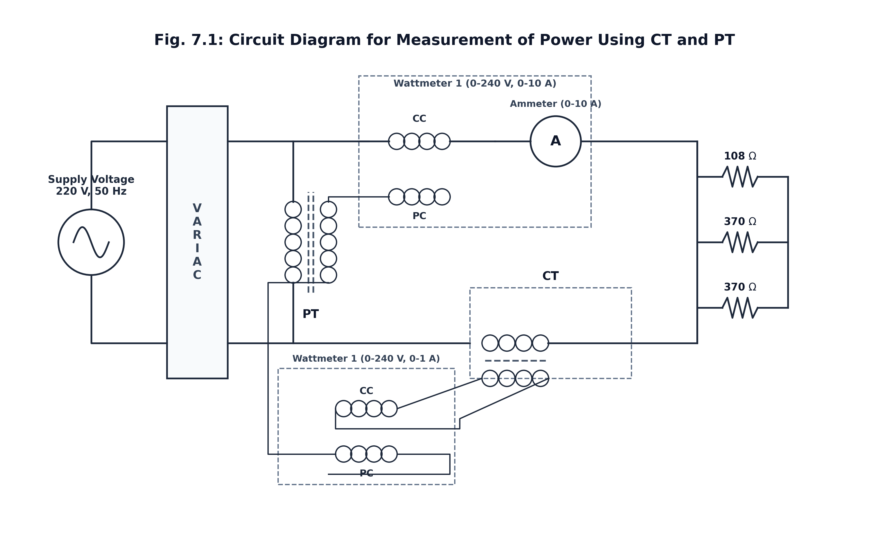

# Experiment No.: 07

## Name of the Experiment: 
Measurement of Power using CT and PT

---

> [!INFO] **Metadata & Submission Details**
> - **Course:** EEE 2212 — Measurements and Instrumentation Sessional
> - **Institution:** Rajshahi University of Engineering & Technology (RUET)
> - **Department:** Department of Electrical & Electronic Engineering (EEE)
> - **Submitted By:** Md. Ayub Ali | **Roll:** 2301076 | **Section:** B | **Session:** 2023-2024
> - **Submitted To:** Md. Abdul Malek, Assistant Professor, Dept. of EEE, RUET

---

## Objectives:

1. To determine the active power of an AC circuit by using a wattmeter along with a Current Transformer (CT) and a Potential Transformer (PT).
2. To assess the accuracy of indirect power measurement by comparing the calculated power on the primary side with the power measured directly.
3. To understand the practical use of CTs and PTs for measuring power in circuits carrying high current and high voltage.

---

## Theory:

Direct power measurement in high-voltage and heavy-current AC power systems presents significant practical challenges and safety risks. Connecting measuring instruments directly to high-voltage lines would require wattmeters with extremely thick, heavily insulated voltage and current coils. Such designs result in bulky, expensive, and dangerous instruments susceptible to severe thermal heating and insulation breakdown.

To overcome these constraints, **Instrument Transformers**—specifically **Current Transformers (CTs)** and **Potential Transformers (PTs)**—are deployed. They serve a dual purpose: stepping down high electrical parameters to standard, safe measuring levels and providing galvanically isolated interfaces between high-power transmission lines and low-voltage measuring instruments.

### 1. Potential Transformer (PT)
A Potential Transformer is connected in parallel (shunt) across the high-voltage supply. It operates as a precision step-down transformer, reducing high line voltages down to standardized lower voltage levels (typically $110\text{ V}$ or lower) suitable for the voltage coil (potential coil) of a standard wattmeter.

### 2. Current Transformer (CT)
A Current Transformer is connected in series with the load phase line. It features a primary winding with very few turns of heavy cross-section conductor carrying the full line current, and a secondary winding with a larger number of turns. It steps down large line currents to standardized secondary values (typically $5\text{ A}$ or $1\text{ A}$) to energize the current coil of the wattmeter.

### 3. Indirect Active Power Calculation
When using instrument transformers, the actual active power ($P_M$) consumed by the primary circuit is derived by multiplying the power measured on the secondary wattmeter ($P_1$) by both transformation ratios:

$$P_M = P_1 \times k_{\text{CT}} \times k_{\text{PT}}$$

Where:
- $P_M$ = Total calculated primary active power ($\text{W}$)
- $P_1$ = Active power reading indicated by the secondary wattmeter ($\text{W}$)
- $k_{\text{CT}}$ = Current Transformer ratio ($\frac{I_{\text{primary}}}{I_{\text{secondary}}}$)
- $k_{\text{PT}}$ = Potential Transformer ratio ($\frac{V_{\text{primary}}}{V_{\text{secondary}}}$)

### 4. Transformer Errors and Operational Safety

> [!WARNING] **Ratio & Phase Angle Errors**
> Real-world instrument transformers experience slight ratio and phase angle deviations. These stem from magnetizing current requirements of the core, eddy current and hysteresis energy dissipation, and internal winding impedance losses.

> [!CAUTION] **CRITICAL SAFETY WARNING: CT SECONDARY OPEN-CIRCUIT HAZARD**
> The secondary circuit of an energized Current Transformer must **NEVER** be left open-circuited. Opening the secondary removes the opposing secondary demagnetizing flux, causing the entire primary current to act purely as magnetizing current. This drives the iron core into extreme magnetic saturation, inducing lethal high-voltage spikes across the open secondary terminals and causing core overheating. Operators must **always short-circuit the CT secondary terminals** prior to disconnecting any secondary measuring instruments.

---

## Required Apparatus:

### Table 7.1: Table For Required Apparatus

| Sl. No. | Components | Specification | Quantity |
| :---: | :--- | :--- | :---: |
| 1. | Ammeter | $0 - 10\text{ A}$ | 2 pcs |
| 2. | Current Transformer (CT) | Turn ratio, $k_{\text{CT}} = 27$ | 1 pc |
| 3. | Potential Transformer (PT) | Turn ratio, $k_{\text{PT}} = 2$ | 1 pc |
| 4. | Wattmeter | $0-240\text{ V}, 0-10\text{ A}$; $0-240\text{ V}, 0-1\text{ A}$ | 2 pcs |
| 5. | Load Resistors | $108\ \Omega$, $370\ \Omega$ | 3 pcs |
| 6. | Variac | $0 - 450\text{ V}$ | 1 pc |
| 7. | AC Power Supply | $220\text{ V}, 50\text{ Hz}$ | 1 Port |
| 8. | Connecting Wires | Standard laboratory leads | As required |

---

## Circuit Diagram:


*Fig. 7.1: Circuit Diagram for Measurement of Power Using CT and PT.*

### Obsidian TikZ Code (using `tikzcircuitz` / `circuitikz` plugin)

```tikz
\usepackage{circuitikz}
\begin{document}
\begin{circuitikz}[american, scale=0.95, transform shape]
  % AC Source
  \draw (0,4) to[sinusoidal voltage source, l={$220\,\text{V}, 50\,\text{Hz}$}] (0,0);
  \draw (0,4) -- (1.5,4);
  \draw (0,0) -- (1.5,0);
  
  % VARIAC Block
  \draw[fill=gray!5] (1.5, -0.3) rectangle (2.8, 4.3);
  \node at (2.15, 2.0) [align=center] {\textbf{VARIAC}\\(0--450\,V)};
  
  % Lines out of VARIAC
  \draw (2.8, 4) -- (4.2, 4);
  \draw (2.8, 0) -- (4.2, 0);
  
  % PT Primary & Secondary
  \draw (4.2, 4) to[L, l_=\textbf{PT Pri}] (4.2, 0);
  \draw (5.2, 4) to[L, l=\textbf{PT Sec}] (5.2, 0);
  \draw[dashed, thick, color=gray] (4.6, 3.8) -- (4.6, 0.2);
  \draw[dashed, thick, color=gray] (4.8, 3.8) -- (4.8, 0.2);
  \node at (4.7, -0.4) {\textbf{PT}};
  
  % Direct Wattmeter CC & Ammeter
  \draw (4.2, 4) -- (5.8, 4) to[L, l=\textbf{CC}] (7.2, 4) to[ammeter, l=\textbf{A (0--10A)}] (9.2, 4) -- (11.5, 4);
  \draw (5.2, 4) -- (6.5, 4) to[L, l=\textbf{PC}] (6.5, 2.2) -- (5.2, 2.2);
  
  % CT Primary & Secondary
  \draw (4.2, 0) -- (7.2, 0) to[L, l_=\textbf{CT Pri}] (8.8, 0) -- (11.5, 0);
  \draw (7.2, -1.3) to[L, l=\textbf{CT Sec}] (8.8, -1.3);
  \draw[dashed, thick, color=gray] (7.2, -0.65) -- (8.8, -0.65);
  \node at (8.0, 0.5) {\textbf{CT}};
  
  % Secondary Wattmeter (CC & PC)
  \draw (7.2, -1.3) -- (6.2, -1.3) to[L, l=\textbf{CC}] (4.8, -1.3);
  \draw (8.8, -1.3) -- (8.8, -2.6) -- (4.8, -2.6);
  \draw (4.8, -2.6) to[L, l=\textbf{PC}] (4.8, -3.6);
  \draw (4.8, -3.6) -- (5.2, -3.6) -- (5.2, 0);
  
  % Parallel Loads
  \draw (11.5, 4) -- (12.5, 4) to[R, l=$108\,\Omega$] (12.5, 0) -- (11.5, 0);
  \draw (12.5, 4) -- (13.8, 4) to[R, l=$370\,\Omega$] (13.8, 0) -- (12.5, 0);
  \draw (13.8, 4) -- (15.1, 4) to[R, l=$370\,\Omega$] (15.1, 0) -- (13.8, 0);

  % Wattmeter Frames
  \draw[dashed, color=gray!80] (5.5, 1.8) rectangle (9.8, 4.8);
  \node[anchor=south] at (7.65, 4.8) {\footnotesize \textbf{Wattmeter 1 (Direct: 0--240V, 0--10A)}};
  
  \draw[dashed, color=gray!80] (4.0, -3.9) rectangle (9.2, -0.8);
  \node[anchor=north] at (6.6, -3.9) {\footnotesize \textbf{Wattmeter 1 (Indirect: 0--240V, 0--1A)}};
\end{circuitikz}
\end{document}
```

---

## Results:

### Table 7.2: Data Table for Measurement of Power Using CT and PT

| S. No. | Load Current (A) | Wattmeter Reading $P_1$ (W) | Measured Wattmeter Reading $P_M = P_1 \cdot k_{\text{CT}} \cdot k_{\text{PT}}$ (W) | Measured Power (W) | Error (%) |
| :---: | :---: | :---: | :---: | :---: | :---: |
| **1** | $2.7$ | $80$ | $216$ | $220$ | $1.81\%$ |
| **2** | $7.0$ | $187$ | $1350$ | $1380$ | $2.17\%$ |
| **3** | $7.5$ | $200$ | $1566$ | $1580$ | $0.88\%$ |
| **4** | $7.7$ | $206$ | $1655$ | $1670$ | $0.89\%$ |

> [!NOTE] **Sample Error Calculation**
> For Observation 1:
> - Indirect Calculated Power, $P_M = 216\text{ W}$
> - Direct Measured Power, $P_{\text{direct}} = 220\text{ W}$
> - Percentage Error formula:
>   $$\text{Error (\%)} = \left| \frac{P_{\text{direct}} - P_M}{P_{\text{direct}}} \right| \times 100\% = \left| \frac{220 - 216}{220} \right| \times 100\% = 1.81\%$$

---

## Discussions & Conclusion:

In this experiment, the active power in an AC circuit carrying high current and voltage was evaluated using both direct wattmeter measurement and indirect measurement via Current Transformer (CT) and Potential Transformer (PT) interfaces. 

The experimental primary power calculated from transformer-assisted secondary wattmeter readings ($P_M$) aligned closely with the primary power measured directly ($P_{\text{direct}}$), yielding percentage error margins between **$0.88\%$** and **$2.17\%$**. 

### Analysis of Deviation Sources:
1. **Ratio and Phase Angle Errors:** Slight disparities between ideal turn ratios ($k_{\text{CT}}, k_{\text{PT}}$) and actual transformation ratios due to magnetizing reactance and core loss currents.
2. **Instrument Burden:** Impedance introduced by connecting secondary wattmeters and ammeters alters the ideal potential/current scaling.
3. **Core Losses & Stray Field Interference:** Hysteresis and eddy current losses within the magnetic cores of CT and PT.
4. **Meter Resolution & Parallax Error:** Analog meter scale reading tolerances and human visual parallax during observation.

### Preventive Measures:
The precision of indirect power measurement can be further enhanced by selecting high-grade, precision-calibrated instrument transformers with nickel-iron or amorphous steel cores and replacing analog pointers with high-precision digital power analyzers.

### Final Conclusion:
The experiment successfully verified that Current Transformers and Potential Transformers provide safe, effective galvanic isolation and step-down capabilities for active power measurement in high-voltage AC circuits. The minimal deviation between calculated and directly measured values confirms the reliability of instrument transformers for industrial power metering and protection systems.
