# EEE 2212: Measurements & Instrumentation Sessional — Master Quiz & Theory Guide

> **Syllabus & Course:** Rajshahi University of Engineering & Technology (RUET) — Dept. of EEE  
> **Course No:** EEE 2212 (Measurements and Instrumentation Sessional)  
> **Integrated Sources:** Official Lab Manual, Lab Notebook (Khata), 600 Viva Question Bank, and Exam Problem Sets.  
> **Structure:** Comprehensive Core Theory, Practical Intuition, Lab Khata Insights, and All Short Maths / Numerical Problems in clear, simple language.

---

## ⚡ Quick Master Formula Sheet

| Experiment / Parameter | Formula | Key Units & Notes |
| :--- | :--- | :--- |
| **Wheatstone Bridge Balance** | $R = \left(\frac{Q}{P}\right) \cdot S$ | $R, S, P, Q$ in $\Omega$. Null method ($I_g = 0$, error $\approx 0.1\%$). |
| **Percentage Error** | $\%e = \frac{|R_{\text{actual}} - R_{\text{measured}}|}{R_{\text{actual}}} \times 100\%$ | Unit: $\%$ |
| **Impedance ($Z$)** | $Z = \frac{V}{I}$ | Ohms ($\Omega$) |
| **Winding / Loss Resistance ($R$)** | $R = \frac{W}{I^2}$ | Ohms ($\Omega$) ($W$ is wattmeter reading) |
| **Inductive Reactance ($X_L$)** | $X_L = \sqrt{Z^2 - R^2} = 2\pi f L$ | Ohms ($\Omega$) |
| **Inductance ($L$)** | $L = \frac{X_L}{2\pi f}$ | Henry ($H$ or $mH$) |
| **Capacitive Reactance ($X_C$)** | $X_C = \sqrt{Z^2 - R^2} = \frac{1}{2\pi f C}$ | Ohms ($\Omega$) |
| **Capacitance ($C$)** | $C = \frac{1}{2\pi f X_C}$ | Farads ($F$ or $\mu F$) |
| **Power Factor ($\cos\phi$)** | $\cos\phi = \frac{R}{Z} = \frac{W}{V \cdot I}$ | Dimensionless ($0 \le \cos\phi \le 1$) |
| **Potential Transformer Ratio ($k_{PT}$)** | $k_{PT} = \frac{V_p}{V_s} \approx \frac{N_1}{N_2}$ | Step-down voltage, standard $V_s = 110\text{ V}$ |
| **Current Transformer Ratio ($k_{CT}$)** | $k_{CT} = \frac{I_p}{I_s} \approx \frac{N_2}{N_1}$ | Step-down current, standard $I_s = 5\text{ A}$ or $1\text{ A}$ |
| **Ammeter Shunt Resistance ($R_{sh}$)** | $R_{sh} = \frac{R_m}{m - 1} \quad \text{where } m = \frac{I}{I_m}$ | Low resistance in parallel ($\Omega$) |
| **Voltmeter Multiplier ($R_s$)** | $R_s = (m - 1)R_m \quad \text{where } m = \frac{V}{V_m}$ | High resistance in series ($\Omega$) (Limit: $<1000\text{V}$) |
| **True Power with CT & PT** | $P_{\text{true}} = k_{CT} \times k_{PT} \times W_{\text{reading}}$ | Watts ($W$) or $kW$ |
| **Energy Meter Constant ($K$)** | $K = \frac{\text{Revolutions}}{kWh} \text{ or } \frac{\text{Impulses}}{kWh}$ | Stamped on meter nameplate (e.g. 1600 or 1200) |
| **Recorded Energy ($E_{\text{rec}}$)** | $E_{\text{rec}} = \frac{N_{\text{rev}}}{K} \text{ or } \frac{\text{Impulses}}{K}$ | $kWh$ |
| **True Energy Consumed ($E_{\text{true}}$)** | $E_{\text{true}} = \frac{P \times t}{1000} = \frac{V \cdot I \cdot \cos\phi \times t_{\text{hours}}}{1000}$ | $kWh$ |
| **Stroboscope Speed ($N$)** | $N = \frac{f_m \cdot f_1 \cdot (m - 1)}{f_m - f_1}$ | $RPM$ ($f_m$ = highest, $f_1$ = lowest flash rate) |
| **Stroboscope RPM Conversion** | $\text{RPM} = 60 \times f_{\text{Hz}}$ | $f_{\text{Hz}}$ is flashes per second |
| **Dielectric Absorption Ratio (DAR)** | $\text{DAR} = \frac{R_{\text{60sec}}}{R_{\text{30sec}}}$ | Good insulation: $\text{DAR} = 1.25 \text{ to } 1.6$ |
| **Polarization Index (PI)** | $\text{PI} = \frac{R_{\text{10min}}}{R_{\text{1min}}}$ | Good insulation: $\text{PI} > 2.0$ |
| **Minimum Safe Insulation ($R_{\text{ins}}$)** | $R_{\text{ins}} \ge (\text{Rated kV} + 1)\text{ M}\Omega$ | Megohms ($M\Omega$), minimum $1\text{ M}\Omega$ |

---

# Experiment 01: Lab Safety, General Instruments & Pre-Lab Rules

### 1. Core Theory & Everyday Intuition
Measurement is comparing an unknown physical quantity with an accepted standard unit. In an electrical lab, instruments are broadly split into two classes:
- **Absolute (Primary) Instruments:** Directly give the magnitude of the electrical quantity in terms of physical constants without needing comparison with another meter (e.g., Tangent Galvanometer, Rayleigh Current Balance). Used in national calibration standards laboratories, not routine labs.
- **Secondary Instruments:** The meters we actually use in the lab (PMMC, Moving-Iron, Digital Multimeters, Wattmeters). Their deflection must be calibrated beforehand against an absolute standard.

#### The Three Essential Torques in Indicating Instruments
To make an analog needle pointer move and give a steady, trustworthy reading, three distinct forces (torques) must work together:
1. **Deflecting Torque ($T_d$):**
   - The force that pulls the pointer away from zero when current flows.
   - Produced using different physical effects: magnetic (PMMC), electromagnetic (Moving-Iron), electrodynamic (Wattmeter), or thermal/electrostatic.
2. **Controlling (Restoring) Torque ($T_c$):**
   - Without a controlling force, the pointer would slam into maximum scale even for a tiny current and would never return to zero when power is shut off.
   - $T_c$ opposes $T_d$ and grows stronger as the pointer deflects further. The needle comes to rest precisely when **$T_d = T_c$**.
   - **How it is produced:**
     - **Spring Control (Most Common):** Two hairsprings made of **Phosphor Bronze** (non-magnetic, zero magnetic distortion, very low mechanical fatigue). Here, $T_c \propto \theta$ (deflection angle is linear).
     - **Gravity Control:** Small adjustable weights on the spindle. Here, $T_c \propto \sin\theta$ (produces a cramped, non-linear scale at the bottom). Must be kept strictly vertical.
3. **Damping Torque ($T_d'$):**
   - Because the moving system has inertia and springs are bouncy, the needle wants to oscillate back and forth around the steady reading for a long time. Damping stops this bouncing quickly without altering the final reading.
   - **Eddy Current Damping:** Aluminum former moving in a strong permanent magnetic field creates eddy currents that oppose motion (Lenz's Law). **Used exclusively in PMMC instruments**.
   - **Air Friction Damping:** A light aluminum vane moves inside a sealed air chamber. **Used in Moving-Iron (MI) and Electrodynamometer instruments** (because permanent magnets used for eddy damping would distort their weak operating fields).
   - **Fluid Friction Damping:** Vanes dip into high-viscosity damping oil (used in high-voltage electrostatic voltmeters).
   - **Damping State:** Instruments are designed to be **critically damped** (or slightly under-damped) so the needle reaches its final position in the shortest time without lingering oscillations.

#### Why Meters Affect the Circuit: The "Loading Effect"
Whenever you attach an instrument to a circuit, the instrument itself consumes a tiny bit of electrical energy, which can change the circuit voltages and currents you are trying to measure:
- **Voltmeter Connection Rule:** A voltmeter is connected in **parallel** across two nodes.
  - To avoid stealing current from the circuit branch, an ideal voltmeter must have **infinite input resistance ($R_{in} = \infty$)**.
  - A real voltmeter must have the highest possible resistance (expressed as sensitivity in $\Omega/\text{V}$). If its resistance is too low, it "loads" the circuit, pulling extra current through source resistances and showing a lower voltage than was actually there.
  - *From Lab Khata:* In a circuit with a $20\,\Omega$ branch at $60\text{V}$, the total current is $I = \frac{60}{20} + \frac{60}{R_v}$. If $R_v \to \infty$, the meter draws $\frac{60}{R_v} \to 0\text{ A}$, leaving the circuit completely undisturbed!
- **Ammeter Connection Rule:** An ammeter is connected in **series** inside a wire branch.
  - To avoid introducing an accidental resistance that chokes the line current, an ideal ammeter must have **zero internal resistance ($R_m = 0$)**.
  - Connecting an ammeter in parallel across a voltage line is catastrophic: its near-zero resistance creates a **dead short circuit**, blowing fuses or destroying the meter movement.

#### The Variac (Auto-Transformer)
A Variac is an autotransformer with a single continuous copper winding wrapped around a toroidal iron core, with a movable carbon brush riding along bare turns.
- It allows you to adjust AC output smoothly from $0\text{ V}$ up to rated line voltage (e.g. $220\text{ V}$ or $250\text{ V}$).
- **Crucial Safety Note:** Because primary and secondary share the same physical winding, **a Variac offers NO galvanic isolation**. If the neutral or live wire is inverted, touching the secondary circuit can cause a lethal electric shock. Always start tests with the knob turned down to zero.

---

### 2. Maths & Numerical Problems (Exp 01)

#### Formula & Concept: Limiting Error & Guarantee Accuracy
Instrument manufacturers specify accuracy as a percentage of Full-Scale Deflection (FSD):
$$\text{Max Absolute Error} = \pm (\% \text{Accuracy}) \times \text{Full Scale Value}$$
$$\text{Percentage Limiting Error at a Reading } V = \frac{\text{Max Absolute Error}}{V} \times 100\%$$
*Key Insight:* The absolute error stays constant over the whole dial. Therefore, reading a small quantity near the low end of a large-scale meter produces a huge percentage error. Always choose a meter where your expected reading falls in the **upper half or top third of the scale**.

**Problem 1.1:**  
A $0 - 300\text{ V}$ analog voltmeter has a guaranteed accuracy of $\pm 1.5\%$ of full scale.  
1. Calculate the maximum absolute error in Volts.  
2. If the voltmeter reads $60\text{ V}$, what is the true limiting percentage error of this measurement?  
3. If it reads $250\text{ V}$, what is the limiting percentage error?

**Step-by-Step Solution:**  
1. $\text{Max Absolute Error} = \pm \left(\frac{1.5}{100}\right) \times 300\text{ V} = \mathbf{\pm 4.5\text{ V}}$.  
2. At $60\text{ V}$ reading:  
   $$\% \text{Error} = \frac{\pm 4.5\text{ V}}{60\text{ V}} \times 100\% = \mathbf{\pm 7.5\%} \quad (\text{Very poor accuracy!})$$  
3. At $250\text{ V}$ reading:  
   $$\% \text{Error} = \frac{\pm 4.5\text{ V}}{250\text{ V}} \times 100\% = \mathbf{\pm 1.8\%} \quad (\text{Much higher accuracy!})$$

---

# Experiment 02: Unknown Resistance using Wheatstone Bridge

### 1. Core Theory & Everyday Intuition
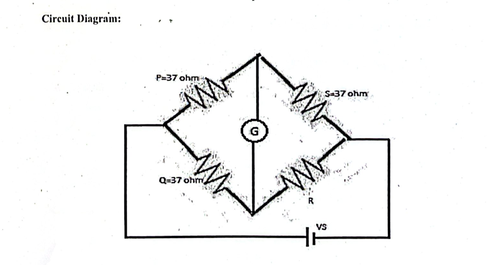

The Wheatstone bridge is the gold standard for measuring **medium resistance** (from $1\,\Omega$ up to roughly $100\,k\Omega$).

#### Why it is Far Better than a Simple Multimeter: The Null Principle
A typical multimeter measures resistance by passing current from an internal battery through a meter coil or ADC resistor divider. 
- *From Lab Khata Insight:* An ordinary **Multimeter has a $3\%$ to $4\%$ typical measurement error**, whereas a **Wheatstone Bridge achieves an error as low as $\mathbf{0.1\%}$**!
- Why? A Wheatstone bridge works on the **null-deflection comparison principle**:
  - You adjust a calibrated variable resistor $S$ until the sensitive galvanometer between the bridge arms reads **exactly zero ($I_g = 0$)**.
  - Because no current flows through the detector at balance, the measurement does **not depend on battery voltage**, internal battery resistance, or galvanometer calibration. It depends purely on the precision of the passive ratio arms!

#### Working Principle & Balance Condition
The circuit has four resistance arms arranged in a closed diamond loop:
- **Ratio arms:** $P$ and $Q$ (precision fixed resistors).
- **Standard arm:** $S$ (calibrated decade resistance box).
- **Unknown arm:** $R$ (resistor being measured).
- A DC voltage source ($V_s$) is connected across one pair of opposing diagonal junctions, and a sensitive D'Arsonval Galvanometer ($G$) is connected across the other pair.

When current in the galvanometer branch is zero, the voltage drop across arm $P$ equals the drop across arm $Q$, and the voltage drop across arm $R$ equals the drop across arm $S$:
$$I_1 P = I_2 Q \quad \text{and} \quad I_1 R = I_2 S$$
Dividing these two expressions gives the universal balance equation:
$$\frac{P}{R} = \frac{Q}{S} \implies P \cdot R = Q \cdot S \implies \mathbf{R = \left(\frac{Q}{P}\right) \cdot S} \quad \left(\text{or } R = \frac{P}{Q} \cdot S \text{ depending on arm positions}\right)$$

#### Key Practical Insights & Exam Traps:
1. **Reciprocity:** If you swap the battery and the galvanometer terminals, the bridge balance condition remains completely unchanged ($P \cdot R = Q \cdot S$).
2. **Maximum Sensitivity Rule:** The galvanometer shows the biggest, easiest-to-see deflection for a tiny change in $R$ when all four arms have roughly equal resistance ($P \approx Q \approx R \approx S$).
3. **Why NOT used for Low Resistance ($< 1\,\Omega$):** The resistance of the connecting lead wires and terminal binding posts is typically $0.005\,\Omega$ to $0.05\,\Omega$. If you try to measure a $0.1\,\Omega$ shunt resistor, lead resistance adds directly to $R$, causing a huge error of $10\%$ to $50\%$. *(For low resistance, we use the **Kelvin Double Bridge**)*.
4. **Why NOT used for High Resistance ($> 100\,k\Omega$):** The total bridge resistance becomes so gigantic that the current drawn from the battery is in fractions of a micro-ampere. The galvanometer barely moves even when the bridge is heavily unbalanced, making it impossible to pinpoint the null point. Furthermore, insulation leakage across the circuit board shunts the bridge arms. *(For high resistance, we use a **Megger** or Loss of Charge method)*.
5. **Thermoelectric EMF Error:** When different metals in the circuit meet at slightly different temperatures, a tiny thermal battery (Seebeck voltage) is formed. This is eliminated by taking two readings with reversed battery polarity and averaging them.

---

### 2. Maths & Numerical Problems (Exp 02)

#### Master Formula:
$$R = \left(\frac{Q}{P}\right) \cdot S$$
$$\text{Percentage Error } \%e = \frac{|R_{\text{actual}} - R_{\text{measured}}|}{R_{\text{actual}}} \times 100\%$$

**Problem 2.1 (Direct Lab Khata Data Calculation):**  
In the student lab khata (Exp 08), the following ratio arm and standard resistance values were recorded at null balance:
- $P = 71.5\,\Omega$, $Q = 48.6\,\Omega$, $S = 67.5\,\Omega$ (where $R = \frac{P}{Q} \times S$).
- Another trial gave $P = 60.1\,\Omega$, $Q = 60.8\,\Omega$, $S = 103.4\,\Omega$.  
Calculate the unknown resistance $R$ for both trials and find the average.

**Step-by-Step Solution:**  
1. **Trial 1:**  
   $$R_1 = \frac{P}{Q} \times S = \frac{71.5}{48.6} \times 67.5 = 1.47119 \times 67.5 = \mathbf{99.30\,\Omega}$$  
2. **Trial 2:**  
   $$R_2 = \frac{P}{Q} \times S = \frac{60.1}{60.8} \times 103.4 = 0.988487 \times 103.4 = \mathbf{102.21\,\Omega}$$  
3. **Average Resistance:**  
   $$R_{\text{avg}} = \frac{99.30 + 102.21}{2} = \mathbf{100.75\,\Omega}$$

**Problem 2.2 (Bridge Balance & Error):**  
A nominal $38.7\,\Omega$ standard resistor is measured using a bridge with ratio arms $P = 100\,\Omega$ and $Q = 100\,\Omega$. Balance occurs when $S = 37.0\,\Omega$. Calculate the measured value and percentage error.  
**Step-by-Step Solution:**  
1. $R = \frac{Q}{P} \times S = \frac{100}{100} \times 37.0 = \mathbf{37.0\,\Omega}$.  
2. $\%e = \frac{|38.7 - 37.0|}{38.7} \times 100\% = \frac{1.7}{38.7} \times 100\% = \mathbf{4.39\%}$.

---

# Experiment 03: Inductance of an Inductor (3-Meter Method)

### 1. Core Theory & Everyday Intuition
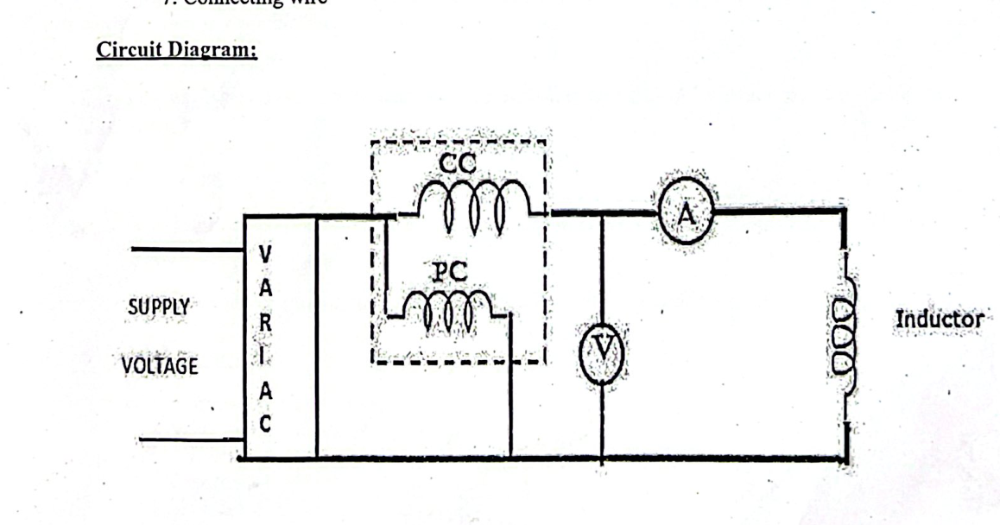

#### Why Can't We Just Use a Voltmeter and Ammeter?
In an ideal AC inductor, current is limited only by inductive reactance: $X_L = 2\pi f L$. If inductors were ideal, you could simply calculate $L = \frac{V}{2\pi f I}$.  
However, **every real inductor is a coil of physical copper wire wound on a core** (governed by Faraday's and Lenz's Law: $V = -N \frac{d\Phi}{dt}$). This wire has real internal winding resistance ($R_L$), and if an iron core is present, there are hysteresis and eddy current core losses.
- Voltmeter gives total terminal voltage $V$.
- Ammeter gives total RMS circuit current $I$.
- The ratio $\frac{V}{I}$ gives the **total impedance ($Z$)**, NOT the pure reactance $X_L$!
- To separate the resistive copper loss from the inductive storage, we need a **Wattmeter** ($W$).

#### How the 3 Meters Work Together:
1. An electrodynamometer wattmeter measures **active real power**:
   $$W = I^2 R \implies \mathbf{R = \frac{W}{I^2}}$$
   *(This gives the effective AC resistance of the coil winding!)*
2. The voltmeter and ammeter together give the magnitude of total opposition:
   $$\mathbf{Z = \frac{V}{I}}$$
3. By the AC impedance triangle ($Z^2 = R^2 + X_L^2$), the inductive reactance is:
   $$\mathbf{X_L = \sqrt{Z^2 - R^2}}$$
4. Knowing line frequency ($f = 50\text{ Hz}$ in Bangladesh), inductance in Henrys is isolated:
   $$X_L = 2\pi f L \implies \mathbf{L = \frac{X_L}{2\pi f}}$$
5. The coil power factor is:
   $$\cos\phi = \frac{R}{Z} = \frac{W}{V \cdot I} \quad (\text{Lagging})$$

#### Essential Meter Connections & Practical Rules:
- **Wattmeter Current Coil (CC):** Low resistance, thick wire. Connected in **series** with the line to carry full load current.
- **Wattmeter Potential Coil (PC):** High resistance, fine wire. Connected in **parallel** across the load to sense voltage.
- **Variac Role:** Connected at the AC input. Allows raising voltage slowly from $0\text{ V}$. An inductor has very low resistance to DC; even under AC, sudden application of full voltage can cause high transient inrush currents.
- **Ideal Inductor Reality Check:** If the coil were ideal ($R = 0$), the wattmeter reading would be exactly $0\text{ W}$, and $\cos\phi = 0$ (current lags voltage by a full $90^\circ$). In our lab, the wattmeter reads positive watts because of real copper resistance!

---

### 2. Maths & Numerical Problems (Exp 03)

#### Calculation Workflow:
1. $Z = \frac{V}{I}$
2. $R = \frac{W}{I^2}$
3. $X_L = \sqrt{Z^2 - R^2}$
4. $L = \frac{X_L}{2\pi f} = \frac{X_L}{314.16}$ (for $50\text{ Hz}$)
5. $\cos\phi = \frac{R}{Z}$

**Problem 3.1 (Direct Lab Data Calculation):**  
In a $50\text{ Hz}$ measurement test on a choke coil, the meters record:
- Voltmeter: $V = 220\text{ V}$
- Ammeter: $I = 3.0\text{ A}$
- Wattmeter: $W = 68\text{ W}$  
Calculate the winding resistance, impedance, inductive reactance, inductance, and power factor.

**Step-by-Step Solution:**  
1. **Total Impedance ($Z$):**  
   $$Z = \frac{V}{I} = \frac{220\text{ V}}{3.0\text{ A}} = \mathbf{73.33\,\Omega}$$  
2. **Winding Resistance ($R$):**  
   $$R = \frac{W}{I^2} = \frac{68}{(3.0)^2} = \frac{68}{9} = \mathbf{7.56\,\Omega}$$  
3. **Inductive Reactance ($X_L$):**  
   $$X_L = \sqrt{Z^2 - R^2} = \sqrt{(73.33)^2 - (7.56)^2} = \sqrt{5377.29 - 57.15} = \sqrt{5320.14} = \mathbf{72.94\,\Omega}$$  
4. **Inductance ($L$):**  
   $$L = \frac{X_L}{2\pi f} = \frac{72.94}{2 \times \pi \times 50} = \frac{72.94}{314.16} \approx \mathbf{0.232\text{ H}}\quad (232\text{ mH})$$  
5. **Power Factor ($\cos\phi$):**  
   $$\cos\phi = \frac{R}{Z} = \frac{7.56}{73.33} \approx \mathbf{0.103\text{ lagging}}$$

---

# Experiment 04: Capacitance of a Capacitor (3-Meter Method)

### 1. Core Theory & Everyday Intuition
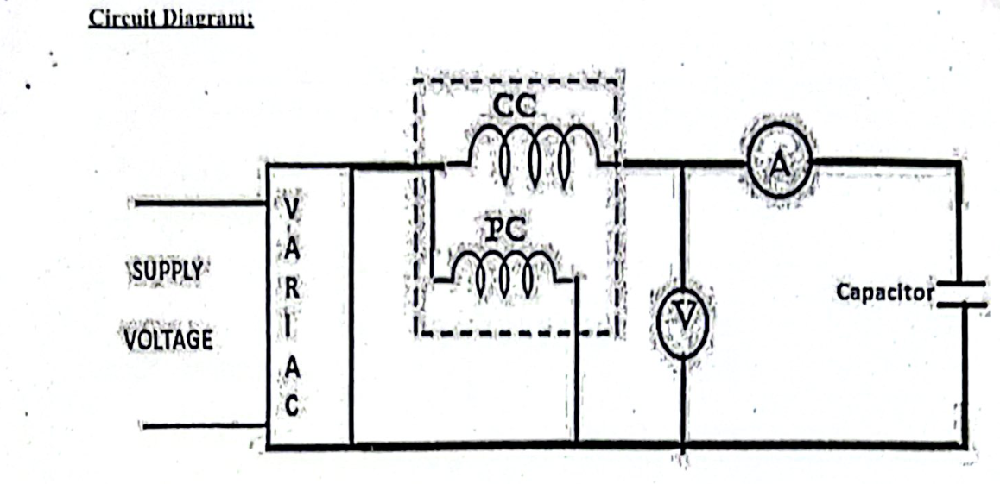

#### Why Does a Capacitor Need a 3-Meter Method?
In an ideal capacitor, the dielectric material is a perfect insulator. Current leads voltage by exactly $90^\circ$, meaning average active power consumed is zero ($W = 0$).  
In any physical capacitor:
- There is a small leakage current passing through the dielectric material, plus dielectric molecular friction (dielectric hysteresis).
- These effects are modeled as an **Equivalent Series Resistance (ESR)** or parallel leakage resistance.
- The wattmeter measures this tiny active power loss ($W = I^2 R$).

#### Mathematical Separation:
1. Total Impedance: $\mathbf{Z = \frac{V}{I}}$
2. Effective Loss Resistance: $\mathbf{R = \frac{W}{I^2}}$
3. Capacitive Reactance: $\mathbf{X_C = \sqrt{Z^2 - R^2}}$
4. Capacitance: Since $X_C = \frac{1}{2\pi f C}$, we get:
   $$\mathbf{C = \frac{1}{2\pi f X_C} = \frac{10^6}{2\pi f X_C} \quad [\mu\text{F}]}$$
5. Dissipation Factor ($\tan\delta$): Ratio of loss resistance to reactance:
   $$\tan\delta = \frac{R}{X_C}$$
   *(For high quality power capacitors, $R \approx 0$, so $\tan\delta \approx 0$ and $X_C \approx Z$)*.

#### Crucial Lab Safety Rules for Capacitors:
- **Polarity Warning:** Only **non-polar (bipolar) AC capacitors** (e.g., oil-filled, paper, or metallized polypropylene) can be used. Ordinary polarized electrolytic capacitors will internally short, vent gas, and explode if subjected to AC!
- **Lethal Shock Hazard:** Capacitors store electrostatic energy ($E = \frac{1}{2} C V^2$). When you switch off the AC power, the capacitor may remain charged at the peak voltage ($V_{\text{peak}} = \sqrt{2} \times 220\text{ V} \approx 311\text{ V}$). Always short-circuit the capacitor terminals through a discharge resistor before touching any wires!

---

### 2. Maths & Numerical Problems (Exp 04)

**Problem 4.1 (From Lab Manual Data Table):**  
A capacitor connected to a $50\text{ Hz}$ supply gives the following meter readings:
- Voltmeter: $V = 100\text{ V}$
- Ammeter: $I = 0.4\text{ A}$
- Wattmeter: $W = 3.0\text{ W}$  
Calculate the equivalent loss resistance, impedance, capacitive reactance, and capacitance in microfarads ($\mu\text{F}$).

**Step-by-Step Solution:**  
1. **Total Impedance ($Z$):**  
   $$Z = \frac{V}{I} = \frac{100\text{ V}}{0.4\text{ A}} = \mathbf{250\,\Omega}$$  
2. **Loss Resistance ($R$):**  
   $$R = \frac{W}{I^2} = \frac{3.0}{(0.4)^2} = \frac{3.0}{0.16} = \mathbf{18.75\,\Omega}$$  
3. **Capacitive Reactance ($X_C$):**  
   $$X_C = \sqrt{Z^2 - R^2} = \sqrt{(250)^2 - (18.75)^2} = \sqrt{62500 - 351.56} = \sqrt{62148.44} = \mathbf{249.29\,\Omega}$$  
4. **Capacitance ($C$):**  
   $$C = \frac{1}{2\pi f X_C} = \frac{1}{2 \times \pi \times 50 \times 249.29} = \frac{1}{78318.5} \approx 12.76 \times 10^{-6}\text{ F} = \mathbf{12.76\,\mu\text{F}}$$

---

# Experiments 05 & 06: Potential Transformer (PT) & Current Transformer (CT)

### 1. Core Theory & Everyday Intuition
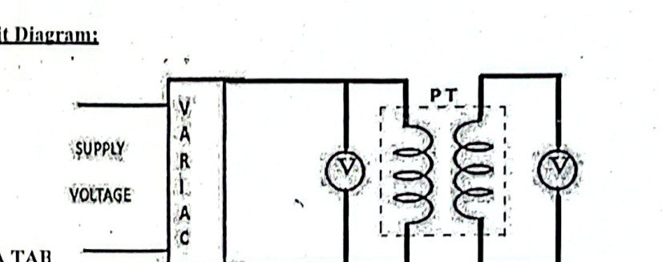  
*Potential Transformer (PT) Circuit Setup*

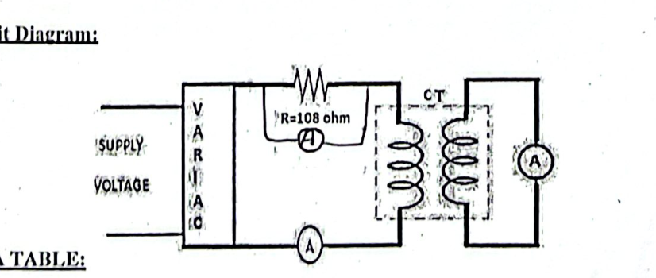  
*Current Transformer (CT) Circuit Setup*

#### Why Are They Called "Instrument Transformers"?
*(From Lab Khata Insight):* In power engineering, transformers are split into two completely distinct jobs:
1. **Power Transformers:** Designed to transfer bulk electrical energy efficiently to consumers.
2. **Instrument Transformers (CT & PT):** Designed **to supply small, safe, scaled-down power to measuring instruments and protective relays**.
   - You cannot connect a $11\text{ kV}$ or $33\text{ kV}$ line directly to a benchtop meter—insulation flashover would destroy the meter and kill the operator.
   - PT steps down high voltage to standard **$110\text{ V}$** (or $100\text{ V}$).
   - CT steps down high current to standard **$5\text{ A}$** (or $1\text{ A}$).
   - **Galvanic Isolation:** The high-power transmission circuit and the low-voltage measuring circuit **have zero direct conductive connection**—they communicate purely through magnetic coupling!

---

#### Detailed Breakdown: Potential Transformer (PT)
- **What it is:** A high-precision, low-power **step-down voltage transformer** ($N_1 > N_2$).
- **Connection:** Primary connects in **parallel** across high voltage lines. Secondary connects across a standard $0 - 150\text{ V}$ voltmeter.
- **Operating Condition:** Because the voltmeter has very high input resistance, the secondary winding operates practically on **open circuit**.
- **Voltage Transformation Ratio:**
  $$k_{PT} = \frac{V_p}{V_s} \approx \frac{N_1}{N_2}$$
- **Errors:** Winding resistance and leakage reactance cause **Ratio Error** (voltage ratio differs from turns ratio) and **Phase Angle Error** (secondary voltage is not exactly $180^\circ$ out of phase with primary).
- **Grounding Safety Requirement:** One terminal of the secondary winding **must be solidly connected to earth ground**. If the internal primary-to-secondary winding insulation ever breaks down, the ground connection carries fault current safely to earth, preventing $11\text{ kV}$ from appearing on the switchboard meters.

---

#### Detailed Breakdown: Current Transformer (CT)
- **What it is:** A specialized **step-up voltage, step-down current transformer** ($N_2 \gg N_1$).
- **Connection:** Primary winding has very few turns of heavy conductor (frequently a **single straight bar** passing through a toroid core, where $N_1 = 1$) connected in **series** with the load line. Secondary winding has many turns of fine wire connected across a low-resistance $0 - 5\text{ A}$ ammeter.
- **Operating Condition:** Because an ammeter has near-zero internal resistance, the CT operates practically in a **continuous short-circuit condition**.
- **Current Transformation Ratio:**
  $$k_{CT} = \frac{I_p}{I_s} \approx \frac{N_2}{N_1}$$

---

#### ⚠️ THE NUMBER ONE EXAM QUESTION: Why Must a CT Secondary NEVER Be Opened While Energized?
*(Crystal-clear explanation from Lab Khata):*
1. **Power Transformer vs CT Fundamental Difference:**
   - In an ordinary Power Transformer, if you open the secondary, the primary current automatically drops to a tiny no-load current ($I_0 \approx 2-5\%$).
   - **In a CT, the primary is connected in series with the entire power grid load!** The primary current is dictated entirely by the external grid loads, NOT by the CT secondary. Therefore, opening the secondary does NOT reduce primary current!
2. **The Physics of the Disaster:**
   - Under normal operation, secondary current produces a counter-MMF ($N_2 I_2$) that cancels $99\%$ of the primary MMF ($N_1 I_1$). The core operates at a tiny net magnetizing flux.
   - If the secondary is opened ($I_2 = 0$), the counter-MMF disappears completely ($N_2 I_2 = 0$).
   - **The entire, massive primary line current now acts as pure, unopposed magnetizing current!**
   - The magnetic flux in the core surges into extreme saturation.
3. **The Immediate Results:**
   - **Lethal Voltage Spike:** Because flux alternates and the secondary has hundreds or thousands of turns ($N_2$), Faraday's Law ($e_2 = -N_2 \frac{d\Phi}{dt}$) induces **dangerously high peak voltages (thousands of volts)** across the open secondary terminals $\implies$ **Lethal shock hazard to anyone nearby**.
   - **Violent Core Overheating:** Huge eddy current and hysteresis losses rapidly cook and burn the winding insulation.
   - **Permanent Core Magnetization:** The core is left with high residual magnetism, permanently destroying its calibration accuracy.
- **Golden Rule:** Always **short-circuit the CT secondary terminals** before removing or replacing an ammeter!

---

#### Measuring CT vs Protective CT & The "5P10" Code
*(From Lab Khata Insight):*
CTs are divided into two distinct classes based on application:
1. **Measuring CT:**
   - **Purpose:** Power measurement, energy metering, and commercial billing.
   - **Requirement:** Must have very high precision at normal operating currents (Low accuracy class number: $0.1, 0.2, 0.5$, meaning $0.1\%$ to $0.5\%$ maximum error).
   - **Saturation Behavior:** Designed with a core that **saturates quickly at moderate over-currents**! This intentional saturation protects delicate meters connected to the secondary from burning up during high fault currents.
2. **Protective CT:**
   - **Purpose:** Connected to protective relays and circuit trip coils.
   - **Requirement:** Must accurately reproduce large short-circuit currents without saturating, so the protection relay can detect the fault and trip the circuit breaker.
   - **Accuracy Class (The 5P10 / 5P20 Code):**
     - A protective CT marked **5P10**:
       - **5**: Maximum **$5\%$ composite error**.
       - **P**: Indicates **Protection class**.
       - **10**: **Accuracy Limit Factor (ALF = 10)**. It means the CT will maintain its $5\%$ accuracy up to **$10$ times its rated current** before saturation distorting occurs!
     - A CT marked **10P20** maintains $10\%$ composite accuracy up to $20 \times$ rated current.

---

### 2. Maths & Numerical Problems (Exp 05 & 06)

**Problem 5.1 (PT Voltage Calculation from Khata Data):**  
In a PT laboratory experiment, primary voltage is $V_p = 199.9\text{ V}$, secondary voltage is $V_s = 100.1\text{ V}$, and the known nominal turns ratio is $k_{PT} = 2$.  
1. Calculate the measured primary voltage based on secondary reading ($V_{\text{cal}} = k_{PT} \times V_s$).  
2. Determine the percentage error.

**Step-by-Step Solution:**  
1. $V_{\text{cal}} = 2 \times 100.1\text{ V} = \mathbf{200.2\text{ V}}$.  
2. Percentage Error:  
   $$\%e = \frac{|V_p - V_{\text{cal}}|}{V_p} \times 100\% = \frac{|199.9 - 200.2|}{199.9} \times 100\% = \frac{0.3}{199.9} \times 100\% = \mathbf{0.15\%}$$

**Problem 6.1 (CT Current Calculation from Khata Data):**  
A CT with nominal ratio $n = 36$ has a primary current of $I_p = 6.0\text{ A}$. The secondary ammeter reads $I_s = 0.165\text{ A}$.  
1. Find the measured primary current ($I_{\text{meas}} = n \times I_s$).  
2. Find the percentage error.

**Step-by-Step Solution:**  
1. $I_{\text{meas}} = 36 \times 0.165\text{ A} = \mathbf{5.94\text{ A}}$.  
2. Percentage Error:  
   $$\%e = \frac{|6.0 - 5.94|}{6.0} \times 100\% = \frac{0.06}{6.0} \times 100\% = \mathbf{1.0\%}$$

---

# Experiments 07 & 08: Extension of Ammeter & Voltmeter Ranges

### 1. Core Theory & Everyday Intuition
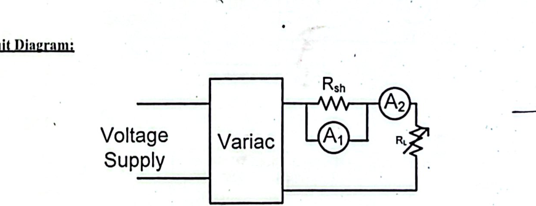  
*Ammeter Extension with Shunt ($R_{sh}$)*

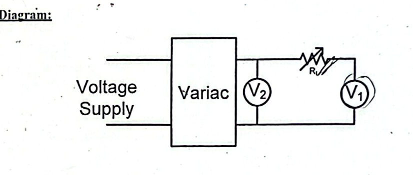  
*Voltmeter Extension with Multiplier ($R_s$)*

Every basic analog meter movement (PMMC) is inherently a delicate micro-ammeter or milli-ammeter. Its tiny hairsprings and fine coil wire can only carry a tiny current (e.g., $1\text{ mA}$ or $5\text{ mA}$) before burning up.  
To measure large currents or large voltages, we modify the circuit around the movement.

---

#### 1. Ammeter Range Extension (The Shunt)
- **Concept:** Connect a very **low resistance (Shunt, $R_{sh}$)** in **parallel** with the meter coil ($R_m$).
- **Current Division:** The large line current $I$ splits at the node: a tiny safe fraction $I_m$ flows through the meter coil, while the vast majority $I_{sh} = I - I_m$ safely bypasses through the low-resistance shunt.
- **Mathematical Derivation:**
  Because both branches are in parallel, their voltage drops are identical:
  $$V_{\text{drop}} = I_m R_m = I_{sh} R_{sh} = (I - I_m) R_{sh}$$
  $$R_{sh} = \frac{I_m R_m}{I - I_m} = \frac{R_m}{\frac{I}{I_m} - 1}$$
  Defining the **Multiplying Factor ($m$)** as the ratio of total target current to meter full-scale current:
  $$\mathbf{m = \frac{I}{I_m}} \implies \mathbf{R_{sh} = \frac{R_m}{m - 1}}$$
- **Material Selection for Shunt:**
  The shunt **must be made of Manganin** (an alloy of $84\%$ Copper, $12\%$ Manganese, $4\%$ Nickel).
  - *Why not Copper?* Copper has a high positive temperature coefficient of resistance . As large currents heat up a copper shunt, its resistance would rise, forcing extra current into the meter coil and ruining accuracy.
  - *Why Manganin?* Manganin has a **virtually zero temperature coefficient of resistance** and zero thermoelectric voltage when joined to copper terminals!

---

#### 2. Voltmeter Range Extension (The Multiplier)
- **Concept:** Connect a very **high resistance (Multiplier, $R_s$)** in **series** with the meter movement ($R_m$).
- **Voltage Division:** The total voltage $V$ is shared between the multiplier and the coil. The multiplier drops almost the entire line voltage, leaving only a tiny millivolt drop ($V_m = I_m R_m$) across the fragile meter coil.
- **Mathematical Derivation:**
- ![[Pasted image 20260920074543.png]]
  The same full-scale current $I_m$ passes through both series elements:
  $$V = I_m (R_m + R_s)$$
  $$\frac{V}{I_m} = R_m + R_s \implies R_s = \frac{V}{I_m} - R_m = \left(\frac{V}{I_m R_m} - 1\right) R_m$$
  Since $V_m = I_m R_m$ is the original full-scale voltage of the basic movement, defining the **Multiplying Factor ($m$):**
  $$\mathbf{m = \frac{V}{V_m}} \implies \mathbf{R_s = (m - 1) R_m}$$

#### 💡 Critical Lab Khata Nuances on Voltmeter Multipliers:
1. **Voltage Limit ($< 1000\text{V}$):**  
   *From Lab Khata:* Multiplier extension is **strictly limited to voltages below $1000\text{V}$**!
   - *Why?* Above $1000\text{V}$, high voltage leads to surface breakdown/flashover across the resistor body, power dissipation causes extreme heat, and there is **no galvanic isolation** between the high voltage line and the meter operator. (For $> 1000\text{V}$, we must use a Potential Transformer!).
2. **The "Induction Effect" & Bifilar Winding:**  
   Because multipliers are made of long coiled resistance wire, they possess parasitic self-inductance. In AC circuits, this inductance introduces unwanted reactance and phase shift.  
   - *How to remove this?* By using **bifilar winding** (doubling the wire back on itself before winding). Current flows in opposite directions in adjacent turns, cancelling the magnetic fields and eliminating inductance!

---

### 2. Maths & Numerical Problems (Exp 07 & 08)

**Problem 7.1 (Ammeter Shunt Design):**  
A moving-coil milliammeter has an internal coil resistance of $R_m = 20\,\Omega$ and gives full-scale deflection with a current of $I_m = 5\text{ mA}$ ($0.005\text{ A}$). Calculate the shunt resistance required to convert it into an ammeter reading up to $10\text{ A}$.

**Step-by-Step Solution:**  
1. **Find Multiplying Factor ($m$):**  
   $$m = \frac{I}{I_m} = \frac{10\text{ A}}{0.005\text{ A}} = \mathbf{2000}$$  
2. **Calculate Shunt Resistance ($R_{sh}$):**  
   $$R_{sh} = \frac{R_m}{m - 1} = \frac{20\,\Omega}{2000 - 1} = \frac{20}{1999} \approx \mathbf{0.010005\,\Omega}\quad (\approx 10\text{ m}\Omega)$$

**Problem 8.1 (Voltmeter Multiplier Design from Khata):**  
In the lab khata (Exp 04), a voltmeter is scaled with multiplying factor $m = 2$. If the internal resistance of the voltmeter is $R_m = 10\text{ k}\Omega$, what is the required series multiplier resistance $R_s$?  
**Step-by-Step Solution:**  
$$R_s = (m - 1) R_m = (2 - 1) \times 10\text{ k}\Omega = 1 \times 10\text{ k}\Omega = \mathbf{10\text{ k}\Omega}$$  
*(If $m = 5$, $R_s = (5 - 1) \times 10 = 40\text{ k}\Omega$)*.

---

# Experiment 09: Electrical Energy Consumption using Energy Meter

### 1. Core Theory & Everyday Intuition
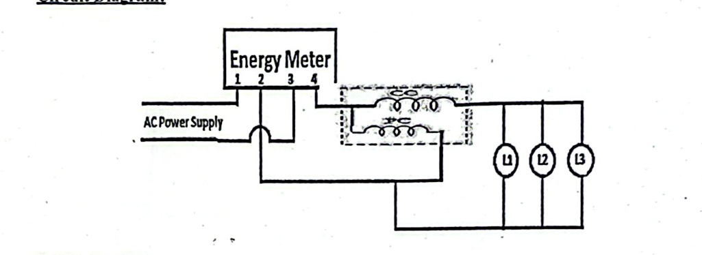

An electrical energy meter measures the total integral of power consumed over time:
$$\text{Energy} = \int P \, dt = \int V \cdot I \cdot \cos\phi \, dt \quad [\text{in Kilowatt-hours, } kWh]$$
One commercial unit of electricity = **$1\text{ kWh} = 1000\text{ Watts for 1 hour} = 3.6 \times 10^6\text{ Joules}$** (also called 1 Board of Trade Unit).

#### Terminal Wiring Layout (From Lab Khata):
An energy meter has 4 standard screw terminals:
- **Terminal 1:** Phase / Line **IN** (from supply)
- **Terminal 2:** Neutral **IN** (from supply)
- **Terminal 3:** Neutral **OUT** (to load)
- **Terminal 4:** Phase / Line **OUT** (to load)
- **Internal Wiring:** Current Coil (CC) is connected in series between Terminal 1 and Terminal 4. Potential Coil (PC) is connected in parallel between Line (Terminal 1) and Neutral (Terminal 2/3).

#### The 4 Mechanical Systems Inside the Meter:
1. **Driving System:**
   - **Shunt Magnet (Voltage Coil):** Wound with many turns of thin wire, highly inductive. Connected directly across line voltage $V$. Its magnetic flux $\Phi_{sh}$ is proportional to $V$ and lags $V$ by nearly $90^\circ$.
   - **Series Magnet (Current Coil):** Wound with few turns of thick wire, very low impedance. Connected in series with load current $I$. Its magnetic flux $\Phi_{se}$ is in phase with line current $I$.
   - These two alternating fluxes penetrate an aluminum disc, inducing circulating **eddy currents**. The interaction between fluxes and eddy currents produces a continuous **deflecting/driving torque ($T_d$)**:
     $$\mathbf{T_d \propto V \cdot I \cdot \cos\phi \propto \text{Active Power } (P)}$$
2. **Moving System:**
   - A light, flat aluminum disc mounted on a vertical spindle resting on a jewel sapphire bearing to minimize mechanical friction.
3. **Braking System:**
   - A permanent horseshoe magnet placed near the edge of the aluminum disc.
   - As the disc spins through this steady magnetic field, eddy currents are induced in the disc. According to Lenz's law, these eddy currents exert an opposing retarding force:
     $$\mathbf{T_b \propto N} \quad (\text{Braking torque is directly proportional to disc speed } N \text{ in RPM})$$
   - **Crucial Balance:** When disc speed stabilizes, driving torque equals braking torque:
     $$T_d = T_b \implies P \propto N \implies \int P \, dt \propto \int N \, dt \implies \mathbf{\text{Energy} \propto \text{Total Revolutions}}$$
4. **Registering System (Analog Disc vs Modern Digital):**
   - **Induction Meters:** Gear train with dials recording revolutions. Meter constant is stamped in **$\text{rev}/kWh$**.
   - **Modern Digital / Static Energy Meters (From Lab Khata):** Use solid-state current sensors and microcontrollers. Energy is indicated by blinking LED pulses. The meter constant is stamped in **$\text{Impulses}/kWh$** (e.g., $1600\text{ Imp/kWh}$ or $3200\text{ Imp/kWh}$).

---

#### ⚠️ THE KEY LAB HAZARD: Creeping Error & How to Fix It
- **What is Creeping?**  
  Creeping is the slow, continuous rotation of the aluminum disc when **there is NO electrical load connected** (load current $I = 0$), but the voltage coil remains energized across the line. (The user is being billed even with all switches off!).
- **What Causes It?**
  1. **Over-compensation for mechanical friction:** To help the meter start smoothly on tiny loads, technicians add a small adjustable copper shading loop on the shunt magnet to produce an artificial forward torque. If this compensation is slightly too aggressive, the disc turns by itself without any load!
  2. Stray magnetic fields, vibration, or excessive supply line voltage.
- **How Engineers Prevent Creeping:**  
  By drilling **two small diametrically opposite holes** in the aluminum disc.
  - *How it works:* When one hole rotates directly under the pole of the shunt magnet, the high-reluctance hole distorts the path of the eddy currents. This creates a small magnetic pull that traps the hole under the pole, stalling the disc against the slight friction-compensating torque. Once a real load turns on, the driving torque easily overcomes this notch, and normal measurement resumes.

#### Testing Method: Phantom (Fictitious) Loading
Testing a large commercial energy meter ($220\text{ V}, 50\text{ A}$) at full rated load for hours would waste $11\text{ kW}$ of real power.  
Instead, labs use **Phantom Loading**:
- The voltage coil (high resistance) is energized from the normal $220\text{ V}$ line (drawing negligible current).
- The current coil (very low resistance) is energized from an independent low-voltage source (e.g. $4\text{ V}$ to $6\text{ V}$) that can push the full $50\text{ A}$ through the coil without dissipating large power. Total power used during testing is a tiny fraction of normal operation!

---

### 2. Maths & Numerical Problems (Exp 09)

**Problem 9.1 (Impulse Calculation from Lab Khata):**  
An energy meter in the lab has a meter constant of $K = 1600\text{ Impulses}/kWh$. In a test running for $t = 303\text{ seconds}$, the LED pulses $15$ times.  
1. Calculate the measured energy $E_1$ in $kWh$.  
2. If the load is an incandescent bulb consuming $P = 70\text{ W}$, calculate the true energy consumed $E_2$ in $kWh$.  
3. Find the percentage error.

**Step-by-Step Solution:**  
1. **Measured Energy ($E_1$):**  
   $$E_1 = \frac{\text{Impulses}}{K} = \frac{15}{1600} = \mathbf{0.009375\text{ kWh}}$$  
2. **True Energy ($E_2$):**  
   $$t = \frac{303}{3600}\text{ hours} \approx 0.084167\text{ hours}$$  
   $$E_2 = \frac{P \times t}{1000} = \frac{70 \times 0.084167}{1000} \approx \mathbf{0.005892\text{ kWh}}$$  
3. **Percentage Error:**  
   $$\%e = \frac{E_1 - E_2}{E_2} \times 100\% = \frac{0.009375 - 0.005892}{0.005892} \times 100\% \approx \mathbf{+59.1\%}$$

---

# Experiment 10: Measurement of Power using CT and PT

### 1. Core Theory & Everyday Intuition
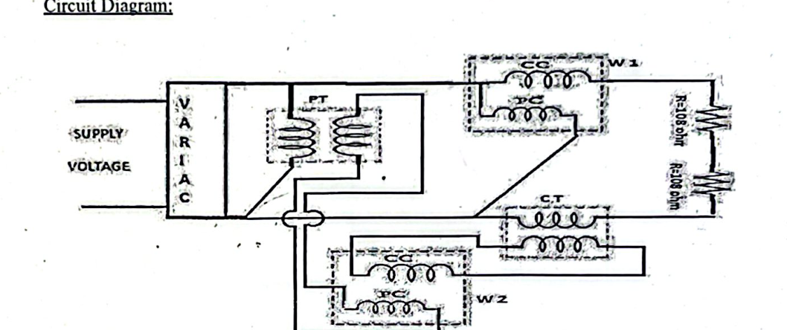

When monitoring high-power transmission or industrial loads (e.g. $11\text{ kV}$ line carrying $400\text{ A}$), you cannot connect an ordinary wattmeter directly to the lines.  
By pairing the wattmeter with both an instrument Potential Transformer (PT) and Current Transformer (CT):
- **Wattmeter Current Coil (CC):** Connects to the **secondary of the CT** ($0 - 5\text{ A}$ range).
- **Wattmeter Potential Coil (PC):** Connects to the **secondary of the PT** ($0 - 110\text{ V}$ range).
- The small benchtop wattmeter now operates at safe, low values while reflecting the high power drawn by the load.

#### Calculation of True System Power:
$$\mathbf{P_{\text{true}} = k_{CT} \times k_{PT} \times W_{\text{measured}}}$$
where:
- $k_{CT} = \frac{I_{\text{primary}}}{I_{\text{secondary}}}$ (Current Transformation Ratio)
- $k_{PT} = \frac{V_{\text{primary}}}{V_{\text{secondary}}}$ (Potential Transformation Ratio)
- $W_{\text{measured}}$ is the raw power reading on the wattmeter dial.

---

### 2. Maths & Numerical Problems (Exp 10)

**Problem 10.1 (Lab Khata / Manual Numerical):**  
In a power measurement setup, a CT with turns ratio $k_{CT} = 24$ and a PT with turns ratio $k_{PT} = 2$ are connected to a wattmeter. The wattmeter indicates $384\text{ W}$.  
Calculate the actual power consumed by the load.

**Step-by-Step Solution:**  
$$P_{\text{true}} = k_{CT} \times k_{PT} \times W_{\text{measured}}$$  
$$P_{\text{true}} = 24 \times 2 \times 384\text{ W} = 48 \times 384\text{ W} = \mathbf{18432\text{ W}} \quad (18.432\text{ kW})$$

---

# Experiment 11: Speed of a Rotating Body using Stroboscope

### 1. Core Theory & Everyday Intuition
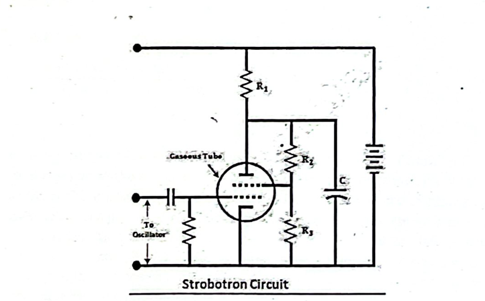  
*Strobotron Flashing Oscillator Circuit*

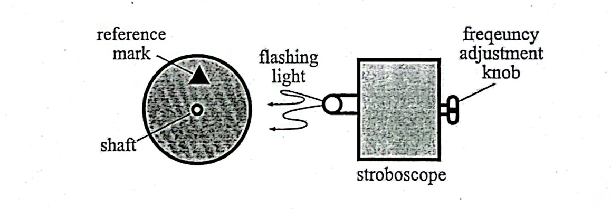  
*Illuminating a Reference Mark on a Spinning Shaft*

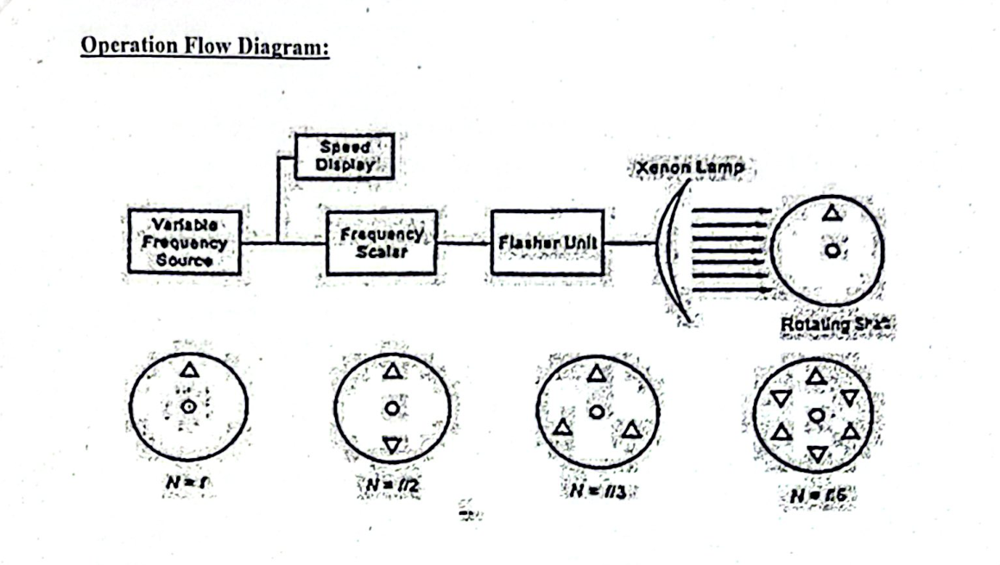  
*Observed Patterns: Single Stationary Mark ($f = N$) vs Submultiples and Multiples*

#### What is a Stroboscope?
A stroboscope is an optical instrument that measures the rotational speed (RPM) of spinning machinery **without physical contact**.
- Traditional contact tachometers press a rubber tip against the shaft, which imposes mechanical friction and slows down fractional-horsepower motors or delicate mechanisms.
- A stroboscope uses a variable-frequency flashing gas discharge tube (**Strobotron** or **Xenon flash tube**) triggered by an electronic oscillator.
- *From Lab Khata Insight:* Modern stroboscopes can flash at rates up to **$500\text{ Hz}$ ($30,000\text{ Flashes/Minute}$)**!
- **Conversion Formula:**
  $$\mathbf{\text{RPM} = 60 \times f_{\text{Hz}}}$$

#### How It Works: Persistence of Vision
The human retina holds an image for approximately $\frac{1}{16}^{\text{th}}$ of a second (**persistence of vision**).
- A single distinct reference mark (such as a white chalk line or triangle) is drawn on the rotor disc.
- When the flashing frequency ($f$ in flashes/min or RPM) matches the shaft speed ($N$ in RPM):
  $$\mathbf{f = N}$$
- Every time the lamp flashes, the shaft has completed exactly one full revolution, illuminating the reference mark in the **exact same physical position**. To human eyes, the mark appears completely **frozen in place as a single stationary image**!

#### Resolving Ambiguity: Why Multiple Stationary Images Appear
A stroboscope has an inherent optical ambiguity that every student must understand:
1. **At Submultiples ($f = \frac{N}{2}, \frac{N}{3}, \dots$):**  
   The shaft makes 2 or 3 complete revolutions between flashes. The mark is still illuminated at the same angular position, so you still see a **single stationary image**, but the flashing frequency is lower than the true speed.
2. **At Harmonics ($f = 2N, 3N, \dots$):**  
   The lamp flashes twice per single shaft revolution (once at $0^\circ$ and once at $180^\circ$). Because of persistence of vision, you see **TWO stationary marks** located $180^\circ$ apart! At $f = 3N$, you see **three stationary marks** spaced $120^\circ$ apart.

#### The Master Formula: How to Find True Speed When $N$ is Unknown
If you don't know the shaft speed, start at the highest flashing rate and tune downward:
- Note the highest flashing frequency $f_m$ where a **single stationary mark** appears.
- Continue lowering the frequency and count how many frequencies $m$ produce a single stationary mark, down to the lowest observed frequency $f_1$.
- The true rotational speed $N$ is:
  $$\mathbf{N = \frac{f_m \cdot f_1 \cdot (m - 1)}{f_m - f_1}}$$
- For two consecutive flashing frequencies $f_1$ and $f_2$ ($m = 2$):
  $$\mathbf{N = \frac{f_2 \cdot f_1}{f_2 - f_1}}$$

---

### 2. Maths & Numerical Problems (Exp 11)

**Problem 11.1 (Lab Manual Numerical):**  
In a lab test to measure the speed of a ceiling fan, the stroboscope is tuned downward:
- Highest flashing frequency giving a single sharp stationary mark: $f_m = 2577\text{ rpm}$
- Lowest flashing frequency giving a single sharp stationary mark: $f_1 = 874.1\text{ rpm}$
- Total number of consecutive single-image frequencies observed: $m = 3$  
Calculate the true rotational speed $N$ of the fan.

**Step-by-Step Solution:**  
$$N = \frac{f_m \cdot f_1 \cdot (m - 1)}{f_m - f_1} = \frac{2577 \times 874.1 \times (3 - 1)}{2577 - 874.1} = \frac{2577 \times 874.1 \times 2}{1702.9}$$  
$$N = \frac{4,505,111.4}{1702.9} \approx \mathbf{2645.5\text{ RPM}}$$

---

# Experiment 12: Insulation Resistance Measurement using Megger

### 1. Core Theory & Everyday Intuition
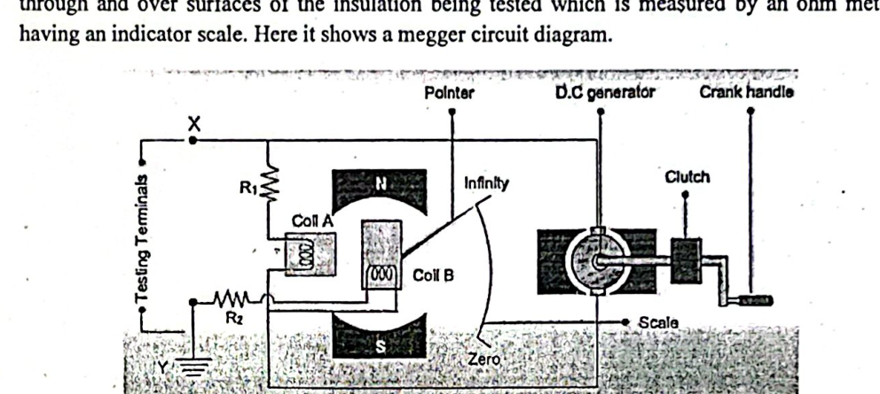  
*Megger Internal Cross-Coil (Ratiometer) Mechanism*

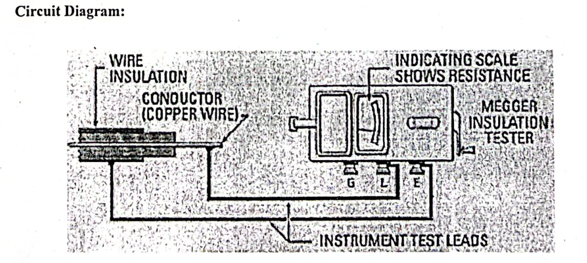  
*Cable Insulation Testing Setup Showing the Vital Guard (G) Connection*

#### What is a Megger?
A Megger (Mega-Ohmmeter) is a specialized portable instrument designed to measure **very high electrical resistance** (insulation resistance in Mega-ohms $M\Omega$ or Giga-ohms $G\Omega$).
- Normal battery ohmmeters operate at $1.5\text{ V}$ or $9\text{ V}$. An insulation fault (such as a microscopic crack in cable plastic) may look completely healthy at $9\text{ V}$, but flash over and leak current at $220\text{ V}$ or $11\text{ kV}$.
- A Megger produces test voltages of **$500\text{ V}, 1000\text{ V},$ or $2500\text{ V}$** to test insulation under real electrical stress.
- *From Lab Khata:* In modern electronic Meggers, high voltage is generated cleanly:  
  **Low Voltage DC Battery $\longrightarrow$ Inverter Oscillator (AC) $\longrightarrow$ Step-Up Transformer $\longrightarrow$ Rectifier/Filter $\longrightarrow$ High Voltage DC!**
- **Withstand Voltage Rule:** The test voltage must always be **strictly less than the dielectric withstand voltage** of the insulation; otherwise, the test itself could permanently puncture and destroy good insulation!

---

#### 💡 The 3 Components of Total Cable Leakage Current: Why Resistance Rises with Time!
*(From Lab Khata Insight):*  
When a step DC voltage is applied to a cable, the total current flowing through the cable is composed of three distinct parts:
$$\mathbf{i_L(t) = i_c(t) + i_A(t) + i_g}$$
1. **Capacitive Charging Current ($i_c$):**
   - The coaxial cable acts as a large capacitor (copper core is inner conductor, lead sheath/ground is outer conductor).
   - Starts extremely high at $t = 0$, then rapidly decays to zero within seconds.
2. **Dielectric Absorption Current ($i_A$):**
   - Caused by the slow mechanical polarization and alignment of dipoles inside the insulating polymer molecules.
   - Decays slowly over several minutes.
3. **Conductance (Leakage) Current ($i_g$):**
   - The true, steady leakage current flowing through the bulk volume and flaws of the insulation.
   - This current remains completely constant over time.

**The Golden Insight:**  
Because $i_c$ and $i_A$ decay over time, the total current drops continuously:
$$\mathbf{i_L \propto \frac{1}{t}} \implies \text{Measured Resistance } \mathbf{R = \frac{V}{i_L} \text{ increases with time!}}$$
At steady state ($t \to \infty$), $i_c \to 0$ and $i_A \to 0$, leaving only pure conductive leakage: **$i_L = i_g$**.

---

#### Dielectric Absorption Ratio (DAR) & Polarization Index (PI)
Because insulation resistance changes over time, industry standards use time-ratio tests to grade insulation health:
1. **Dielectric Absorption Ratio (DAR):**
   $$\mathbf{DAR = \frac{R_{\text{60 seconds}}}{R_{\text{30 seconds}}}}$$
   - **$\mathbf{DAR = 1.25 \text{ to } 1.6} \implies$ Healthy, good, dry insulation.**
   - $\text{DAR} < 1.0 \implies$ Dangerous moisture or contamination (insulation failure imminent).
2. **Polarization Index (PI):**
   $$\mathbf{PI = \frac{R_{\text{10 minutes}}}{R_{\text{1 minute}}}}$$
   - $\mathbf{PI > 2.0} \implies$ Excellent insulation.
   - $PI < 1.5 \implies$ Contaminated or wet insulation.

---

#### The Cross-Coil (Ratiometer) Principle: Why Crank Speed Doesn't Matter!
A Megger movement has two coils (Coil A and Coil B) rigidly mounted together on a common spindle inside a permanent magnet field:
1. **Control Coil (Pressure Coil - Coil A):** Connected in series with a fixed resistor $R_1$ straight across the generator. It exerts a torque driving the pointer toward **Infinity ($\infty$)**.
2. **Deflecting Coil (Current Coil - Coil B):** Connected in series with the unknown insulation under test ($R_x$). It exerts an opposing torque driving the pointer toward **Zero ($0$)**.

**The Mathematical Cancellation:**  
The torque produced by Coil A is proportional to generator voltage $V$: $T_A \propto V$.  
The torque produced by Coil B is proportional to the leakage current through the insulation: $T_B \propto \frac{V}{R_x}$.  
When the pointer reaches equilibrium ($T_A = T_B$):
$$\theta \propto \frac{T_B}{T_A} \propto \frac{\left(\frac{V}{R_x}\right)}{V} = \mathbf{\frac{1}{R_x}}$$
- **Notice that $V$ completely cancels out!**
- This means whether you crank the handle at $140\text{ RPM}$ or $180\text{ RPM}$, the ratio remains constant, and **the needle reading is completely independent of generator voltage or hand-crank speed!**
- Meggers have **no controlling hairsprings**. When at rest, the needle can lie freely anywhere on the dial.

---

#### The Three Terminals & The Guard Wire ($G$)
A Megger has three terminals:
- **Line Terminal (L):** Connected to the central copper conductor of the cable.
- **Earth Terminal (E):** Connected to the external metallic armor or earth ground.
- **Guard Terminal (G):** Wrapped around the exposed outer surface of the insulation.

#### ⚠️ KEY EXAM QUESTION: What is the Purpose of the Guard Terminal?
When testing a high-voltage cable on a humid or dusty day, electricity leaks across the **surface** of the exposed insulation ends (surface leakage), in addition to leaking through the **volume** of the insulation (bulk volume leakage).
- If you don't use the Guard terminal, the surface leakage flows through the current coil (Coil B), causing the Megger to register a falsely low insulation reading (a healthy cable will fail the test!).
- The **Guard wire** collects this surface leakage current and routes it **directly back to the generator negative terminal, completely bypassing the deflecting coil (Coil B)**.
- As a result, the Megger measures **only pure internal volume insulation resistance**!

---

#### Routine Megger Health Check Before Testing:
1. **Open Circuit Test:** Keep test leads L and E separated in the air $\implies$ Crank handle $\implies$ Pointer must indicate **$\mathbf{\infty}$ (Infinity)**.
2. **Short Circuit Test:** Touch leads L and E firmly together $\implies$ Turn handle gently $\implies$ Pointer must swing cleanly to **$\mathbf{0}$ (Zero)**.

#### General Safety Rule for Minimum Insulation Resistance:
$$\mathbf{R_{\text{insulation}} \ge (\text{Rated kV} + 1)\text{ M}\Omega} \quad \text{with an absolute minimum of } \mathbf{1.0\text{ M}\Omega}$$

---

### 2. Maths & Numerical Problems (Exp 12)

**Problem 12.1 (DAR Calculation):**  
In an insulation test on a power feeder cable using a $1000\text{ V}$ Megger, the readings are:
- Insulation resistance at $30\text{ seconds}$: $R_{30s} = 200\text{ M}\Omega$
- Insulation resistance at $60\text{ seconds}$: $R_{60s} = 280\text{ M}\Omega$  
1. Calculate the Dielectric Absorption Ratio (DAR).  
2. State whether the insulation condition is acceptable.

**Step-by-Step Solution:**  
1. **DAR Calculation:**  
   $$\text{DAR} = \frac{R_{60s}}{R_{30s}} = \frac{280\text{ M}\Omega}{200\text{ M}\Omega} = \mathbf{1.40}$$  
2. **Assessment:**  
   Since $1.40$ falls squarely within the standard good insulation range of **$1.25$ to $1.60$**, the cable insulation is **healthy, dry, and acceptable**.

**Problem 12.2 (Transformer Insulation Assessment):**  
A $33\text{ kV}$ three-phase distribution transformer is tested with a $2500\text{ V}$ Megger between the high-voltage winding and the transformer steel tank (earth).  
1. What is the minimum acceptable insulation resistance recommended by standard safety codes?  
2. If the Megger reads $2500\text{ M}\Omega$ (as in the lab manual data sheet), state with reason whether the transformer insulation is acceptable.

**Step-by-Step Solution:**  
1. Minimum acceptable insulation resistance:  
   $$R_{\text{min}} = (\text{Rated kV} + 1)\text{ M}\Omega = (33 + 1)\text{ M}\Omega = \mathbf{34\text{ M}\Omega}$$  
2. **Assessment:**  
   The measured insulation resistance is $2500\text{ M}\Omega = 2.5\text{ G}\Omega$.  
   Since $2500\text{ M}\Omega \gg 34\text{ M}\Omega$, the insulation is in **excellent, healthy condition** and the transformer is completely safe to energize.
