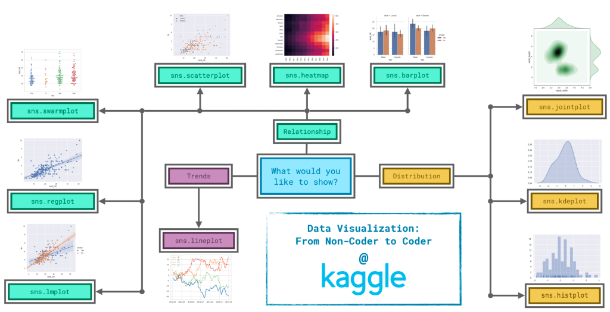

# Data Visualization & EDA

This folder is for notes on how to represent data visually to find patterns, trends, and outliers.

## Visual Guides

## Tools
- **Matplotlib**: Low-level plotting.
- **Seaborn**: High-level statistical visualization.
- **Plotly**: Interactive plots.
- **Tableau/PowerBI**: BI tools (optional).

## Concepts
- **Univariate Analysis**: Histograms, Box plots, Count plots.
- **Bivariate Analysis**: Scatter plots, Line plots, Heatmaps.
- **Multivariate Analysis**: Pair plots, Parallel coordinates.
- **Dashboarding**: Creating reports.
