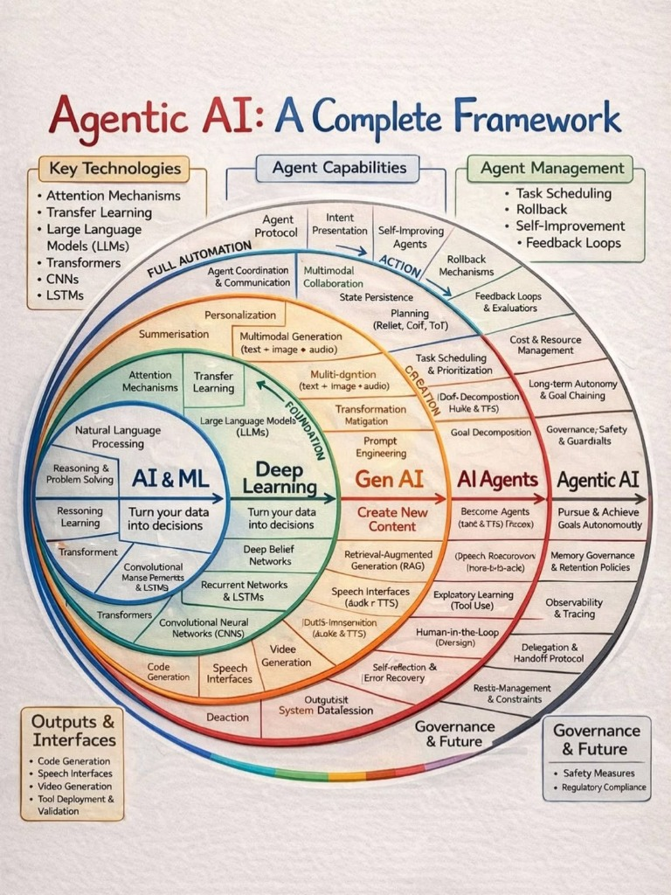

# Agentic AI: A Complete Framework

This note provides an overview of the Agentic AI framework, mapping the evolution from standard AI & ML to fully autonomous Agentic systems.

## 🖼️ Framework Overview

## 🧩 Key Components

### 1. Key Technologies
- **Attention Mechanisms**: The foundation for focusing on relevant information.
- **Transfer Learning**: Leveraging pre-trained models for new tasks.
- **Large Language Models (LLMs)**: The core reasoning engine.
- **Transformers**: The architecture driving modern NLP.
- **CNNs & LSTMs**: Foundations for visual and sequential data.

### 2. Agent Capabilities
- **Foundation**: Turning data into decisions (Deep Learning).
- **Creation**: Generating new content (Gen AI).
- **AI Agents**: Becoming active agents (Task-oriented).
- **Agentic AI**: Pursuing and achieving goals autonomously.

### 3. Agent Management
- **Task Scheduling & Prioritization**: Managing complex workflows.
- **Rollback Mechanisms**: Handling errors and state persistence.
- **Self-Improvement**: Learning from feedback loops and evaluators.
- **Memory Governance**: Retention policies for long-term autonomy.

### 4. Outputs & Interfaces
- **Code Generation**
- **Speech & Video Generation**
- **Tool Deployment & Validation**

### 5. Governance & Future
- **Safety Measures**
- **Regulatory Compliance**
- **Observability & Tracing**
- **Delegation & Handoff Protocols**
